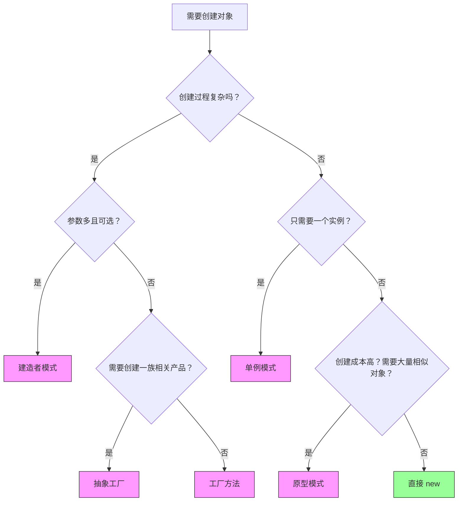

# 创建型模式对比 — 选型指南

> **一句话记忆口诀**：工厂造不同类型，单例只留一个，建造者拼复杂对象，原型克隆省开销。

## 1. 五种创建型模式一览

| 模式 | 核心思想 | 一句话 | 关键词 |
| :-- | :-- | :-- | :-- |
| **简单工厂** | 一个工厂方法创建多种产品 | 传类型，返对象 | `if-else` 替代者 |
| **工厂方法** | 每个产品有自己的工厂 | 工厂抽象化 | 继承、多态 |
| **抽象工厂** | 一个工厂创建一族产品 | 产品族 | UI 主题、跨平台 |
| **单例** | 全局唯一实例 | 只此一份 | 配置中心、连接池 |
| **建造者** | 分步构建复杂对象 | 链式调用 | 参数多、不可变 |
| **原型** | 克隆已有对象 | 复印机 | 深拷贝、浅拷贝 |

## 2. 生活类比：用餐厅场景串联

你去一家**连锁餐厅**（抽象工厂）吃饭：

1. **工厂模式**：你告诉服务员"来份宫保鸡丁"，厨房（工厂）做出来给你。你不需要知道厨师是谁。
2. **单例模式**：餐厅只有一个收银台（单例），所有顾客共用。
3. **建造者模式**：你点了一份套餐，需要选主食 + 饮料 + 甜点 + 辣度（分步构建），最后服务员把套餐组合好给你。
4. **原型模式**：厨房有一份标准配方（原型），每次做菜时复印一份，只改辣度和份量（克隆后修改）。

## 3. 何时用哪种？决策树



## 4. 详细对比

### 4.1 工厂模式三兄弟对比

| 对比维度 | 简单工厂 | 工厂方法 | 抽象工厂 |
| :-- | :-- | :-- | :-- |
| **产品等级** | 单一产品 | 单一产品 | 一族产品 |
| **扩展方式** | 修改工厂（违反开闭） | 新增工厂子类 | 新增工厂子类 |
| **复杂度** | 低 | 中 | 高 |
| **典型例子** | `Calendar.getInstance()` | `Collection.iterator()` | `DocumentBuilderFactory` |
| **适用场景** | 产品类型少且固定 | 产品类型可能扩展 | 多个维度的产品组合 |

### 4.2 单例的 5 种写法对比

| 写法 | 线程安全 | 懒加载 | 防反射 | 防序列化 | 推荐度 |
| :-- | :-- | :-- | :-- | :-- | :-- |
| 饿汉式 | ✅ | ❌ | ❌ | ❌ | ⭐⭐⭐ |
| 懒汉式（DCL） | ✅ | ✅ | ❌ | ❌ | ⭐⭐⭐ |
| 静态内部类 | ✅ | ✅ | ❌ | ❌ | ⭐⭐⭐⭐ |
| 枚举单例 | ✅ | ❌ | ✅ | ✅ | ⭐⭐⭐⭐⭐ |
| 容器单例 | ✅ | ✅ | — | — | ⭐⭐⭐ |

> **结论**：枚举单例是 Effective Java 推荐的最佳方式，天然防反射和序列化破坏。

### 4.3 建造者 vs 构造函数 vs JavaBean

| 方式 | 可读性 | 不可变 | 参数校验 | 代码量 |
| :-- | :-- | :-- | :-- | :-- |
| 构造函数 | ❌ 差（参数含义不明） | ✅ | ✅ | 少 |
| JavaBean | ✅ 好 | ❌ | ❌ | 多 |
| **建造者** | ✅✅ 最好 | ✅ | ✅ | 中 |

### 4.4 原型模式：深拷贝 vs 浅拷贝

| 方式 | 基本类型 | 引用类型 | 性能 | 安全性 |
| :-- | :-- | :-- | :-- | :-- |
| 浅拷贝 `clone()` | 复制值 | 复制引用（共享） | 快 | 低 |
| 深拷贝（序列化） | 复制值 | 递归复制（独立） | 慢 | 高 |
| 深拷贝（手动） | 复制值 | 递归复制（独立） | 中 | 高 |

## 5. 实战选型代码示例

### 5.1 场景一：支付系统 — 工厂方法

```java
// 产品可能不断增加（支付宝、微信、银联、数字货币...）
// 选择：工厂方法模式

interface Payment {
    void pay(BigDecimal amount);
}

interface PaymentFactory {
    Payment create();
}

// 每新增一种支付方式，只需新增一对 Factory + Payment 实现
class AlipayFactory implements PaymentFactory {
    public Payment create() { return new Alipay(); }
}

// 注册到 Map，运行时动态获取
Map<String, PaymentFactory> factories = Map.of(
    "alipay", new AlipayFactory(),
    "wechat", new WechatPayFactory()
);
Payment payment = factories.get("alipay").create();
payment.pay(new BigDecimal("100"));
```

### 5.2 场景二：数据库连接池 — 单例 + 工厂

```java
// 连接池全局唯一 → 单例
// 连接创建逻辑复杂 → 工厂
public enum DataSourceManager {
    INSTANCE;

    private final HikariDataSource dataSource;

    DataSourceManager() {
        HikariConfig config = new HikariConfig();
        config.setJdbcUrl("jdbc:mysql://localhost:3306/db");
        config.setMaximumPoolSize(10);
        this.dataSource = new HikariDataSource(config);
    }

    public Connection getConnection() throws SQLException {
        return dataSource.getConnection();
    }
}

// 使用
Connection conn = DataSourceManager.INSTANCE.getConnection();
```

### 5.3 场景三：复杂配置对象 — 建造者

```java
// 参数多（>5个）、可选、需要不可变
ServerConfig config = ServerConfig.builder()
    .host("0.0.0.0")
    .port(8080)
    .maxConnections(1000)
    .timeout(Duration.ofSeconds(30))
    .ssl(true)
    .build();
```

### 5.4 场景四：报表模板 — 原型

```java
// 创建成本高（需要查DB、解析模板）
// 大量相似对象（只有标题和数据不同）
ReportTemplate monthly = new ReportTemplate("月报", dbConfig, styles);
ReportTemplate jan = monthly.deepClone();
jan.setTitle("1月报表");
jan.setData(janData);
```

## 6. Spring 中的创建型模式

| 模式 | Spring 中的应用 | 说明 |
| :-- | :-- | :-- |
| **工厂** | `BeanFactory`、`FactoryBean` | Bean 的创建核心 |
| **单例** | Bean 默认 `singleton` 作用域 | IoC 容器管理生命周期 |
| **建造者** | `BeanDefinitionBuilder`、`UriComponentsBuilder` | 构建复杂配置 |
| **原型** | `scope="prototype"` | 每次获取新实例 |
| **工厂方法** | `@Bean` 方法 | 工厂方法模式的注解版 |

## 7. 常见误区

### 7.1 误区一：滥用单例

```java
// ❌ 把有状态的 Service 设为单例
@Component
public class OrderService {
    private int counter = 0; // 可变状态！并发问题！
    public void process() { counter++; }
}

// ✅ 有状态的类应该用 prototype 或局部变量
@Scope("prototype")
@Component
public class OrderService { ... }
```

### 7.2 误区二：简单工厂违反开闭原则

```java
// ❌ 每次新增产品都要修改工厂
public Payment create(String type) {
    if ("alipay".equals(type)) return new Alipay();
    else if ("wechat".equals(type)) return new WechatPay();
    // 新增银联？改代码！
}

// ✅ 用注册表 + 工厂方法
Map<String, Supplier<Payment>> registry = new ConcurrentHashMap<>();
registry.put("alipay", Alipay::new);
registry.put("wechat", WechatPay::new);
// 新增：registry.put("unionpay", UnionPay::new); 不改工厂代码
```

### 7.3 误区三：过度设计

```java
// ❌ 只有两种固定产品，用抽象工厂
// 产品族：WindowsButton + WindowsCheckbox / MacButton + MacCheckbox
// 但如果永远只做中文系统，根本不需要抽象工厂

// ✅ 先简单工厂，产品类型变多再升级
```

## 8. 总结：面试回答模板

**面试官问：创建型模式怎么选？**

> 选型标准：
>
> 1. **对象类型多、可能扩展** → 工厂方法（Spring BeanFactory 就是典型）
> 2. **多个维度的产品组合** → 抽象工厂（如跨平台 UI）
> 3. **全局唯一实例** → 单例（配置中心、连接池，推荐枚举方式）
> 4. **参数多且可选** → 建造者（如 HTTP 请求构建、配置对象）
> 5. **创建成本高、相似对象多** → 原型（克隆避免重复初始化）
>
> 工作中工厂模式和建造者最常用，单例推荐枚举，原型注意深浅拷贝。
