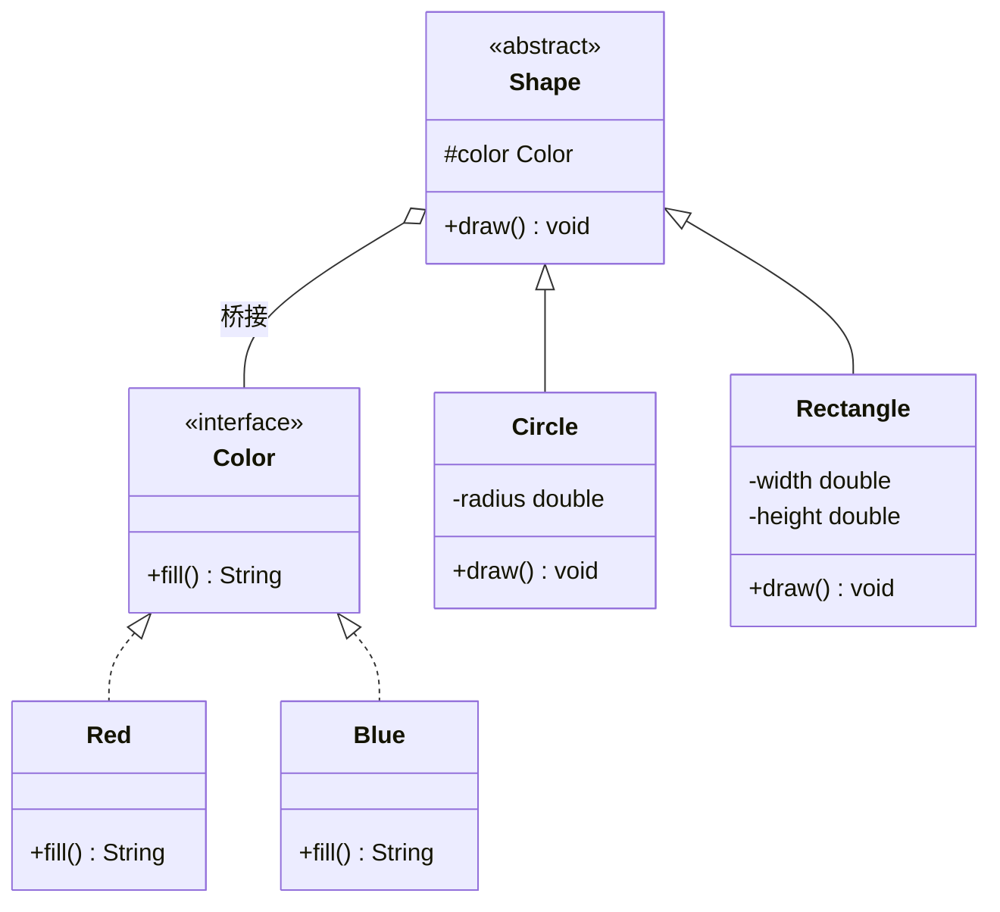

# 桥接模式（Bridge Pattern）

> **一句话记忆口诀**：桥接分离抽象与实现两个独立变化的维度，用组合替代继承，避免笛卡尔积式的类爆炸。

## 1. 🏠 生活类比

遥控器和电视机是两个独立的东西。遥控器有基础版和高级版，电视有索尼和三星。两个维度自由组合：

- 基础遥控器 + 索尼电视
- 高级遥控器 + 索尼电视
- 基础遥控器 + 三星电视
- 高级遥控器 + 三星电视

如果用继承：`BasicSonyRemote`、`AdvancedSonyRemote`、`BasicSamsungRemote`、`AdvancedSamsungRemote` — 4 个类。新增一个 LG 电视？再加 2 个类！

**桥接模式的做法**：遥控器**持有**电视的引用（组合），两个维度独立变化。

## 2. 💩 烂代码：继承导致类爆炸

```java
// 形状 × 颜色 = 类爆炸
// 2 种形状 × 3 种颜色 = 6 个类
class RedCircle extends Circle {
    public void draw() { drawCircle(); fillRed(); }
}
class BlueCircle extends Circle {
    public void draw() { drawCircle(); fillBlue(); }
}
class GreenCircle extends Circle {
    public void draw() { drawCircle(); fillGreen(); }
}
class RedRectangle extends Rectangle {
    public void draw() { drawRectangle(); fillRed(); }
}
class BlueRectangle extends Rectangle {
    public void draw() { drawRectangle(); fillBlue(); }
}
class GreenRectangle extends Rectangle {
    public void draw() { drawRectangle(); fillGreen(); }
}
// 新增一种颜色？所有形状都要新增子类！
// 新增一种形状？所有颜色都要新增子类！
// N 种形状 × M 种颜色 = N×M 个子类
```

**问题根因**：多个独立变化的维度通过继承耦合，子类数量呈笛卡尔积增长。

## 3. ✨ 桥接模式方案

将"形状"和"颜色"分离为两个独立维度，通过组合连接：



## 4. 💻 完整代码实现

```java
// ===== 实现维度：颜色接口 =====
public interface Color {
    String fill();
}

public class Red implements Color {
    @Override
    public String fill() { return "红色"; }
}

public class Blue implements Color {
    @Override
    public String fill() { return "蓝色"; }
}

public class Green implements Color {
    @Override
    public String fill() { return "绿色"; }
}

// ===== 抽象维度：形状 =====
public abstract class Shape {
    protected final Color color; // 桥接：持有实现维度的引用

    public Shape(Color color) {
        this.color = color;
    }

    public abstract void draw();
}

public class Circle extends Shape {
    private final double radius;

    public Circle(double radius, Color color) {
        super(color);
        this.radius = radius;
    }

    @Override
    public void draw() {
        System.out.println("绘制" + color.fill() + "圆形，半径=" + radius);
    }
}

public class Rectangle extends Shape {
    private final double width;
    private final double height;

    public Rectangle(double width, double height, Color color) {
        super(color);
        this.width = width;
        this.height = height;
    }

    @Override
    public void draw() {
        System.out.println("绘制" + color.fill() + "矩形，宽=" + width + "，高=" + height);
    }
}

// ===== 使用示例 =====
public class Main {
    public static void main(String[] args) {
        // 两个维度自由组合
        Shape redCircle = new Circle(5.0, new Red());
        Shape blueCircle = new Circle(3.0, new Blue());
        Shape greenRect = new Rectangle(4.0, 6.0, new Green());

        redCircle.draw();    // 绘制红色圆形，半径=5.0
        blueCircle.draw();   // 绘制蓝色圆形，半径=3.0
        greenRect.draw();    // 绘制绿色矩形，宽=4.0，高=6.0

        // 新增黄色？只需新增 Yellow 类，不影响任何 Shape 子类！
        // 新增三角形？只需新增 Triangle 类，不影响任何 Color 实现！
    }
}
```

### 4.1 进阶示例：跨平台通知系统

```java
// ===== 实现维度：消息发送渠道 =====
public interface MessageSender {
    void send(String title, String content);
}

public class EmailSender implements MessageSender {
    @Override
    public void send(String title, String content) {
        System.out.println("[邮件] " + title + ": " + content);
    }
}

public class SmsSender implements MessageSender {
    @Override
    public void send(String title, String content) {
        System.out.println("[短信] " + title + ": " + content);
    }
}

public class DingTalkSender implements MessageSender {
    @Override
    public void send(String title, String content) {
        System.out.println("[钉钉] " + title + ": " + content);
    }
}

// ===== 抽象维度：消息类型 =====
public abstract class Message {
    protected final MessageSender sender; // 桥接

    public Message(MessageSender sender) {
        this.sender = sender;
    }

    public abstract void send(String content);
}

public class NormalMessage extends Message {
    public NormalMessage(MessageSender sender) { super(sender); }

    @Override
    public void send(String content) {
        sender.send("普通通知", content);
    }
}

public class UrgentMessage extends Message {
    public UrgentMessage(MessageSender sender) { super(sender); }

    @Override
    public void send(String content) {
        sender.send("【紧急】", content + " 请及时处理！");
    }
}

// ===== 使用 =====
Message urgentEmail = new UrgentMessage(new EmailSender());
urgentEmail.send("服务器宕机"); // [邮件] 【紧急】: 服务器宕机 请及时处理！

Message normalDingTalk = new NormalMessage(new DingTalkSender());
normalDingTalk.send("日报已提交"); // [钉钉] 普通通知: 日报已提交
```

## 5. 🔧 框架应用

| 框架/类 | 抽象维度 | 实现维度 | 说明 |
| :-- | :-- | :-- | :-- |
| JDBC `Driver`/`Connection` | JDBC API | 各数据库驱动 | 应用代码不关心底层是 MySQL 还是 Oracle |
| `PlatformTransactionManager` | 事务管理 API | JDBC/JPA/JTA 实现 | Spring 事务抽象与具体实现分离 |
| SLF4J + Logback | 日志门面（SLF4J） | 日志实现（Logback/Log4j） | 日志抽象与实现分离 |
| `java.util.List` | List 接口 | ArrayList/LinkedList | 抽象与实现分离 |
| Spring `Resource` | Resource 接口 | ClassPath/FileSystem/URL | 资源抽象与实现分离 |

## 6. ⚠️ 适用场景

**适合使用桥接模式的情况：**

- 一个类存在**两个或多个独立变化的维度**
- 不希望因维度组合导致类数量爆炸
- 需要在**运行期切换**实现

**不适合的情况：**

- 只有一个变化维度 → 直接用继承
- 维度之间有强耦合 → 分离没有意义
- 变化维度很少（2×2=4个类）→ 直接继承更简单

## 7. 🔍 桥接模式 vs 策略模式

| 对比维度 | 桥接模式 | 策略模式 |
| :-- | :-- | :-- |
| **目的** | 分离抽象与实现两个维度 | 算法可替换 |
| **维度** | 两个独立变化的维度 | 一个维度（算法选择） |
| **关系** | 抽象持有实现，两者**共同演化** | Context 持有 Strategy，**单向依赖** |
| **典型场景** | JDBC 驱动、跨平台 UI | 支付方式、排序算法 |
