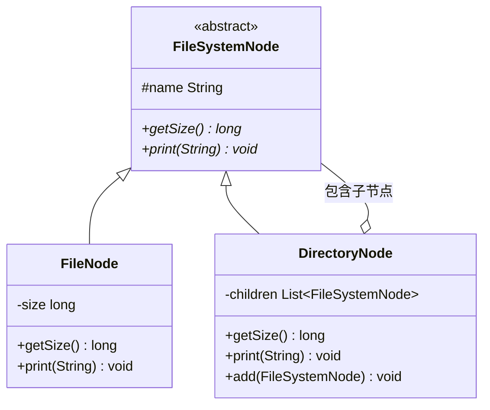

# 组合模式（Composite Pattern）

> **一句话记忆口诀**：组合模式统一叶子和容器的接口，递归处理树形结构，文件系统和菜单树是最经典的例子。

## 1. 🏠 生活类比

公司组织架构：公司有多个部门，每个部门有多个员工。计算"薪资总额"时：

- 员工的薪资 = 自己的工资
- 部门的薪资 = 所有子部门薪资之和 + 所有员工薪资之和
- 公司的薪资 = 所有部门薪资之和

无论你拿到的是"员工"还是"部门"，都可以统一调用 `getSalary()` 方法。

## 2. 💩 烂代码：到处都是 instanceof

```java
// ❌ 反例：客户端必须区分叶子节点和容器节点
public long calculateSize(Object node) {
    if (node instanceof File) {
        return ((File) node).getSize();
    } else if (node instanceof Directory) {
        long total = 0;
        for (Object child : ((Directory) node).getChildren()) {
            total += calculateSize(child); // 递归
        }
        return total;
    }
    throw new IllegalArgumentException("未知节点类型");
}

// 每次新增节点类型（如软链接），都要修改这个方法！
// 到处都是 instanceof 判断，代码难以维护
```

**问题根因**：叶子节点和容器节点接口不统一，客户端必须区分处理，违反开闭原则。

## 3. ✨ 组合模式方案



## 4. 💻 完整代码实现

```java
import java.util.*;

// ===== 抽象组件：统一叶子和容器的接口 =====
public abstract class FileSystemNode {
    protected final String name;

    public FileSystemNode(String name) {
        this.name = name;
    }

    public abstract long getSize();
    public abstract void print(String prefix);

    // 默认实现抛异常，叶子节点不需要这些操作
    public void add(FileSystemNode node) {
        throw new UnsupportedOperationException("不支持添加子节点");
    }

    public void remove(FileSystemNode node) {
        throw new UnsupportedOperationException("不支持删除子节点");
    }

    public List<FileSystemNode> getChildren() {
        throw new UnsupportedOperationException("不支持获取子节点");
    }
}

// ===== 叶子节点：文件 =====
public class FileNode extends FileSystemNode {
    private final long size;

    public FileNode(String name, long size) {
        super(name);
        this.size = size;
    }

    @Override
    public long getSize() {
        return size;
    }

    @Override
    public void print(String prefix) {
        System.out.println(prefix + "📄 " + name + " (" + formatSize(size) + ")");
    }

    private String formatSize(long bytes) {
        if (bytes < 1024) return bytes + "B";
        if (bytes < 1024 * 1024) return (bytes / 1024) + "KB";
        return (bytes / 1024 / 1024) + "MB";
    }
}

// ===== 容器节点：目录 =====
public class DirectoryNode extends FileSystemNode {
    private final List<FileSystemNode> children = new ArrayList<>();

    public DirectoryNode(String name) {
        super(name);
    }

    @Override
    public void add(FileSystemNode node) {
        children.add(node);
    }

    @Override
    public void remove(FileSystemNode node) {
        children.remove(node);
    }

    @Override
    public List<FileSystemNode> getChildren() {
        return Collections.unmodifiableList(children);
    }

    @Override
    public long getSize() {
        // 递归计算所有子节点大小之和
        return children.stream()
                .mapToLong(FileSystemNode::getSize)
                .sum();
    }

    @Override
    public void print(String prefix) {
        System.out.println(prefix + "📁 " + name + " (" + formatSize(getSize()) + ")");
        children.forEach(child -> child.print(prefix + "  "));
    }

    private String formatSize(long bytes) {
        if (bytes < 1024) return bytes + "B";
        if (bytes < 1024 * 1024) return (bytes / 1024) + "KB";
        return (bytes / 1024 / 1024) + "MB";
    }
}

// ===== 使用示例 =====
public class Main {
    public static void main(String[] args) {
        // 构建文件系统树
        DirectoryNode root = new DirectoryNode("project");

        DirectoryNode src = new DirectoryNode("src");
        src.add(new FileNode("Main.java", 2048));
        src.add(new FileNode("Utils.java", 1024));

        DirectoryNode test = new DirectoryNode("test");
        test.add(new FileNode("MainTest.java", 1536));

        root.add(src);
        root.add(test);
        root.add(new FileNode("README.md", 512));
        root.add(new FileNode("pom.xml", 3072));

        // 统一接口，无需区分文件和目录
        root.print("");
        System.out.println("总大小: " + root.getSize() + "B");

        // 输出：
        // 📁 project (8192B)
        //   📁 src (3072B)
        //     📄 Main.java (2KB)
        //     📄 Utils.java (1KB)
        //   📁 test (1536B)
        //     📄 MainTest.java (1KB)
        //   📄 README.md (512B)
        //   📄 pom.xml (3KB)
    }
}
```

### 4.1 进阶示例：组织架构薪资计算

```java
// ===== 抽象组件 =====
public abstract class OrganizationComponent {
    protected String name;
    protected String title;

    public OrganizationComponent(String name, String title) {
        this.name = name;
        this.title = title;
    }

    public abstract double calculateSalary();
    public abstract int headcount();

    public void add(OrganizationComponent component) {
        throw new UnsupportedOperationException();
    }
}

// ===== 叶子：员工 =====
public class Employee extends OrganizationComponent {
    private double salary;

    public Employee(String name, String title, double salary) {
        super(name, title);
        this.salary = salary;
    }

    @Override
    public double calculateSalary() { return salary; }

    @Override
    public int headcount() { return 1; }
}

// ===== 容器：部门 =====
public class Department extends OrganizationComponent {
    private List<OrganizationComponent> members = new ArrayList<>();

    public Department(String name, String title) {
        super(name, title);
    }

    @Override
    public void add(OrganizationComponent component) {
        members.add(component);
    }

    @Override
    public double calculateSalary() {
        return members.stream()
                .mapToDouble(OrganizationComponent::calculateSalary)
                .sum();
    }

    @Override
    public int headcount() {
        return members.stream()
                .mapToInt(OrganizationComponent::headcount)
                .sum();
    }
}

// ===== 使用 =====
Department company = new Department("科技公司", "公司");

Department techDept = new Department("技术部", "部门");
techDept.add(new Employee("张三", "Java 工程师", 25000));
techDept.add(new Employee("李四", "前端工程师", 20000));

Department salesDept = new Department("销售部", "部门");
salesDept.add(new Employee("王五", "销售经理", 30000));

company.add(techDept);
company.add(salesDept);

System.out.println("公司总人数: " + company.headcount());     // 3
System.out.println("公司月薪总额: " + company.calculateSalary()); // 75000
```

## 5. 🔧 框架应用

| 框架/类 | 说明 |
| :-- | :-- |
| `java.awt.Container` / `Component` | Swing 组件树：Container 可以包含 Component（包括其他 Container） |
| `javax.swing.JMenu` / `JMenuItem` | 菜单树：JMenu 可以包含 JMenuItem 或其他 JMenu |
| MyBatis `SqlNode` | 动态 SQL 的 `<if>`、`<choose>`、`<foreach>` 组成树形结构 |
| Jackson `JsonNode` | ObjectNode 包含子节点，ValueNode 是叶子 |
| Spring Security `AccessDecisionVoter` | 投票器组合 |
| HTML DOM | Document → Element → Text Node 树形结构 |

## 6. ⚠️ 适用场景

**适合：**

- 需要表示**部分-整体**的树形结构
- 希望客户端**统一处理**单个对象和组合对象
- 文件系统、菜单、组织架构、UI 组件树

**不适合：**

- 不是树形结构
- 叶子和容器的行为差异很大，统一接口没有意义

### 6.1 安全组合 vs 透明组合

| 方式 | add/remove 放在哪 | 优点 | 缺点 |
| :-- | :-- | :-- | :-- |
| **透明组合** | 抽象组件中 | 客户端统一处理 | 叶子节点被迫实现无意义方法 |
| **安全组合** | 只在容器中 | 接口干净 | 客户端需要区分类型 |

> JDK 用的是**透明组合**：`java.awt.Component` 中有 `add()` 方法，叶子节点调用会抛异常。
