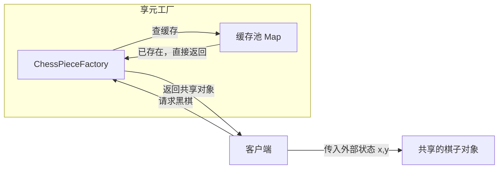

# 享元模式（Flyweight Pattern）

> **一句话记忆口诀**：享元共享内部状态，分离外部状态，String 常量池和 Integer 缓存是最经典的例子。

## 1. 🏠 生活类比

**共享单车**：城市里有成千上万的骑行需求，但不需要每人买一辆自行车。共享单车（享元对象）被多人复用，每次骑行的起点终点（外部状态）不同，但车本身（内部状态）是共享的。

**围棋棋子**：棋盘上有 361 个位置，但棋子只有黑和白两种。不需要创建 361 个独立的棋子对象，只需要 2 个享元对象（黑棋、白棋），每个棋子记录自己的坐标（外部状态）即可。

## 2. 💩 烂代码：大量重复对象浪费内存

```java
// ❌ 反例：每个棋子都是独立对象，包含重复的颜色和纹理信息
public class ChessPiece {
    private String color;    // "黑" 或 "白" — 只有 2 种，却重复了 361 次！
    private String texture;  // 纹理数据 — 只有 2 种，却重复了 361 次！
    private int x, y;        // 坐标 — 每个棋子不同

    public ChessPiece(String color, String texture, int x, int y) {
        this.color = color;
        this.texture = texture;  // 每次都加载纹理，浪费内存！
        this.x = x;
        this.y = y;
    }
}

// 创建 361 个棋子，每个都独立存储 color 和 texture
for (int i = 0; i < 361; i++) {
    ChessPiece piece = new ChessPiece(color, loadTexture(color), x, y);
}
// color 和 texture 只有 2 种组合，却创建了 361 份！
```

**问题根因**：大量对象的**内部状态**（不变部分）被重复存储，没有共享复用。

## 3. ✨ 享元模式方案

将对象状态分为：
- **内部状态**（Intrinsic）：可共享、不变的部分（如棋子颜色、纹理）
- **外部状态**（Extrinsic）：不可共享、随环境变化的部分（如棋子坐标）



## 4. 💻 完整代码实现

```java
import java.util.*;

// ===== 享元接口 =====
public interface ChessPiece {
    void draw(int x, int y); // x, y 是外部状态
}

// ===== 具体享元：包含内部状态（可共享）=====
public class ConcreteChessPiece implements ChessPiece {
    private final String color;    // 内部状态：颜色
    private final String texture;  // 内部状态：纹理

    public ConcreteChessPiece(String color) {
        this.color = color;
        this.texture = loadTexture(color); // 只在创建时加载一次
        System.out.println("创建" + color + "棋子（耗时操作，仅执行一次）");
    }

    @Override
    public void draw(int x, int y) {
        System.out.printf("在(%d,%d)绘制%s棋子，纹理=%s%n", x, y, color, texture);
    }

    private String loadTexture(String color) {
        // 模拟耗时操作：加载纹理
        try { Thread.sleep(100); } catch (InterruptedException e) { }
        return color + "_texture_data";
    }
}

// ===== 享元工厂：缓存并复用享元对象 =====
public class ChessPieceFactory {
    private static final Map<String, ChessPiece> pieceCache = new HashMap<>();

    public static ChessPiece getChessPiece(String color) {
        // 如果缓存中已有，直接返回；否则创建新对象并缓存
        return pieceCache.computeIfAbsent(color, ConcreteChessPiece::new);
    }

    public static int getCacheSize() {
        return pieceCache.size();
    }
}

// ===== 使用示例 =====
public class Main {
    public static void main(String[] args) {
        // 模拟一局围棋：下了 10 手棋
        int[][] moves = {
            {0, 0}, {1, 1}, {0, 1}, {1, 0}, {2, 2},
            {3, 3}, {4, 4}, {5, 5}, {6, 6}, {7, 7}
        };

        for (int i = 0; i < moves.length; i++) {
            String color = (i % 2 == 0) ? "黑" : "白";
            // 获取共享的棋子对象（黑棋和白棋各只创建一次）
            ChessPiece piece = ChessPieceFactory.getChessPiece(color);
            piece.draw(moves[i][0], moves[i][1]);
        }

        System.out.println("缓存中的棋子类型数: " + ChessPieceFactory.getCacheSize());
        // 输出：2（只有黑和白两种）

        // 验证：同一颜色的棋子是同一个对象
        ChessPiece black1 = ChessPieceFactory.getChessPiece("黑");
        ChessPiece black2 = ChessPieceFactory.getChessPiece("黑");
        System.out.println("black1 == black2: " + (black1 == black2)); // true
    }
}
```

### 4.1 进阶示例：字符渲染器

```java
// ===== 场景：文本编辑器渲染大量字符 =====
// 每个字符有：字体（内部状态）、字号（内部状态）、位置（外部状态）
// 如果有 10000 个字符，每种字体+字号组合只有 5 种
// 享元模式：只创建 5 个 CharacterStyle 对象，而不是 10000 个

// 享元：字符样式（内部状态）
public class CharacterStyle {
    private final String fontFamily;
    private final int fontSize;
    private final boolean bold;

    public CharacterStyle(String fontFamily, int fontSize, boolean bold) {
        this.fontFamily = fontFamily;
        this.fontSize = fontSize;
        this.bold = bold;
        System.out.println("创建样式: " + this);
    }

    public void render(char ch, int x, int y) {
        System.out.printf("在(%d,%d)渲染字符'%c'，样式=%s%n", x, y, ch, this);
    }

    @Override
    public String toString() {
        return fontFamily + "-" + fontSize + (bold ? "-Bold" : "");
    }
}

// 享元工厂
public class StyleFactory {
    private static final Map<String, CharacterStyle> styles = new HashMap<>();

    public static CharacterStyle getStyle(String fontFamily, int fontSize, boolean bold) {
        String key = fontFamily + "-" + fontSize + "-" + bold;
        return styles.computeIfAbsent(key,
                k -> new CharacterStyle(fontFamily, fontSize, bold));
    }
}

// 使用：渲染一篇 10000 字的文章
public class TextRenderer {
    public void render(String text) {
        for (int i = 0; i < text.length(); i++) {
            CharacterStyle style = StyleFactory.getStyle("Arial", 12, false);
            style.render(text.charAt(i), i * 10, 0);
        }
    }
}
// 无论文本多长，CharacterStyle 对象只创建 1 个！
```

## 5. 🔧 框架应用

| 框架/类 | 内部状态 | 外部状态 | 说明 |
| :-- | :-- | :-- | :-- |
| `String` 常量池 | 字符串内容 | — | `"abc" == "abc"` 为 true |
| `Integer.valueOf()` | 整数值 | — | -128~127 缓存，超出范围创建新对象 |
| `Boolean.valueOf()` | 布尔值 | — | 只有 TRUE 和 FALSE 两个实例 |
| `Long.valueOf()` | 长整数值 | — | -128~127 缓存 |
| 数据库连接池 | 连接配置 | 事务状态 | Connection 对象被多个请求复用 |
| 线程池 | 线程对象 | 任务 | Thread 对象被多个任务复用 |

### 5.1 经典面试题

```java
// ⚠️ 为什么 Integer 在 -128~127 范围内 == 为 true？
Integer a = 127, b = 127;
System.out.println(a == b); // true — IntegerCache 享元缓存！

Integer c = 128, d = 128;
System.out.println(c == d); // false — 超出缓存范围，新对象

// 结论：Integer 比较永远用 equals()，不要用 ==
```

## 6. ⚠️ 适用场景

**适合：**

- 系统中存在**大量相似对象**
- 对象的**内部状态可以外部化**（分离出不变的部分）
- 对象数量多导致内存问题
- 典型场景：字符渲染、棋子、线程池、连接池

**不适合：**

- 对象数量不多，直接创建即可
- 内部状态和外部状态难以分离
- 多线程环境下外部状态需要同步，增加复杂度

## 7. 🔍 享元模式 vs 缓存 vs 对象池

| 对比维度 | 享元模式 | 缓存 | 对象池 |
| :-- | :-- | :-- | :-- |
| **核心思想** | 分离内部/外部状态 | 存储计算结果 | 复用对象避免创建/销毁 |
| **对象数量** | 固定（按内部状态种类） | 动态增长 | 固定上限 |
| **共享方式** | 多个上下文共享同一对象 | 避免重复计算 | 借用-归还 |
| **典型例子** | `IntegerCache` | Redis、Guava Cache | 数据库连接池、线程池 |
