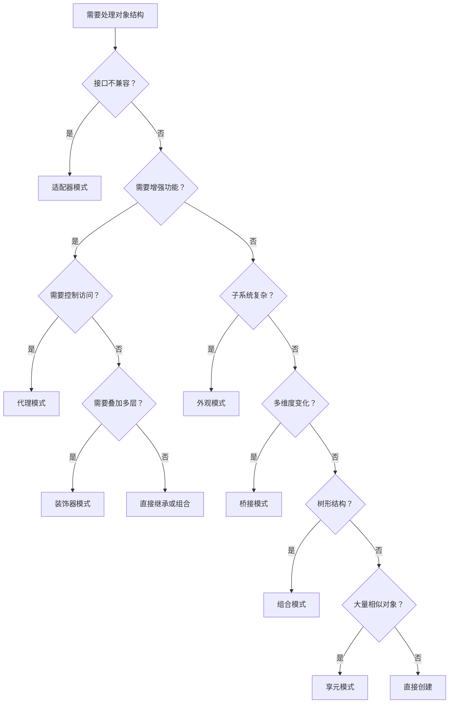

# 结构型模式对比 — 选型指南

> **一句话记忆口诀**：适配器转接口、装饰器加功能、代理控访问、外观简化入口、桥接分离维度、组合统一树形、享元共享复用。

## 1. 七种结构型模式一览

| 模式 | 核心思想 | 一句话 | 关键词 |
|------|---------|--------|--------|
| **适配器** | 接口转换 | 充电器转接头 | 兼容、转换 |
| **装饰器** | 动态增强 | 手机壳套手机 | 叠加、透明 |
| **代理** | 控制访问 | 明星经纪人 | 拦截、AOP |
| **外观** | 统一入口 | 酒店前台 | 简化、封装 |
| **桥接** | 分离维度 | 遥控器与电视 | 抽象与实现 |
| **组合** | 树形统一 | 文件系统 | 部分-整体 |
| **享元** | 共享复用 | 共享单车 | 内部/外部状态 |

## 2. 最容易混淆的三兄弟：适配器 vs 装饰器 vs 代理

这三个模式**结构相似**（都持有一个被包装对象的引用），但**意图完全不同**：

### 2.1 生活类比

| 模式 | 类比 | 做什么 |
|------|------|--------|
| **适配器** | 充电器转接头 | 让不兼容的插头能插进插座 |
| **装饰器** | 手机壳 | 给手机加保护、加支架、加卡包 |
| **代理** | 经纪人 | 代替明星处理合同、档期、费用 |

### 2.2 详细对比

```java
// ===== 适配器：接口转换 =====
// 目标：让老接口适配新接口
class OldToNewAdapter implements NewInterface {
    private OldInterface old; // 持有老接口引用
    public OldToNewAdapter(OldInterface old) { this.old = old; }
    public void newMethod() {
        old.oldMethod(); // 转换调用
    }
}

// ===== 装饰器：功能增强 =====
// 目标：给对象叠加新功能
class BufferDecorator implements InputStream {
    private InputStream wrapped; // 持有被装饰对象
    public BufferDecorator(InputStream is) { this.wrapped = is; }
    public int read() {
        // 添加缓冲功能
        return wrapped.read();
    }
}

// ===== 代理：控制访问 =====
// 目标：控制对对象的访问
class SecurityProxy implements OrderService {
    private OrderService real; // 持有真实对象
    public SecurityProxy(OrderService real) { this.real = real; }
    public void createOrder(Order o) {
        checkPermission(); // 权限校验
        real.createOrder(o);
    }
}
```

### 2.3 三者核心区别

| 对比维度 | 适配器 | 装饰器 | 代理 |
|---------|--------|--------|------|
| **目的** | 接口兼容 | 功能增强 | 访问控制 |
| **被包装对象来源** | 外部传入 | 外部传入 | 通常自己创建 |
| **是否改变接口** | ✅ 改变（转换） | ❌ 不改变（同接口） | ❌ 不改变（同接口） |
| **调用方是否知情** | 知道在适配 | 知道在装饰 | **不知道**在代理 |
| **能否叠加** | ❌ 通常一层 | ✅ 多层叠加 | ❌ 通常一层 |
| **典型例子** | `InputStreamReader` | `BufferedInputStream` | Spring AOP |

## 3. 外观 vs 中介者（结构相似但意图不同）

| 对比维度 | 外观模式 | 中介者模式 |
|---------|---------|----------|
| **目的** | 简化子系统访问 | 协调多个对象交互 |
| **子系统是否知道外观** | ❌ 不知道 | ✅ 同事类知道中介者 |
| **交互方向** | 单向（客户端→子系统） | 双向（同事↔中介者↔同事） |
| **典型例子** | `JdbcTemplate` | 聊天室、MQ |

## 4. 组合 vs 装饰器（结构相似但意图不同）

| 对比维度 | 组合模式 | 装饰器模式 |
|---------|---------|----------|
| **目的** | 树形结构统一处理 | 动态叠加功能 |
| **子节点数量** | 多个子节点 | 通常一个被包装对象 |
| **递归** | ✅ 递归处理所有子节点 | ❌ 单链调用 |
| **典型例子** | 文件系统、菜单树 | IO 流 |

## 5. 决策树：如何选择结构型模式



## 6. Spring 中的结构型模式

| 模式 | Spring 中的应用 | 说明 |
|------|----------------|------|
| **适配器** | `HandlerAdapter` | 将不同类型的 Handler 适配为统一调用 |
| **装饰器** | `HttpServletRequestWrapper` | 装饰请求对象 |
| **代理** | `@Transactional`、`@Cacheable` | AOP 动态代理 |
| **外观** | `JdbcTemplate`、`RestTemplate` | 封装复杂操作 |
| **桥接** | `PlatformTransactionManager` | 事务抽象与实现分离 |
| **组合** | `CompositeCacheManager` | 组合多个缓存管理器 |
| **享元** | Bean 作用域管理 | 单例 Bean 缓存复用 |

## 7. 常见误区

### 7.1 误区一：适配器 vs 装饰器搞混

```java
// ❌ 错误：用适配器增强功能（应该用装饰器）
class EnhancedServiceAdapter implements Service {
    private OldService old;
    public void doWork() {
        old.doWork();
        log(); // 增强功能 → 应该用装饰器
    }
}

// ✅ 正确：
// 适配器 = 接口转换（不兼容 → 兼容）
// 装饰器 = 功能增强（原来能用 → 更好用）
```

### 7.2 误区二：代理模式自调用失效

```java
// ❌ Spring AOP 自调用失效
@Service
public class OrderService {
    public void create() {
        this.save(); // this 是真实对象，不走代理！
    }

    @Transactional
    public void save() { /* 事务不生效！ */ }
}

// ✅ 注入自身代理
@Autowired private OrderService self;
public void create() { self.save(); } // 通过代理调用
```

### 7.3 误区三：享元模式过度使用

```java
// ❌ 对象数量少、内部状态占比低时，享元模式得不偿失
// 只有 3 个对象，享元工厂的开销比直接 new 还大

// ✅ 只在对象数量大（>1000）、内部状态重复率高时使用
```

## 8. 总结：面试回答模板

**面试官问：结构型模式怎么选？**

> 选择标准：
>
> 1. **接口不兼容** → 适配器（如老系统迁移、第三方库集成）
> 2. **功能增强且可叠加** → 装饰器（如 IO 流、缓存包装）
> 3. **控制访问** → 代理（如 AOP、权限、延迟加载）
> 4. **子系统复杂** → 外观（如 JdbcTemplate 封装 JDBC 操作）
> 5. **多维度变化** → 桥接（如 JDBC 驱动、跨平台 UI）
> 6. **树形结构** → 组合（如文件系统、菜单树）
> 7. **大量相似对象** → 享元（如 String 常量池、线程池）
>
> 最容易混淆的是适配器、装饰器、代理，核心区别看**意图**：转换接口 vs 增强功能 vs 控制访问。
