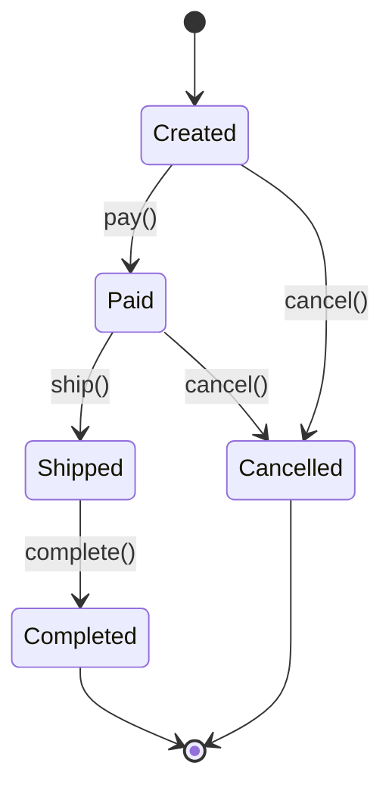

# 状态模式（State Pattern）

> **一句话记忆口诀**：状态模式消灭 if-else，每种状态一个类，状态自动转换，订单状态机是最经典的例子。

## 1. 🏠 生活类比

**自动售货机**：售货机有不同的状态——待投币、已投币、出货中、缺货。每个状态下可用的操作不同：

- 待投币：只能投币，不能选商品
- 已投币：可以选商品，也可以退币
- 出货中：什么都不能做，等出货完成
- 缺货：什么都不能做，等补货

状态机会根据当前状态决定允许哪些操作，以及操作后转换到什么状态。

## 2. 💩 烂代码：if-else 地狱

```java
// ❌ 反例：订单状态处理的 if-else 地狱
public class Order {
    private String state; // "CREATED", "PAID", "SHIPPED", "COMPLETED", "CANCELLED"

    public void pay() {
        if ("CREATED".equals(state)) {
            System.out.println("支付成功");
            state = "PAID";
        } else if ("PAID".equals(state)) {
            throw new RuntimeException("已支付，不能重复支付");
        } else if ("SHIPPED".equals(state)) {
            throw new RuntimeException("已发货，不能支付");
        } else if ("COMPLETED".equals(state)) {
            throw new RuntimeException("已完成，不能支付");
        } else if ("CANCELLED".equals(state)) {
            throw new RuntimeException("已取消，不能支付");
        }
    }

    public void ship() {
        if ("CREATED".equals(state)) {
            throw new RuntimeException("未支付，不能发货");
        } else if ("PAID".equals(state)) {
            System.out.println("发货成功");
            state = "SHIPPED";
        } else if ("SHIPPED".equals(state)) {
            throw new RuntimeException("已发货，不能重复发货");
        }
        // ... 每个方法都要写 5 个 if-else！
    }

    public void cancel() {
        // 又是 5 个 if-else...
    }
}

// 5 个状态 × 4 个操作 = 20 个 if-else 分支！
// 新增一个状态？所有方法都要加 else if！
```

**问题根因**：对象的行为随状态变化，用 if-else 硬编码导致代码膨胀、难以维护和扩展。

## 3. ✨ 状态模式方案

将每种状态封装为一个独立类，状态转换逻辑分散到各状态类中：



## 4. 💻 完整代码实现

```java
// ===== 状态接口 =====
public interface OrderState {
    void pay(OrderContext context);
    void ship(OrderContext context);
    void complete(OrderContext context);
    void cancel(OrderContext context);
    String getStateName();
}

// ===== 具体状态：已创建（待支付）=====
public class CreatedState implements OrderState {
    @Override
    public void pay(OrderContext context) {
        System.out.println("✅ 支付成功，订单金额: " + context.getAmount());
        context.setState(new PaidState());
    }

    @Override
    public void ship(OrderContext context) {
        throw new IllegalStateException("未支付，不能发货");
    }

    @Override
    public void complete(OrderContext context) {
        throw new IllegalStateException("未支付，不能完成");
    }

    @Override
    public void cancel(OrderContext context) {
        System.out.println("❌ 订单已取消");
        context.setState(new CancelledState());
    }

    @Override
    public String getStateName() { return "待支付"; }
}

// ===== 具体状态：已支付 =====
public class PaidState implements OrderState {
    @Override
    public void pay(OrderContext context) {
        throw new IllegalStateException("已支付，不能重复支付");
    }

    @Override
    public void ship(OrderContext context) {
        System.out.println("🚚 订单已发货，快递单号: " + generateTrackingNo());
        context.setState(new ShippedState());
    }

    @Override
    public void complete(OrderContext context) {
        throw new IllegalStateException("未发货，不能确认收货");
    }

    @Override
    public void cancel(OrderContext context) {
        System.out.println("❌ 订单已取消，退款处理中...");
        context.setState(new CancelledState());
    }

    @Override
    public String getStateName() { return "已支付"; }

    private String generateTrackingNo() {
        return "SF" + System.currentTimeMillis();
    }
}

// ===== 具体状态：已发货 =====
public class ShippedState implements OrderState {
    @Override
    public void pay(OrderContext context) {
        throw new IllegalStateException("已发货，不能支付");
    }

    @Override
    public void ship(OrderContext context) {
        throw new IllegalStateException("已发货，不能重复发货");
    }

    @Override
    public void complete(OrderContext context) {
        System.out.println("🎉 订单已完成，感谢购买！");
        context.setState(new CompletedState());
    }

    @Override
    public void cancel(OrderContext context) {
        throw new IllegalStateException("已发货，不能取消");
    }

    @Override
    public String getStateName() { return "已发货"; }
}

// ===== 具体状态：已完成 =====
public class CompletedState implements OrderState {
    @Override
    public void pay(OrderContext context) {
        throw new IllegalStateException("订单已完成");
    }
    @Override
    public void ship(OrderContext context) {
        throw new IllegalStateException("订单已完成");
    }
    @Override
    public void complete(OrderContext context) {
        throw new IllegalStateException("订单已完成");
    }
    @Override
    public void cancel(OrderContext context) {
        throw new IllegalStateException("订单已完成，不能取消");
    }
    @Override
    public String getStateName() { return "已完成"; }
}

// ===== 具体状态：已取消 =====
public class CancelledState implements OrderState {
    @Override
    public void pay(OrderContext context) {
        throw new IllegalStateException("订单已取消");
    }
    @Override
    public void ship(OrderContext context) {
        throw new IllegalStateException("订单已取消");
    }
    @Override
    public void complete(OrderContext context) {
        throw new IllegalStateException("订单已取消");
    }
    @Override
    public void cancel(OrderContext context) {
        throw new IllegalStateException("订单已取消");
    }
    @Override
    public String getStateName() { return "已取消"; }
}

// ===== 上下文：订单 =====
public class OrderContext {
    private OrderState state;
    private final String orderId;
    private final BigDecimal amount;

    public OrderContext(String orderId, BigDecimal amount) {
        this.orderId = orderId;
        this.amount = amount;
        this.state = new CreatedState(); // 初始状态
    }

    public void setState(OrderState state) {
        System.out.println("状态变更: " + this.state.getStateName() + " → " + state.getStateName());
        this.state = state;
    }

    // 委托给当前状态对象处理
    public void pay() { state.pay(this); }
    public void ship() { state.ship(this); }
    public void complete() { state.complete(this); }
    public void cancel() { state.cancel(this); }

    public String getCurrentState() { return state.getStateName(); }
    public String getOrderId() { return orderId; }
    public BigDecimal getAmount() { return amount; }
}

// ===== 使用示例 =====
public class Main {
    public static void main(String[] args) {
        OrderContext order = new OrderContext("ORD-001", new BigDecimal("299.00"));
        System.out.println("当前状态: " + order.getCurrentState());

        order.pay();      // 待支付 → 已支付
        order.ship();     // 已支付 → 已发货
        order.complete(); // 已发货 → 已完成

        // 非法操作会抛异常
        try {
            order.cancel(); // 已完成，不能取消
        } catch (IllegalStateException e) {
            System.out.println("操作失败: " + e.getMessage());
        }
    }
}
```

## 5. 🔧 框架应用

| 框架/类 | 说明 |
|--------|------|
| Spring State Machine | Spring 官方状态机框架 |
| `Thread.State` | 线程状态：NEW → RUNNABLE → BLOCKED → WAITING → TERMINATED |
| TCP 连接状态 | LISTEN → SYN_SENT → ESTABLISHED → FIN_WAIT → CLOSED |
| `Lifecycle` 接口 | Spring Bean 生命周期状态管理 |
| `OrderStatus` 枚举 | 电商系统订单状态机 |

## 6. ⚠️ 适用场景

**适合：**

- 对象的行为随**内部状态**改变而改变
- 代码中存在大量与**状态相关的条件分支**
- 状态转换规则明确，可以用状态图表示
- 典型场景：订单状态机、审批流程、游戏状态

**不适合：**

- 状态很少（2-3个）且不会增加 → 简单 if-else 更清晰
- 状态转换规则不明确 → 先梳理清楚再设计

## 7. 🔍 状态模式 vs 策略模式

| 对比维度 | 状态模式 | 策略模式 |
|---------|---------|---------|
| **切换方式** | 状态**自动转换**（内部驱动） | 客户端**主动选择**（外部驱动） |
| **关注点** | 对象在不同状态下的**行为差异** | **算法**的可替换性 |
| **状态感知** | 状态对象**知道**下一个状态是什么 | 策略对象**不知道**其他策略 |
| **典型场景** | 订单状态机、TCP 连接状态 | 支付方式选择、排序算法 |

> **一句话记忆口诀**：状态模式把每种状态封装为类，消灭 if-else，状态自动转换，`Thread.State` 和订单状态机是最经典的例子。
