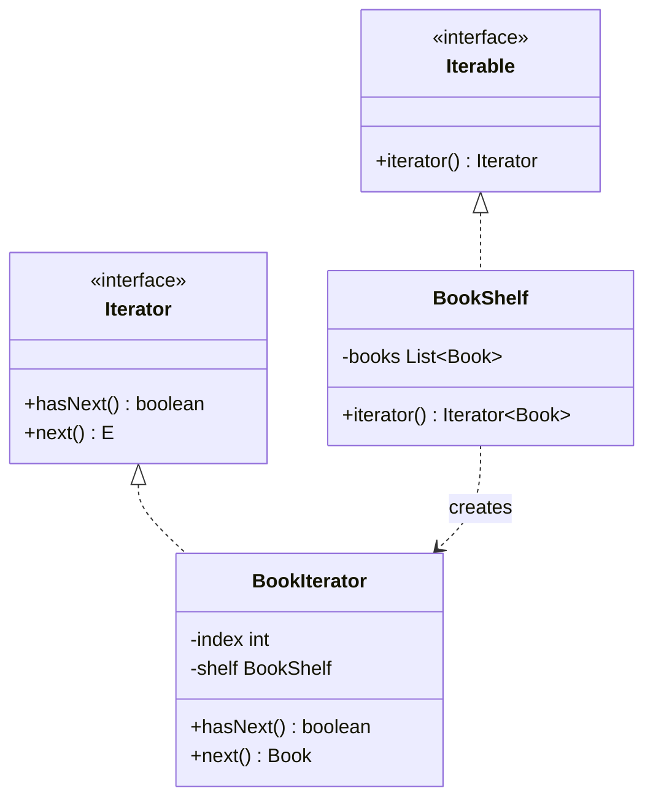

# 迭代器模式（Iterator Pattern）

> **一句话记忆口诀**：迭代器统一遍历接口，hasNext + next 是核心，for-each 语法糖底层就是迭代器。

## 1. 🏠 生活类比

**电视遥控器的"下一个频道"按钮**：无论电视内部是用数组、链表还是哈希表存储频道列表，用户只需要按"下一个"就能遍历所有频道。用户不需要知道频道是怎么存储的。

**图书馆的索引卡片**：无论书架上的书怎么排列，索引卡片提供了一种统一的方式来逐本查找。

## 2. 💩 烂代码：遍历方式与集合类型强耦合

```java
// ❌ 反例：每种集合都要用不同的遍历方式
// 数组遍历
String[] array = {"a", "b", "c"};
for (int i = 0; i < array.length; i++) {
    System.out.println(array[i]);
}

// 链表遍历
LinkedList<String> list = new LinkedList<>();
for (Node node = list.head; node != null; node = node.next) {
    System.out.println(node.value);
}

// 二叉树遍历（中序）
void inorder(TreeNode node) {
    if (node == null) return;
    inorder(node.left);
    System.out.println(node.value);
    inorder(node.right);
}

// 如果集合类型从数组换成链表，遍历代码全部要改！
// 客户端必须了解每种集合的内部结构！
```

**问题根因**：不同集合有不同的内部结构和遍历方式，客户端与集合的具体实现强耦合。

## 3. ✨ 迭代器模式方案



## 4. 💻 完整代码实现

```java
import java.util.*;

// ===== 自定义集合：书架 =====
public class BookShelf implements Iterable<Book> {
    private final List<Book> books = new ArrayList<>();

    public void addBook(Book book) {
        books.add(book);
    }

    public Book getBookAt(int index) {
        return books.get(index);
    }

    public int size() {
        return books.size();
    }

    @Override
    public Iterator<Book> iterator() {
        return new BookIterator(this);
    }
}

// ===== 书籍 =====
public class Book {
    private final String name;
    private final String author;

    public Book(String name, String author) {
        this.name = name;
        this.author = author;
    }

    public String getName() { return name; }
    public String getAuthor() { return author; }

    @Override
    public String toString() {
        return "《" + name + "》- " + author;
    }
}

// ===== 具体迭代器 =====
public class BookIterator implements Iterator<Book> {
    private final BookShelf shelf;
    private int index = 0;

    public BookIterator(BookShelf shelf) {
        this.shelf = shelf;
    }

    @Override
    public boolean hasNext() {
        return index < shelf.size();
    }

    @Override
    public Book next() {
        if (!hasNext()) {
            throw new NoSuchElementException();
        }
        Book book = shelf.getBookAt(index);
        index++;
        return book;
    }
}

// ===== 使用示例 =====
public class Main {
    public static void main(String[] args) {
        BookShelf shelf = new BookShelf();
        shelf.addBook(new Book("设计模式", "GoF"));
        shelf.addBook(new Book("重构", "Martin Fowler"));
        shelf.addBook(new Book("Effective Java", "Joshua Bloch"));

        // 方式一：显式使用迭代器
        Iterator<Book> it = shelf.iterator();
        while (it.hasNext()) {
            System.out.println(it.next());
        }

        // 方式二：for-each 语法糖（底层就是迭代器）
        for (Book book : shelf) {
            System.out.println(book);
        }

        // 方式三：Stream（内部迭代）
        shelf.stream()
             .filter(b -> b.getName().contains("设计"))
             .forEach(System.out::println);
    }
}
```

### 4.1 进阶示例：支持多种遍历方式的迭代器

```java
// ===== 二叉树支持前序、中序、后序遍历 =====
public class BinaryTree<T> implements Iterable<T> {
    private TreeNode<T> root;
    private TraversalOrder order = TraversalOrder.INORDER;

    public enum TraversalOrder { PREORDER, INORDER, POSTORDER }

    public void setOrder(TraversalOrder order) { this.order = order; }

    @Override
    public Iterator<T> iterator() {
        return switch (order) {
            case PREORDER -> new PreorderIterator<>(root);
            case INORDER -> new InorderIterator<>(root);
            case POSTORDER -> new PostorderIterator<>(root);
        };
    }

    // 中序迭代器实现
    private static class InorderIterator<T> implements Iterator<T> {
        private final Stack<TreeNode<T>> stack = new Stack<>();

        public InorderIterator(TreeNode<T> root) {
            pushLeft(root);
        }

        private void pushLeft(TreeNode<T> node) {
            while (node != null) {
                stack.push(node);
                node = node.left;
            }
        }

        @Override
        public boolean hasNext() { return !stack.isEmpty(); }

        @Override
        public T next() {
            TreeNode<T> node = stack.pop();
            pushLeft(node.right);
            return node.value;
        }
    }
}

class TreeNode<T> {
    T value;
    TreeNode<T> left, right;
    TreeNode(T value) { this.value = value; }
}
```

## 5. 🔧 框架应用

| 框架/类 | 说明 |
|--------|------|
| `java.util.Iterator` | JDK 标准迭代器接口 |
| `Iterable` + for-each | 语法糖，编译后使用 Iterator |
| `java.util.stream.Stream` | Java 8 内部迭代器，支持惰性求值 |
| `ListIterator` | 双向迭代器，支持向前/向后遍历 |
| `Enumeration` | JDK 1.0 的迭代器（已被 Iterator 替代） |
| MyBatis `Cursor` | 大数据量查询的流式迭代器 |
| `ResultSet` | JDBC 结果集遍历 |

## 6. ⚠️ 适用场景

**适合：**
- 需要**统一遍历**不同类型的集合
- 不想暴露集合的**内部结构**
- 需要**多种遍历方式**（前序/中序/后序）
- 需要**延迟加载**（Stream 的惰性求值）

**不适合：**
- 集合结构简单，直接 for 循环即可
- 需要随机访问（迭代器只能顺序访问）

## 7. 🔍 迭代器的 fail-fast vs fail-safe

| 类型 | 代表 | 特点 |
|------|------|------|
| **fail-fast** | `ArrayList.iterator()` | 遍历中修改集合 → 抛 `ConcurrentModificationException` |
| **fail-safe** | `CopyOnWriteArrayList.iterator()` | 遍历中修改集合 → 不抛异常（遍历的是快照） |

```java
// fail-fast 示例
List<String> list = new ArrayList<>(Arrays.asList("a", "b", "c"));
for (String s : list) {
    if ("b".equals(s)) list.remove(s); // ❌ ConcurrentModificationException
}

// 正确做法：使用迭代器的 remove 方法
Iterator<String> it = list.iterator();
while (it.hasNext()) {
    if ("b".equals(it.next())) it.remove(); // ✅ 安全删除
}
```

> **一句话记忆口诀**：迭代器提供统一的遍历接口（hasNext/next），for-each 底层就是迭代器，`java.util.Iterator` 和 `Iterable` 是 JDK 中最标准的实现。
