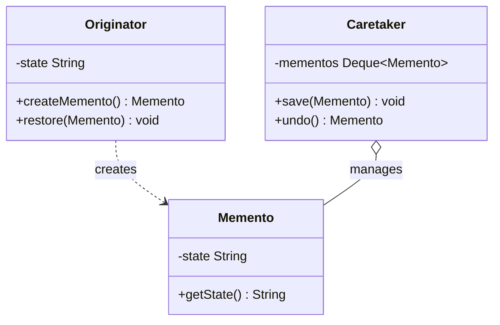

# 备忘录模式（Memento Pattern）

> **一句话记忆口诀**：备忘录在不破坏封装的前提下保存对象状态快照，支持撤销/回滚，Git commit 和数据库Undo Log是最经典的例子。

## 1. 🏠 生活类比

**游戏存档**：玩家可以在关键节点保存进度（创建备忘录），失败后读取存档恢复到之前的状态。存档文件（备忘录）保存了游戏的完整状态，但玩家不需要知道游戏内部的数据结构。

**Ctrl+Z 撤销**：文本编辑器中每次操作后保存一份快照，按 Ctrl+Z 就能恢复到上一步的状态。

## 2. 💩 烂代码：保存状态破坏封装

```java
// ❌ 反例：直接暴露对象内部状态来实现撤销
public class TextEditor {
    public String content = "";     // 公开字段！
    public int cursorPos = 0;      // 公开字段！
    public List<String> history = new ArrayList<>(); // 公开字段！

    public void save() {
        // 保存状态 —— 但外部可以直接修改这些字段！
        history.add(content);
    }

    public void undo() {
        if (!history.isEmpty()) {
            content = history.remove(history.size() - 1);
        }
    }
}

// 外部代码可以直接修改 editor.content，破坏状态一致性！
editor.content = "被篡改了";
```

**问题根因**：为了实现撤销功能，不得不暴露对象的内部状态，破坏了封装性。

## 3. ✨ 备忘录模式方案



三个角色：
- **发起人（Originator）**：需要保存状态的对象（如文本编辑器）
- **备忘录（Memento）**：保存状态快照的不可变对象
- **管理者（Caretaker）**：管理备忘录的历史记录

## 4. 💻 完整代码实现

```java
import java.util.*;

// ===== 备忘录：保存状态快照（不可变）=====
public class EditorMemento {
    private final String content;         // 文本内容
    private final int cursorPosition;     // 光标位置
    private final LocalDateTime timestamp; // 保存时间

    public EditorMemento(String content, int cursorPosition) {
        this.content = content;
        this.cursorPosition = cursorPosition;
        this.timestamp = LocalDateTime.now();
    }

    // 只提供 getter，不提供 setter（不可变，保证状态不被篡改）
    public String getContent() { return content; }
    public int getCursorPosition() { return cursorPosition; }
    public LocalDateTime getTimestamp() { return timestamp; }
}

// ===== 发起人：文本编辑器 =====
public class TextEditor {
    private String content = "";
    private int cursorPosition = 0;

    public void type(String text) {
        // 在光标位置插入文本
        content = content.substring(0, cursorPosition) + text + content.substring(cursorPosition);
        cursorPosition += text.length();
    }

    public void delete(int count) {
        int start = Math.max(0, cursorPosition - count);
        content = content.substring(0, start) + content.substring(cursorPosition);
        cursorPosition = start;
    }

    public void moveCursor(int position) {
        cursorPosition = Math.max(0, Math.min(position, content.length()));
    }

    // 创建备忘录（保存当前状态）
    public EditorMemento save() {
        return new EditorMemento(content, cursorPosition);
    }

    // 从备忘录恢复状态
    public void restore(EditorMemento memento) {
        this.content = memento.getContent();
        this.cursorPosition = memento.getCursorPosition();
    }

    @Override
    public String toString() {
        return "内容: \"" + content + "\"，光标位置: " + cursorPosition;
    }
}

// ===== 管理者：历史记录管理 =====
public class History {
    private final Deque<EditorMemento> snapshots = new ArrayDeque<>();
    private final int maxSize;

    public History(int maxSize) {
        this.maxSize = maxSize;
    }

    public void push(EditorMemento memento) {
        if (snapshots.size() >= maxSize) {
            snapshots.removeLast(); // 移除最旧的快照
        }
        snapshots.push(memento);
    }

    public EditorMemento pop() {
        return snapshots.isEmpty() ? null : snapshots.pop();
    }

    public boolean canUndo() {
        return !snapshots.isEmpty();
    }
}

// ===== 使用示例 =====
public class Main {
    public static void main(String[] args) {
        TextEditor editor = new TextEditor();
        History history = new History(10);

        // 输入文字，每次操作后保存状态
        editor.type("Hello");
        history.push(editor.save());
        System.out.println("1: " + editor);

        editor.type(" World");
        history.push(editor.save());
        System.out.println("2: " + editor);

        editor.type("!");
        System.out.println("3: " + editor);

        // 撤销两次
        editor.restore(history.pop());
        System.out.println("撤销1次: " + editor); // Hello World

        editor.restore(history.pop());
        System.out.println("撤销2次: " + editor); // Hello
    }
}
```

### 4.1 进阶示例：数据库事务回滚

```java
// ===== 场景：数据库事务的 Undo Log =====
public class DatabaseTransaction {
    private final Map<String, String> data = new HashMap<>();
    private final Deque<Memento> undoLog = new ArrayDeque<>();

    // 保存当前状态快照
    public void begin() {
        undoLog.push(new Memento(new HashMap<>(data)));
        System.out.println("事务开始，保存快照");
    }

    public void put(String key, String value) {
        data.put(key, value);
        System.out.println("写入: " + key + "=" + value);
    }

    public String get(String key) {
        return data.get(key);
    }

    // 提交：清除快照
    public void commit() {
        undoLog.clear();
        System.out.println("事务提交");
    }

    // 回滚：恢复到最近的快照
    public void rollback() {
        if (undoLog.isEmpty()) {
            throw new IllegalStateException("没有可回滚的快照");
        }
        Memento snapshot = undoLog.pop();
        data.clear();
        data.putAll(snapshot.getState());
        System.out.println("事务回滚，恢复到快照状态");
    }

    // 备忘录
    private static class Memento {
        private final Map<String, String> state;
        Memento(Map<String, String> state) { this.state = state; }
        Map<String, String> getState() { return state; }
    }
}

// 使用
DatabaseTransaction tx = new DatabaseTransaction();
tx.begin();
tx.put("user:1", "Alice");
tx.put("user:2", "Bob");
tx.rollback(); // 回滚，user:1 和 user:2 的修改被撤销
```

## 5. 🔧 框架应用

| 框架/类 | 说明 |
| :-- | :-- |
| 数据库 Undo Log | 事务回滚时恢复数据的历史状态 |
| Git 版本控制 | 每次 commit 就是一个备忘录（代码快照） |
| Spring `@Transactional` 回滚 | 事务失败时恢复到事务开始前的状态 |
| `Serializable` | 序列化就是保存对象状态的一种方式 |
| `Prototype` 模式 | 原型模式的 clone 也可以看作创建备忘录的一种方式 |
| 编辑器历史记录 | IDE 的 Ctrl+Z 功能 |

## 6. ⚠️ 适用场景

**适合：**

- 需要保存对象的**历史状态**以支持撤销/回滚
- 不想暴露对象的**内部实现细节**
- 典型场景：文本编辑器、绘图软件、数据库事务、游戏存档

**不适合：**

- 对象状态很大，频繁保存快照会消耗大量内存
- 状态变化频率极高（如每帧都变）→ 考虑增量快照或命令模式

### 6.1 内存优化技巧

```java
// 1. 限制历史记录数量
History history = new History(50); // 只保留最近 50 个快照

// 2. 增量快照：只保存变化的部分
class DeltaMemento {
    private final Map<String, Object> changes; // 只记录变化的字段
}

// 3. 压缩存储：对旧快照进行压缩
```

> **一句话记忆口诀**：备忘录保存对象状态快照，不破坏封装，支持撤销/回滚，Git commit 和数据库 Undo Log 是最经典的例子。
