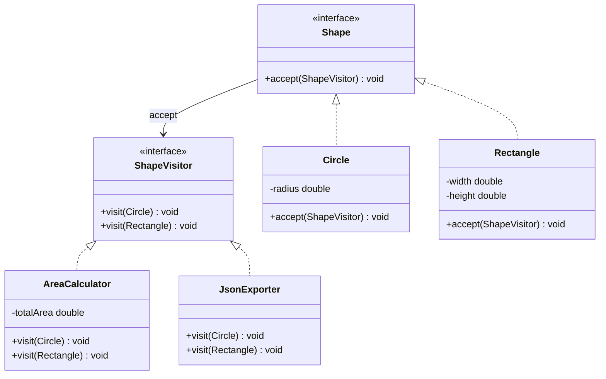

# 访问者模式（Visitor Pattern）

> **一句话记忆口诀**：访问者将数据结构与数据操作分离，通过双分派实现运行期方法选择，编译器AST遍历是最经典的例子。

## 1. 🏠 生活类比

**税务审计**：公司的各个部门（研发部、销售部、财务部）结构稳定，但审计方式经常变化（所得税审计、增值税审计、社保审计）。新增一种审计方式时，不需要修改部门结构，只需要新增一个审计员。

**快递员送快递**：小区的住户结构稳定（A栋、B栋、C栋），但配送方式可以变化（普通快递、生鲜冷链、大件物流）。新增一种配送方式不影响住户结构。

## 2. 💩 烂代码：操作放在元素类中导致职责膨胀

```java
// ❌ 反例：每新增一种操作，所有元素类都要修改
public class Circle {
    private double radius;

    public double area() { return Math.PI * radius * radius; }
    public String toJson() { return "{\"type\":\"circle\",\"radius\":" + radius + "}"; }
    public String toXml() { return "<circle radius=\"" + radius + "\"/>"; }
    public void render(Graphics g) { g.drawCircle(radius); }
    public void exportToSvg() { /* ... */ }
    // 新增"导出 PDF"？Circle、Rectangle、Triangle 全部要改！
    // 新增"计算周长"？所有形状类都要改！
}

public class Rectangle {
    private double width, height;

    public double area() { return width * height; }
    public String toJson() { return "{\"type\":\"rect\",\"w\":" + width + "}"; }
    public String toXml() { return "<rect width=\"" + width + "\"/>"; }
    public void render(Graphics g) { g.drawRect(width, height); }
    // 又是重复的操作方法...
}
```

**问题根因**：数据结构（形状）和数据操作（面积计算、JSON导出、渲染）耦合在一起，新增操作需要修改所有元素类，违反开闭原则。

## 3. ✨ 访问者模式方案

将操作抽取到独立的 Visitor 类中，元素类只提供 `accept()` 方法：



## 4. 💻 完整代码实现

```java
import java.util.*;

// ===== 访问者接口 =====
public interface ShapeVisitor {
    void visit(Circle circle);
    void visit(Rectangle rectangle);
    void visit(Triangle triangle);
}

// ===== 元素接口 =====
public interface Shape {
    void accept(ShapeVisitor visitor); // 双分派的关键
}

// ===== 具体元素 =====
public class Circle implements Shape {
    private final double radius;

    public Circle(double radius) {
        this.radius = radius;
    }

    public double getRadius() { return radius; }

    @Override
    public void accept(ShapeVisitor visitor) {
        visitor.visit(this); // 第二次分派：根据 this 的类型调用对应 visit 方法
    }
}

public class Rectangle implements Shape {
    private final double width;
    private final double height;

    public Rectangle(double width, double height) {
        this.width = width;
        this.height = height;
    }

    public double getWidth() { return width; }
    public double getHeight() { return height; }

    @Override
    public void accept(ShapeVisitor visitor) {
        visitor.visit(this);
    }
}

public class Triangle implements Shape {
    private final double a, b, c; // 三条边

    public Triangle(double a, double b, double c) {
        this.a = a;
        this.b = b;
        this.c = c;
    }

    public double getA() { return a; }
    public double getB() { return b; }
    public double getC() { return c; }

    @Override
    public void accept(ShapeVisitor visitor) {
        visitor.visit(this);
    }
}

// ===== 具体访问者1：计算面积 =====
public class AreaCalculator implements ShapeVisitor {
    private double totalArea = 0;

    @Override
    public void visit(Circle circle) {
        totalArea += Math.PI * circle.getRadius() * circle.getRadius();
    }

    @Override
    public void visit(Rectangle rectangle) {
        totalArea += rectangle.getWidth() * rectangle.getHeight();
    }

    @Override
    public void visit(Triangle triangle) {
        // 海伦公式
        double s = (triangle.getA() + triangle.getB() + triangle.getC()) / 2;
        totalArea += Math.sqrt(s * (s - triangle.getA()) * (s - triangle.getB()) * (s - triangle.getC()));
    }

    public double getTotalArea() { return totalArea; }
}

// ===== 具体访问者2：导出 JSON =====
public class JsonExporter implements ShapeVisitor {
    private final List<String> jsonList = new ArrayList<>();

    @Override
    public void visit(Circle circle) {
        jsonList.add("{\"type\":\"circle\",\"radius\":" + circle.getRadius() + "}");
    }

    @Override
    public void visit(Rectangle rectangle) {
        jsonList.add("{\"type\":\"rectangle\",\"width\":" + rectangle.getWidth()
                + ",\"height\":" + rectangle.getHeight() + "}");
    }

    @Override
    public void visit(Triangle triangle) {
        jsonList.add("{\"type\":\"triangle\",\"a\":" + triangle.getA()
                + ",\"b\":" + triangle.getB() + ",\"c\":" + triangle.getC() + "}");
    }

    public String export() {
        return "[" + String.join(",", jsonList) + "]";
    }
}

// ===== 具体访问者3：绘制（模拟）=====
public class Renderer implements ShapeVisitor {
    @Override
    public void visit(Circle circle) {
        System.out.println("绘制圆形，半径=" + circle.getRadius());
    }

    @Override
    public void visit(Rectangle rectangle) {
        System.out.println("绘制矩形，宽=" + rectangle.getWidth() + "，高=" + rectangle.getHeight());
    }

    @Override
    public void visit(Triangle triangle) {
        System.out.println("绘制三角形，边长=" + triangle.getA() + "," + triangle.getB() + "," + triangle.getC());
    }
}

// ===== 使用示例 =====
public class Main {
    public static void main(String[] args) {
        List<Shape> shapes = List.of(
            new Circle(5.0),
            new Rectangle(3.0, 4.0),
            new Triangle(3.0, 4.0, 5.0)
        );

        // 计算总面积
        AreaCalculator calc = new AreaCalculator();
        shapes.forEach(s -> s.accept(calc));
        System.out.printf("总面积: %.2f%n", calc.getTotalArea());

        // 导出 JSON（新增操作，不修改任何 Shape 类！）
        JsonExporter json = new JsonExporter();
        shapes.forEach(s -> s.accept(json));
        System.out.println("JSON: " + json.export());

        // 绘制（新增操作，不修改任何 Shape 类！）
        Renderer renderer = new Renderer();
        shapes.forEach(s -> s.accept(renderer));
    }
}
```

## 5. 🔧 框架应用

| 框架/类 | 说明 |
|--------|------|
| 编译器 AST 遍历 | 对语法树节点执行不同操作（类型检查、代码生成） |
| Spring `BeanDefinitionVisitor` | 访问并处理 BeanDefinition 中的属性值 |
| `java.nio.file.FileVisitor` | 遍历文件树时执行不同操作（`visitFile`、`visitDirectory`） |
| Lombok `AbstractAnnotationProcessor` | 注解处理器遍历 AST |
| Jackson `JsonSerializer` | 对不同类型执行不同的序列化逻辑 |

### 5.1 NIO FileVisitor 示例

```java
// JDK 内置的访问者模式
Path start = Paths.get("/tmp");
Files.walkFileTree(start, new SimpleFileVisitor<Path>() {
    @Override
    public FileVisitResult visitFile(Path file, BasicFileAttributes attrs) {
        System.out.println("文件: " + file);
        return FileVisitResult.CONTINUE;
    }

    @Override
    public FileVisitResult visitFileFailed(Path file, IOException exc) {
        System.err.println("访问失败: " + file);
        return FileVisitResult.CONTINUE;
    }
});
```

## 6. ⚠️ 适用场景

**适合：**
- 数据结构**稳定**（元素类型不常变）
- 需要对数据结构执行**多种不同且不相关的操作**
- 操作经常变化，但元素结构很少变化
- 典型场景：编译器、报表生成、文档导出

**不适合：**
- 元素类型经常新增（每新增一种元素，所有 Visitor 都要改）
- 操作很少，只有 1-2 种 → 直接放在元素类中更简单

### 6.1 双分派机制

```java
// 第一次分派：编译时确定调用 accept 的具体类型（多态）
shape.accept(visitor);

// 第二次分派：运行时根据 this 的类型选择对应的 visit 方法
// Circle.accept → visitor.visit(this) → 调用 visit(Circle)
// Rectangle.accept → visitor.visit(this) → 调用 visit(Rectangle)
```

## 7. 🔍 访问者 vs 策略 vs 命令

| 对比维度 | 访问者 | 策略 | 命令 |
|---------|--------|------|------|
| **目的** | 对**多种元素**执行多种操作 | 算法可替换 | 请求参数化 |
| **元素类型** | 多种（双分派） | 单一 | 单一 |
| **操作类型** | 多种（每种一个 Visitor） | 多种（每种一个 Strategy） | 多种（每种一个 Command） |
| **典型场景** | AST 遍历、文档导出 | 支付方式、排序算法 | 撤销/重做、任务队列 |

> **一句话记忆口诀**：访问者将数据结构与操作分离，通过双分派实现运行期方法选择，数据结构稳定但操作多变时使用，`FileVisitor` 是 JDK 中最经典的例子。
