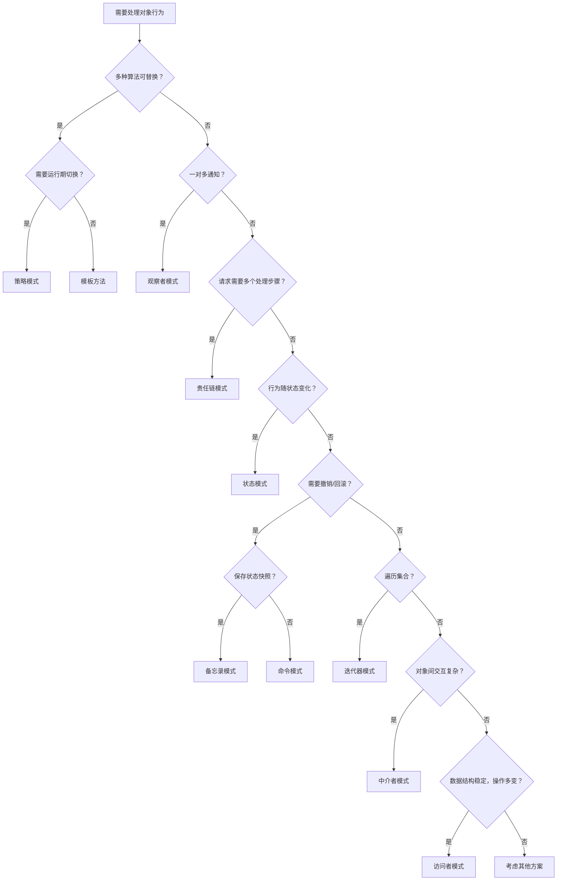

# 行为型模式对比 — 选型指南

> **一句话记忆口诀**：策略选算法、观察者发通知、模板定骨架、责任链串处理、命令封装请求、状态管转换、迭代器遍历、中介者解耦、备忘录存快照、访问者分离操作。

## 1. 十一种行为型模式一览

| 模式 | 核心思想 | 一句话 | 关键词 |
|------|---------|--------|--------|
| **策略** | 算法可替换 | 付款方式选择 | if-else 替代 |
| **观察者** | 一对多通知 | 微信公众号推送 | 事件、发布-订阅 |
| **模板方法** | 骨架+细节 | 冲泡流程 | 继承、final |
| **责任链** | 链式处理 | 审批流程 | Filter、拦截 |
| **命令** | 请求对象化 | 餐厅订单 | Undo、队列 |
| **状态** | 状态驱动 | 自动售货机 | 状态机 |
| **迭代器** | 统一遍历 | 遥控器下一个频道 | hasNext/next |
| **中介者** | 集中交互 | 机场塔台 | 星型拓扑 |
| **备忘录** | 状态快照 | 游戏存档 | 撤销、回滚 |
| **访问者** | 分离操作 | 税务审计 | 双分派 |
| **解释器** | 语法解析 | 翻译官 | 表达式树 |

## 2. 最容易混淆的几组对比

### 2.1 策略 vs 状态（最常混淆）

```java
// 策略：客户端主动选择算法
context.setStrategy(new AlipayStrategy()); // 外部驱动
context.pay(100);

// 状态：状态自动转换
order.pay(); // 内部驱动，状态 CreatedState → PaidState
```

| 对比维度 | 策略模式 | 状态模式 |
|---------|---------|---------|
| **切换方式** | 客户端**主动选择**（外部驱动） | 状态**自动转换**（内部驱动） |
| **关注点** | **算法**的可替换性 | **行为**随状态变化 |
| **状态感知** | 策略之间**互不知道** | 状态对象**知道**下一个状态 |
| **典型场景** | 支付方式、排序算法 | 订单状态机、TCP 连接 |

### 2.2 模板方法 vs 策略（继承 vs 组合）

| 对比维度 | 模板方法 | 策略模式 |
|---------|---------|---------|
| **实现机制** | **继承**，子类覆盖方法 | **组合**，注入策略接口 |
| **算法骨架** | 父类定义**固定骨架** | 无固定骨架 |
| **运行期切换** | ❌ 编译期确定 | ✅ 运行期切换 |
| **典型例子** | `HttpServlet.service()` | `Comparator` |

### 2.3 责任链 vs 装饰器（结构相似）

| 对比维度 | 责任链 | 装饰器 |
|---------|--------|--------|
| **处理方式** | 某个节点处理后**可以终止** | **每层都处理**，全部执行 |
| **典型例子** | Servlet Filter | IO 流 |

### 2.4 观察者 vs 中介者（解耦方式不同）

| 对比维度 | 观察者 | 中介者 |
|---------|--------|--------|
| **通信方式** | Subject **直接通知** Observer | 通过中介者**集中转发** |
| **关系** | 一对多 | 多对多（通过中心） |
| **典型例子** | Spring Event | MQ、DispatcherServlet |

## 3. 决策树：如何选择行为型模式



## 4. 按场景分类

### 4.1 消除 if-else

| 场景 | 推荐模式 | 示例 |
|------|---------|------|
| 算法选择 | **策略** | 支付方式、排序算法 |
| 状态判断 | **状态** | 订单状态、审批流程 |
| 类型判断 | **工厂** | 对象创建 |
| 操作判断 | **访问者** | 文档导出、AST 遍历 |

### 4.2 解耦

| 场景 | 推荐模式 | 示例 |
|------|---------|------|
| 一对多通知 | **观察者** | 事件监听、消息推送 |
| 多对多交互 | **中介者** | 聊天室、MQ |
| 请求与处理解耦 | **命令** | 任务队列、撤销操作 |

### 4.3 流程控制

| 场景 | 推荐模式 | 示例 |
|------|---------|------|
| 固定骨架，部分步骤不同 | **模板方法** | Servlet、JdbcTemplate |
| 多步骤，可动态组合 | **责任链** | Filter、审批流程 |

### 4.4 状态管理

| 场景 | 推荐模式 | 示例 |
|------|---------|------|
| 保存/恢复状态 | **备忘录** | 撤销操作、事务回滚 |
| 状态驱动行为 | **状态** | 状态机 |

## 5. Spring 中的行为型模式

| 模式 | Spring 中的应用 | 说明 |
|------|----------------|------|
| **策略** | `Resource` 接口 | ClassPath/FileSystem/URL 资源策略 |
| **观察者** | `ApplicationEvent` + `@EventListener` | Spring 事件机制 |
| **模板方法** | `JdbcTemplate`、`refresh()` | 封装公共流程 |
| **责任链** | `FilterChain`、`HandlerInterceptor` | 请求过滤链 |
| **命令** | `Runnable` 提交给线程池 | 任务封装 |
| **状态** | Spring State Machine | 状态机框架 |
| **迭代器** | `Iterator`、`Stream` | 集合遍历 |
| **中介者** | `DispatcherServlet` | 中央调度器 |
| **备忘录** | `@Transactional` 回滚 | 事务回滚 |
| **访问者** | `BeanDefinitionVisitor` | Bean 定义访问 |

## 6. 常见误区

### 6.1 误区一：策略和状态搞混

```java
// ❌ 错误：用策略模式实现状态机
// 策略之间互不知道，无法自动转换状态
context.setStrategy(new CreatedState());
context.handle(); // 处理后谁来切换到下一个策略？

// ✅ 正确：状态模式中，状态对象自己决定转换到哪个状态
public class CreatedState implements OrderState {
    public void handle(OrderContext ctx) {
        // 处理后自动转换
        ctx.setState(new PaidState());
    }
}
```

### 6.2 误区二：观察者不处理异常

```java
// ❌ 一个观察者抛异常，后续都不执行
for (Observer o : observers) {
    o.update(event); // 如果这里抛异常...
}

// ✅ 捕获每个观察者的异常
for (Observer o : observers) {
    try { o.update(event); }
    catch (Exception e) { log.error("观察者失败", e); }
}
```

### 6.3 误区三：责任链没有默认处理者

```java
// ❌ 链末端没有处理者，请求"消失"
Handler chain = new AuthHandler();
chain.setNext(new ValidationHandler());
// 都通过后返回 null！

// ✅ 末端加默认处理者
chain.setNext(new BusinessHandler()); // 必须返回非 null
```

## 7. 总结：面试回答模板

**面试官问：行为型模式怎么选？**

> 选择标准：
> 1. **算法可替换** → 策略（运行期切换）或模板方法（编译期确定）
> 2. **一对多通知** → 观察者（Spring Event）
> 3. **多步处理，可动态组合** → 责任链（Filter 链）
> 4. **行为随状态变化** → 状态（消灭 if-else）
> 5. **需要撤销/回滚** → 备忘录（保存快照）或命令（封装请求）
> 6. **统一遍历** → 迭代器（for-each 底层）
> 7. **对象间交互复杂** → 中介者（MQ、DispatcherServlet）
> 8. **数据结构稳定，操作多变** → 访问者（编译器 AST）
>
> 最容易混淆的是策略 vs 状态（外部选择 vs 内部驱动）和模板方法 vs 策略（继承 vs 组合）。

> **一句话记忆口诀**：行为型模式解决对象间的交互和职责分配，核心是"谁做什么、怎么协作"，选型看意图——选算法用策略，发通知用观察者，定骨架用模板方法，串处理用责任链。
