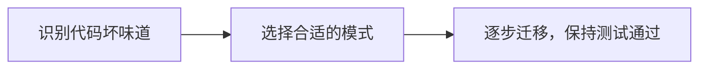

# 重构到设计模式

> **一句话记忆口诀**：不要为了用模式而用模式，先有代码坏味道，再用模式重构。重构三步：识别问题→选择模式→逐步迁移。

## 1. 重构的基本原则

### 1.1 什么时候该重构？

| 代码坏味道 | 可能需要的模式 |
| :-- | :-- |
| 大量 if-else/switch | 策略、状态、工厂 |
| 构造函数参数过多 | 建造者 |
| 重复的流程骨架 | 模板方法 |
| 直接创建复杂对象 | 工厂 |
| 对象间直接引用形成网状 | 中介者、观察者 |
| 接口不兼容 | 适配器 |
| 需要在不修改类的前提下增强功能 | 装饰器、代理 |
| 需要撤销/回滚 | 命令、备忘录 |

### 1.2 重构的三步法



## 2. 实战案例一：if-else → 策略模式

### 2.1 重构前：支付逻辑的 if-else 地狱

```java
public class PaymentService {
    public void pay(String type, BigDecimal amount) {
        if ("alipay".equals(type)) {
            // 支付宝逻辑 30 行
            System.out.println("调用支付宝 SDK");
            System.out.println("签名验证");
            System.out.println("回调处理");
        } else if ("wechat".equals(type)) {
            // 微信支付逻辑 30 行
            System.out.println("调用微信 SDK");
            System.out.println("签名验证");
            System.out.println("回调处理");
        } else if ("bank".equals(type)) {
            // 银行卡逻辑 30 行
            System.out.println("调用银行网关");
            System.out.println("短信验证");
            System.out.println("回调处理");
        }
        // 每次新增支付方式都要改这个方法！
        // 已经 100 行了，还在增长...
    }
}
```

### 2.2 重构步骤

**Step 1：提取策略接口**

```java
public interface PaymentStrategy {
    void pay(BigDecimal amount);
    String getType();
}
```

**Step 2：将每个分支提取为策略类**

```java
public class AlipayStrategy implements PaymentStrategy {
    @Override
    public void pay(BigDecimal amount) {
        System.out.println("调用支付宝 SDK，金额: " + amount);
        System.out.println("签名验证");
        System.out.println("回调处理");
    }

    @Override
    public String getType() { return "alipay"; }
}

public class WechatPayStrategy implements PaymentStrategy {
    @Override
    public void pay(BigDecimal amount) {
        System.out.println("调用微信 SDK，金额: " + amount);
        System.out.println("签名验证");
        System.out.println("回调处理");
    }

    @Override
    public String getType() { return "wechat"; }
}
```

**Step 3：重构 PaymentService**

```java
public class PaymentService {
    private final Map<String, PaymentStrategy> strategies;

    public PaymentService(List<PaymentStrategy> strategyList) {
        this.strategies = strategyList.stream()
            .collect(Collectors.toMap(PaymentStrategy::getType, s -> s));
    }

    public void pay(String type, BigDecimal amount) {
        PaymentStrategy strategy = strategies.get(type);
        if (strategy == null) {
            throw new IllegalArgumentException("不支持的支付方式: " + type);
        }
        strategy.pay(amount);
    }
}
```

**Step 4：使用**

```java
// Spring 自动注入所有 PaymentStrategy 实现
@Autowired
private PaymentService paymentService;

paymentService.pay("alipay", new BigDecimal("100"));
// 新增银联支付？只需新增 UnionPayStrategy 类，不修改任何现有代码！
```

## 3. 实战案例二：复杂构造 → 建造者模式

### 3.1 重构前：构造函数参数爆炸

```java
public class HttpRequest {
    private String url;
    private String method;
    private Map<String, String> headers;
    private Map<String, String> queryParams;
    private String body;
    private int timeout;
    private boolean followRedirects;
    private int retryCount;
    private String proxy;

    // 构造函数 9 个参数，调用时谁知道第 5 个是啥？
    public HttpRequest(String url, String method, Map<String, String> headers,
                       Map<String, String> queryParams, String body, int timeout,
                       boolean followRedirects, int retryCount, String proxy) {
        // ...
    }
}

// 调用：参数含义完全不清晰
new HttpRequest("https://api.example.com", "POST", null, null,
                "{\"name\":\"test\"}", 3000, true, 3, null);
```

### 3.2 重构后：建造者模式

```java
public class HttpRequest {
    private final String url;
    private final String method;
    private final Map<String, String> headers;
    private final String body;
    private final int timeout;
    private final boolean followRedirects;
    private final int retryCount;

    private HttpRequest(Builder builder) {
        this.url = builder.url;
        this.method = builder.method;
        this.headers = builder.headers;
        this.body = builder.body;
        this.timeout = builder.timeout;
        this.followRedirects = builder.followRedirects;
        this.retryCount = builder.retryCount;
    }

    public static Builder builder(String url) {
        return new Builder(url);
    }

    public static class Builder {
        private final String url;
        private String method = "GET";
        private Map<String, String> headers = new HashMap<>();
        private String body;
        private int timeout = 5000;
        private boolean followRedirects = true;
        private int retryCount = 0;

        public Builder(String url) { this.url = url; }
        public Builder method(String method) { this.method = method; return this; }
        public Builder header(String key, String value) { headers.put(key, value); return this; }
        public Builder body(String body) { this.body = body; return this; }
        public Builder timeout(int timeout) { this.timeout = timeout; return this; }
        public Builder followRedirects(boolean follow) { this.followRedirects = follow; return this; }
        public Builder retryCount(int count) { this.retryCount = count; return this; }

        public HttpRequest build() {
            if (url == null || url.isEmpty()) throw new IllegalStateException("URL 不能为空");
            return new HttpRequest(this);
        }
    }
}

// 调用：清晰、可读、参数含义明确
HttpRequest request = HttpRequest.builder("https://api.example.com")
    .method("POST")
    .header("Content-Type", "application/json")
    .body("{\"name\":\"test\"}")
    .timeout(3000)
    .retryCount(3)
    .build();
```

## 4. 实战案例三：通知耦合 → 观察者模式

### 4.1 重构前：订单完成直接调用所有通知方

```java
public class OrderService {
    private EmailService emailService;
    private SMSService smsService;
    private PointsService pointsService;
    private LogService logService;

    public void completeOrder(Order order) {
        order.setStatus("COMPLETED");
        orderDao.save(order);

        // 直接调用——强耦合！
        emailService.send(order);
        smsService.send(order);
        pointsService.addPoints(order);
        logService.log(order);
        // 新增通知方式？修改这个类！
    }
}
```

### 4.2 重构后：观察者模式（Spring Event）

```java
// 事件对象
public class OrderCompletedEvent extends ApplicationEvent {
    private final Order order;
    public OrderCompletedEvent(Object source, Order order) {
        super(source);
        this.order = order;
    }
    public Order getOrder() { return order; }
}

// 发布者
@Service
public class OrderService {
    @Autowired
    private ApplicationEventPublisher publisher;

    public void completeOrder(Order order) {
        order.setStatus("COMPLETED");
        orderDao.save(order);
        publisher.publishEvent(new OrderCompletedEvent(this, order));
    }
}

// 观察者们（各自独立，互不影响）
@Component
public class EmailNotifier {
    @EventListener
    public void onOrderCompleted(OrderCompletedEvent event) {
        emailService.send(event.getOrder());
    }
}

@Component
public class PointsUpdater {
    @EventListener
    @Async
    public void onOrderCompleted(OrderCompletedEvent event) {
        pointsService.addPoints(event.getOrder());
    }
}

// 新增通知？只需新增一个 @EventListener 类，不修改 OrderService！
```

## 5. 实战案例四：重复流程 → 模板方法

### 5.1 重构前：数据导出的重复代码

```java
public class ExcelExporter {
    public void export() {
        DataSource ds = connect();    // 重复
        List<Data> data = query(ds);  // 重复
        String formatted = toExcel(data);  // 独特
        writeExcel(formatted);             // 独特
        close(ds);                    // 重复
    }
}

public class CsvExporter {
    public void export() {
        DataSource ds = connect();    // 重复！
        List<Data> data = query(ds);  // 重复！
        String formatted = toCsv(data);    // 独特
        writeCsv(formatted);               // 独特
        close(ds);                    // 重复！
    }
}
```

### 5.2 重构后：模板方法

```java
public abstract class DataExporter {
    // 模板方法：定义骨架
    public final void export() {
        DataSource ds = connect();        // 公共步骤
        List<Data> data = query(ds);      // 公共步骤
        String formatted = format(data);  // 子类实现
        write(formatted);                 // 子类实现
        close(ds);                        // 公共步骤
    }

    protected DataSource connect() { /* 公共实现 */ }
    protected List<Data> query(DataSource ds) { /* 公共实现 */ }
    protected void close(DataSource ds) { /* 公共实现 */ }

    protected abstract String format(List<Data> data);
    protected abstract void write(String formatted);
}

public class ExcelExporter extends DataExporter {
    protected String format(List<Data> data) { return "excel"; }
    protected void write(String formatted) { /* 写 Excel */ }
}
```

## 6. 重构检查清单

在重构到设计模式之前，问自己：

- [ ] **真的需要模式吗？** 简单问题不需要复杂方案
- [ ] **是哪种代码坏味道？** 先诊断，再开药
- [ ] **测试覆盖了吗？** 重构前确保有测试
- [ ] **逐步迁移了吗？** 一次性大改风险高
- [ ] **团队理解吗？** 模式是为了沟通，不是炫技

## 7. 反模式：过度使用设计模式

```java
// ❌ 为了用模式而用模式
// 只有 2 种固定支付方式，用策略模式 → 过度设计
// 只有 1 个观察者，用观察者模式 → 过度设计
// 对象创建很简单，用工厂模式 → 过度设计

// ✅ 正确态度：模式是工具，不是目标
// 简单问题用简单方案
// 代码有坏味道时再用模式重构
// 模式是为了让代码更好维护，不是为了让代码更"高级"
```

> **一句话记忆口诀**：重构到模式的三步法——识别坏味道、选择模式、逐步迁移。不要为了用模式而用模式，先有痛点再用药。
