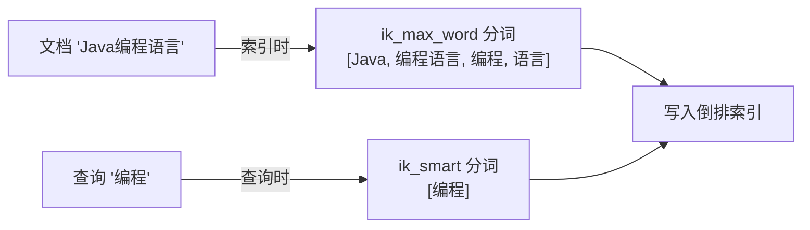
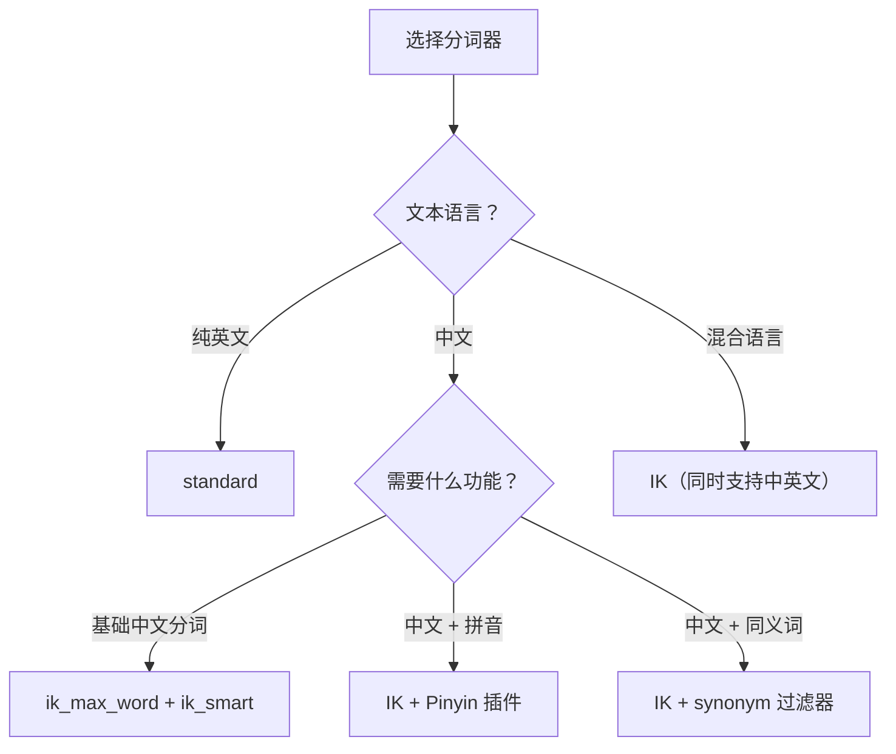

# ES 分词器与中文分词

> **核心问题**：ES 如何把一段文本拆分成可搜索的词项？分词器由哪几部分组成？中文分词为什么需要 IK，如何配置索引与查询的分词策略？

## 1. 分词解决什么问题？

ES 的全文检索建立在**倒排索引**之上：把文档里的文本拆成一个个词项（Term），再记录"哪个词项出现在哪些文档里"。搜索时，把查询词也拆成词项，去倒排索引里查命中的文档。

这条链路的起点就是**分词**，它直接决定搜索质量：

| 分词结果 | 后果 |
| :-- | :-- |
| 太粗：`"Java编程语言"` → `["Java编程语言"]` | 搜 "Java" 或 "编程" 都找不到 |
| 太细：`"Java编程语言"` → `["J","a","v","a","编","程","语","言"]` | 噪音多、精度差 |
| 合理：`"Java编程语言"` → `["Java","编程","语言"]` | 搜 "Java"、"编程"、"语言" 都能命中 |

英文天然以空格和标点分词，但中文没有分隔符，词语边界需要专门算法识别——这正是 IK 分词器要解决的问题。

**生活类比**：分词器像一个"断句专家"。英文句子里词之间有空格，断句简单；中文句子没有空格，必须理解语义才能正确切词。

## 2. 分词发生在两个时机 {#two-phases}

这是全文最关键的一点：**同一段文本会被分词两次，目的完全不同。**



| 时机 | 做什么 | 目标 |
| :-- | :-- | :-- |
| **索引时** | 把文档文本拆成词项，写入倒排索引 | 让更多可能的查询词都能命中，**提高召回率** |
| **查询时** | 把查询词也拆成词项，去倒排索引匹配 | 精确匹配用户意图，**提高精确度** |

两者目标相反，所以实践中常给索引和查询配置不同的分词器（见 [§5.3](#index-vs-search)）。理解这一点，才能看懂后文"索引用 `ik_max_word`、查询用 `ik_smart`"的推荐。

## 3. 分词器的三层架构 {#analyzer-architecture}

每个分词器（Analyzer）由三个组件**按顺序**组成：


| 组件 | 作用 | 示例 |
| :-- | :-- | :-- |
| **Char Filter** | 预处理原始字符（去 HTML、字符替换） | `<p>Hello</p>` → `Hello` |
| **Tokenizer** | 把字符流切成词项（**必须且唯一**） | `Hello World` → `[Hello, World]` |
| **Token Filter** | 对词项做后处理（小写、去停用词、同义词） | `[Hello, World]` → `[hello, world]` |

三者中 **Tokenizer 是必须的**，Char Filter 和 Token Filter 可以有零个或多个。分词质量主要由 Tokenizer 决定。

## 4. ES 内置分词器

### 4.1 常用内置分词器对比

| 分词器 | 分词规则 | 示例输入 | 分词结果 | 适用场景 |
| :-- | :-- | :-- | :-- | :-- |
| **standard** | 按 Unicode 文本分割，转小写 | `"Java编程 Very Cool"` | `[java, 编, 程, very, cool]` | 默认分词器，英文效果好，**中文逐字切分** |
| **simple** | 按非字母字符分割，转小写 | `"Hello-World 123"` | `[hello, world]` | 简单英文文本 |
| **whitespace** | 按空格分割，不转小写 | `"Hello World"` | `[Hello, World]` | 保留大小写 |
| **keyword** | 不分词，整段作为一个词项 | `"Hello World"` | `[Hello World]` | 精确匹配（ID、邮箱） |
| **pattern** | 按正则分割 | `"foo-bar_baz"` | `[foo, bar, baz]`（按 `\W+`） | 自定义分隔符 |

### 4.2 用 _analyze 测试分词

```bash
GET /_analyze
{
  "analyzer": "standard",
  "text": "Java编程语言非常强大"
}
# tokens: [java, 编, 程, 语, 言, 非, 常, 强, 大]
```

> ⚠️ **关键问题**：`standard` 对中文是**逐字切分**，无法识别词语边界。搜 "编程" 时，实际切成了 "编" 和 "程" 两个字分别去匹配，会命中大量无关文档。

## 5. IK 中文分词器

IK 是 ES 生态最常用的中文分词插件，用**词典匹配算法**切词——维护一个中文词典，把文本与词典里的词做最大匹配，再通过消歧选出最优切分路径。

### 5.1 安装

```bash
# 版本必须与 ES 版本一致
./bin/elasticsearch-plugin install https://github.com/medcl/elasticsearch-analysis-ik/releases/download/v8.x.x/elasticsearch-analysis-ik-8.x.x.zip
# 安装后重启 ES
```

### 5.2 两种分词模式

| 模式 | 分词器 | 策略 | 用途 |
| :-- | :-- | :-- | :-- |
| **细粒度** | `ik_max_word` | 穷举所有可能的词组合 | **索引时**，提高召回 |
| **粗粒度** | `ik_smart` | 消歧选最合理的一条切分，不重复 | **查询时**，提高精度 |

```bash
GET /_analyze
{ "analyzer": "ik_max_word", "text": "Java编程语言非常强大" }
# [java, 编程语言, 编程, 语言, 非常, 强大] —— "编程语言" 又被拆出 "编程"、"语言"

GET /_analyze
{ "analyzer": "ik_smart", "text": "Java编程语言非常强大" }
# [java, 编程语言, 非常, 强大] —— 最少切分，不再拆 "编程语言"
```

### 5.3 索引时 vs 查询时的搭配 {#index-vs-search}

呼应 [§2](#two-phases) 的两个时机：索引用 `ik_max_word` 多切分（"编程语言" 同时产生 "编程语言"、"编程"、"语言" 三个词项），查询用 `ik_smart` 少切分（"编程" 只产生 "编程" 一个词项）。

```bash
PUT /articles
{
  "mappings": {
    "properties": {
      "title": {
        "type": "text",
        "analyzer": "ik_max_word",      # 索引时
        "search_analyzer": "ik_smart"  # 查询时
      },
      "content": {
        "type": "text",
        "analyzer": "ik_max_word",
        "search_analyzer": "ik_smart"
      }
    }
  }
}
```

效果：

- 索引 "Java编程语言" 时，倒排索引里同时有 `java`、`编程语言`、`编程`、`语言` 四个词项。
- 搜 "编程" 时，查询词被 `ik_smart` 切成 `[编程]`，命中倒排索引里的 "编程" ✅
- 搜 "编程语言" 时，切成 `[编程语言]`，精确命中 ✅

### 5.4 自定义词典

IK 依赖内置词典，但专业术语、新词、品牌名常不在词典里，需要扩展。

**本地词典**：

```xml
<!-- config/IKAnalyzer.cfg.xml -->
<?xml version="1.0" encoding="UTF-8"?>
<!DOCTYPE properties SYSTEM "http://java.sun.com/dtd/properties.dtd">
<properties>
    <comment>IK Analyzer 扩展配置</comment>
    <entry key="ext_dict">custom/my_dict.dic</entry>
    <entry key="ext_stopwords">custom/my_stopwords.dic</entry>
</properties>
```

```txt
# custom/my_dict.dic（每行一个词，UTF-8 编码）
SpringBoot
微服务
分布式锁
布隆过滤器
```

**远程词典（热更新，无需重启）**：

```xml
<entry key="remote_ext_dict">http://your-server/api/dict</entry>
<entry key="remote_ext_stopwords">http://your-server/api/stopwords</entry>
```

> 远程词典接口返回纯文本（每行一个词），并通过 `Last-Modified` 或 `ETag` 响应头告知 IK 是否有更新，IK 定期轮询。

## 6. 自定义分词器

内置和 IK 都不满足时，可以自定义：自己选 Char Filter、Tokenizer、Token Filter 组装。

### 6.1 组装一个自定义分词器

```bash
PUT /my_index
{
  "settings": {
    "analysis": {
      "char_filter": {
        "my_char_filter": { "type": "mapping", "mappings": ["& => and", "| => or"] }
      },
      "tokenizer": {
        "my_tokenizer": { "type": "pattern", "pattern": "[\\s,;]+" }
      },
      "filter": {
        "my_stopwords": { "type": "stop", "stopwords": ["的", "了", "是", "在", "和"] }
      },
      "analyzer": {
        "my_analyzer": {
          "type": "custom",
          "char_filter": ["my_char_filter"],
          "tokenizer": "my_tokenizer",
          "filter": ["lowercase", "my_stopwords"]
        }
      }
    }
  }
}
```

结构上就是 [§3](#analyzer-architecture) 的三层：`char_filter` → `tokenizer` → `filter`。

### 6.2 同义词过滤器

```bash
PUT /my_index
{
  "settings": {
    "analysis": {
      "filter": {
        "my_synonyms": {
          "type": "synonym",
          "synonyms": ["Java, java, JAVA", "手机, 手机设备, mobile phone"]
        }
      },
      "analyzer": {
        "ik_with_synonyms": {
          "type": "custom",
          "tokenizer": "ik_max_word",
          "filter": ["lowercase", "my_synonyms"]
        }
      }
    }
  }
}
```

同义词建议放文件维护：

```
# config/analysis/synonyms.txt
# 等价同义词
手机, 手机设备, mobile phone
# 单向映射
笔记本电脑 => laptop
```

### 6.3 拼音分词（拼音搜索）

```bash
# 安装拼音插件
./bin/elasticsearch-plugin install https://github.com/medcl/elasticsearch-analysis-pinyin/releases/download/v8.x.x/elasticsearch-analysis-pinyin-8.x.x.zip

PUT /my_index
{
  "settings": {
    "analysis": {
      "filter": {
        "my_pinyin": {
          "type": "pinyin",
          "keep_full_pinyin": true,
          "keep_joined_full_pinyin": true,
          "keep_original": true,
          "remove_duplicated_term": true
        }
      },
      "analyzer": {
        "ik_pinyin_analyzer": {
          "type": "custom",
          "tokenizer": "ik_max_word",
          "filter": ["my_pinyin"]
        }
      }
    }
  }
}
# 搜 "bianchen" 或 "bc" 能匹配到 "编程"
```

## 7. Mapping 中的分词器配置

### 7.1 字段级配置与 multi-field

```bash
PUT /articles
{
  "mappings": {
    "properties": {
      "title": { "type": "text", "analyzer": "ik_max_word", "search_analyzer": "ik_smart" },
      "tags": { "type": "keyword" },
      "content": {
        "type": "text",
        "analyzer": "ik_max_word",
        "search_analyzer": "ik_smart",
        "fields": {
          "pinyin": { "type": "text", "analyzer": "ik_pinyin_analyzer" }
        }
      }
    }
  }
}
```

`fields` 即 multi-field：同一个字段值，用不同方式建多个倒排索引，一个字段同时支持中文搜索和拼音搜索。

### 7.2 text vs keyword

| 类型 | 是否分词 | 适用场景 | 支持的查询 |
| :-- | :-- | :-- | :-- |
| **text** | ✅ 分词建倒排索引 | 全文搜索（标题、内容） | `match`、`match_phrase` |
| **keyword** | ❌ 整值作为一个词项 | 精确匹配（ID、状态、标签） | `term`、`terms`、`range` |

```bash
# ❌ 错误：text 字段被分词了，term 查完整值找不到
GET /articles/_search
{ "query": { "term": { "title": "Java编程" } } }

# ✅ 正确：text 字段用 match
GET /articles/_search
{ "query": { "match": { "title": "Java编程" } } }

# ✅ 正确：keyword 字段用 term
GET /articles/_search
{ "query": { "term": { "tags": "Java" } } }
```

## 8. 分词器选型指南



| 场景 | 推荐方案 |
| :-- | :-- |
| 英文内容搜索 | `standard`（默认） |
| 中文内容搜索 | `ik_max_word`（索引）+ `ik_smart`（查询） |
| 中文 + 拼音搜索 | IK + Pinyin 插件 + multi-field |
| 中文 + 同义词 | IK + synonym 过滤器 |
| 精确匹配（ID、标签） | `keyword`，不分词 |
| 日志分析 | `pattern`，按自定义分隔符 |

## 9. 常见问题

**Q：为什么 standard 分词器对中文效果差？**

> `standard` 按 Unicode 文本分割，英文靠空格和标点分词，中文没有空格，被逐字切分。"编程语言" 被切成 "编"、"程"、"语"、"言" 四个字。搜 "编程" 时实际搜的是 "编" 和 "程"，会命中大量无关文档。

**Q：ik_max_word 和 ik_smart 怎么选？**

> 索引时用 `ik_max_word`（多切分，提高召回），查询时用 `ik_smart`（少切分，提高精度），通过 `analyzer` 和 `search_analyzer` 分别配置。原因见 [§2](#two-phases)。

**Q：如何让 IK 识别新词？**

> ① 本地词典：`IKAnalyzer.cfg.xml` 里配 `ext_dict` 指向词典文件；② 远程词典：配 `remote_ext_dict` 指向 HTTP 接口，IK 定期轮询热更新，无需重启。

**Q：如何实现拼音搜索？**

> 装 elasticsearch-analysis-pinyin 插件，自定义分词器组合 IK + Pinyin，再用 multi-field 让一个字段同时支持中文和拼音搜索。

**Q：修改分词器后，已有数据要重新索引吗？**

> 要。分词器变更只影响新写入数据，已有数据的倒排索引不会自动更新，需要 Reindex 重建索引。
