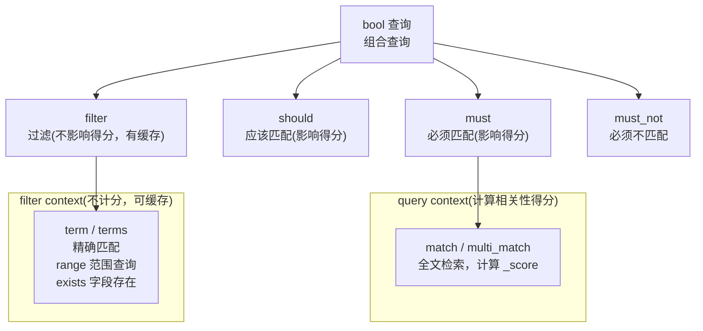

# ES 查询 DSL：核心查询类型

## 1. query context vs filter context



## 2. 为什么 filter 比 must 性能更好

> 1. filter 不计算相关性得分，省去了 TF-IDF/BM25 的计算开销
> 2. filter 结果可以被缓存（Filter Cache），相同过滤条件第二次查询直接走缓存
> 3. 纯过滤场景（如按状态筛选）应优先使用 filter，而非 must

## 3. 常用查询示例

```json
// 组合查询：搜索"Java工程师"，价格在10-50之间，状态为上架
{
  "query": {
    "bool": {
      "must": [
        { "match": { "title": "Java工程师" }}   // 全文检索，影响得分
      ],
      "filter": [
        { "range": { "price": { "gte": 10, "lte": 50 }}},  // 范围过滤，不影响得分
        { "term": { "status": "online" }}                   // 精确匹配，不影响得分
      ]
    }
  }
}
```

## 4. 问题：ES 的 query 和 filter 有什么区别？

> - `query`：计算相关性得分（_score），结果不缓存，适合全文检索
> - `filter`：不计算得分，结果可缓存（Filter Cache），性能更高，适合精确过滤
> - 最佳实践：全文检索用 `must`（query context），条件过滤用 `filter`（filter context）