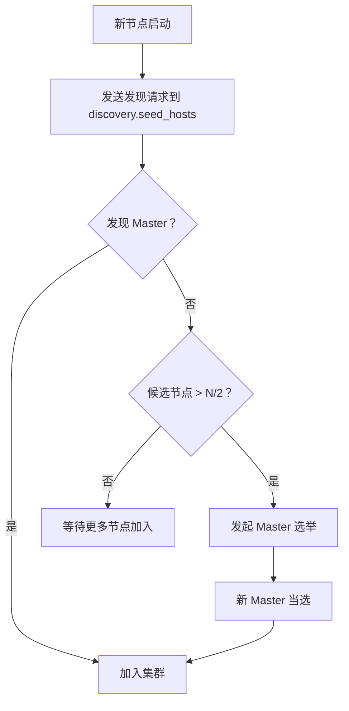

# 分布式架构

## 1. 节点角色

ES 集群中的每个节点可以承担多种角色：

| 角色 | 配置 | 职责 |
| :-- | :-- | :-- |
| **Master** | `node.roles: [master]` | 集群元数据管理、分片分配决策 |
| **Data** | `node.roles: [data]` | 存储数据、执行 CRUD 和搜索 |
| **Data Hot** | `node.roles: [data_hot]` | 存储热数据（ILM） |
| **Data Warm** | `node.roles: [data_warm]` | 存储温数据 |
| **Data Cold** | `node.roles: [data_cold]` | 存储冷数据 |
| **Ingest** | `node.roles: [ingest]` | 数据预处理（Pipeline） |
| **Coordinating** | `node.roles: []` | 查询协调（不存储数据） |
| **ML** | `node.roles: [ml]` | 机器学习任务 |

```yaml
# 推荐：生产环境分离角色
# Master 节点（3 个，轻量级）
node.roles: [master]

# Data 节点（根据数据量扩展）
node.roles: [data_hot]

# Coordinating 节点（可选，大型集群）
node.roles: []
```

## 2. Master 选举

ES 使用类 Raft 协议进行 Master 选举：

| 参数 | 说明 |
| :-- | :-- |
| `discovery.seed_hosts` | 集群种子节点列表 |
| `cluster.initial_master_nodes` | 初始 Master 候选节点 |
| `cluster.fault_detection.leader_check.timeout` | Leader 检测超时 |

**选举流程**：

1. 节点启动后向 `discovery.seed_hosts` 发送发现请求
2. 当候选节点数 > 总数/2 时，发起选举
3. 优先选择 `master` 节点中版本号最高的节点
4. 选举成功后，新 Master 广播集群状态

> ⚠️ **脑裂问题**：ES 7.x 后通过 `cluster.initial_master_nodes` 和仲裁机制避免脑裂。生产环境必须部署奇数个 Master 节点（通常 3 个）。

## 3. 集群状态

```json
GET /_cluster/health
```

```json
{
  "cluster_name": "prod-cluster",
  "status": "green",
  "timed_out": false,
  "number_of_nodes": 5,
  "number_of_data_nodes": 3,
  "active_primary_shards": 10,
  "active_shards": 20,
  "relocating_shards": 0,
  "initializing_shards": 0,
  "unassigned_shards": 0
}
```

| 状态 | 含义 | 处理 |
| :-- | :-- | :-- |
| 🟢 Green | 所有分片正常 | 正常 |
| 🟡 Yellow | 主分片正常，部分副本未分配 | 检查节点数 |
| 🔴 Red | 部分主分片不可用 | 紧急处理 |

## 4. 分片分配

Master 节点负责将分片分配到各个 Data 节点：

```json
// 查看分片分配
GET /_cat/shards?v

// 查看分片分配原因
GET /_cluster/allocation/explain
{
  "index": "my-index",
  "shard": 0,
  "primary": true
}
```

### 4.1 分片分配策略

| 策略 | 说明 |
| :-- | :-- |
| **均衡分配** | 尽量均匀分配到各节点 |
| **主副分离** | 主分片和副本不在同一节点 |
| **磁盘水位线** | 磁盘使用率超过阈值不再分配新分片 |

```json
// 磁盘水位线配置
PUT /_cluster/settings
{
  "persistent": {
    "cluster.routing.allocation.disk.watermark.low": "85%",
    "cluster.routing.allocation.disk.watermark.high": "90%",
    "cluster.routing.allocation.disk.watermark.flood_stage": "95%"
  }
}
```

## 5. 集群发现机制



## 6. 最佳实践

- 生产环境至少 3 个专用 Master 节点
- Master 节点不存储数据，配置低即可（2 核 4GB）
- Data 节点根据数据量和查询压力水平扩展
- 使用 `node.roles` 明确指定节点角色
- 监控集群状态和未分配分片数量
- 设置合理的磁盘水位线，避免磁盘打满
