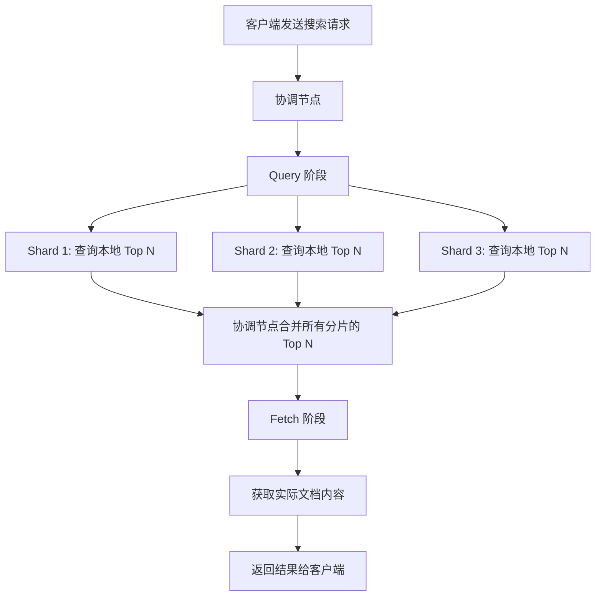

# 读取流程

## 1. 搜索流程概述

ES 的搜索分为两个阶段：**Query 阶段** 和 **Fetch 阶段**。



## 2. Query 阶段

```
1. 协调节点接收搜索请求
2. 协调节点将请求广播到目标索引的所有相关分片
3. 每个分片在本地执行查询，找到匹配的文档 ID
4. 每个分片返回文档 ID 列表和排序值（_score 或 sort 值）
5. 协调节点合并所有分片的结果，得到全局 Top N 文档 ID
```

> **关键点**：Query 阶段只返回文档 ID 和排序值，不返回文档内容，减少网络传输。

## 3. Fetch 阶段

```
1. 协调节点根据合并后的 Top N 文档 ID，确定每个文档所在分片
2. 向对应分片发送 multi_get 请求获取完整文档内容
3. 协调节点组装最终结果返回客户端
```

## 4. DFS Query Then Fetch

默认的 Query Then Fetch 每个分片独立计算 _score，可能导致评分不一致。DFS（Distributed Frequency Search）模式先收集全局词频信息：

```json
// 使用 DFS 模式（更精确但更慢）
GET /my-index/_search?search_type=dfs_query_then_fetch
{
  "query": {
    "match": { "title": "Elasticsearch" }
  }
}
```

| 搜索模式 | 说明 | 适用场景 |
|---------|------|---------|
| `query_then_fetch` | 默认，每个分片独立评分 | 通用场景 |
| `dfs_query_then_fetch` | 先收集全局词频，再评分 | 需要精确评分的场景 |

## 5. 分片偏好（Preference）

```json
// 指定查询特定分片
GET /my-index/_search?preference=_shards:0,1
{
  "query": { "match_all": {} }
}

// 指定查询主分片（保证读取最新数据）
GET /my-index/_search?preference=_primary_first
{
  "query": { "match_all": {} }
}
```

## 6. 读取性能优化

| 优化手段 | 原理 |
|---------|------|
| 使用 `filter` | 结果可缓存，不计算评分 |
| 减少返回字段 | `_source` 过滤减少网络传输 |
| 使用 `routing` | 只查询特定分片 |
| 合理分片数 | 分片过多增加协调开销 |
| 预热文件系统缓存 | 热数据常驻内存 |

## 7. 最佳实践

- 理解 Query-Then-Fetch 两阶段原理，有助于排查搜索问题
- 精确评分需求使用 `dfs_query_then_fetch`
- 使用 `preference` 控制查询路由，避免缓存失效
- 监控每个阶段的耗时，定位性能瓶颈
- 大结果集使用 `search_after` 而非深度分页
