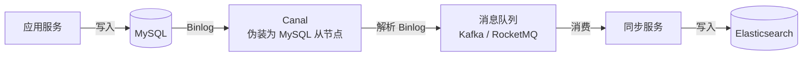
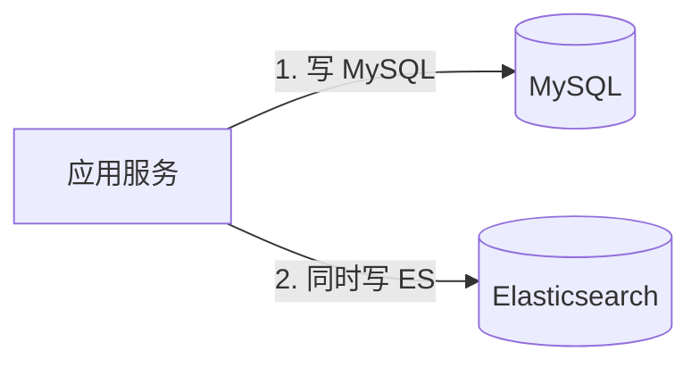
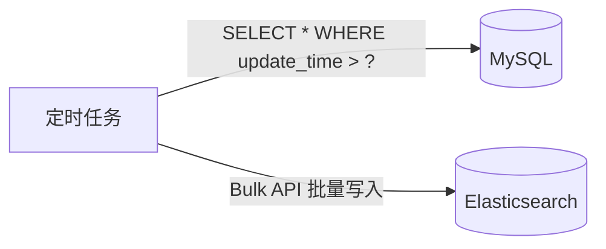
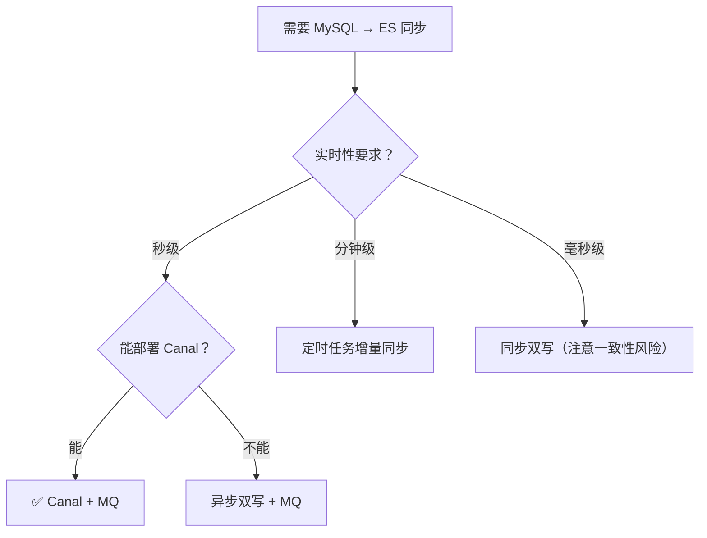

# ES 数据一致性：MySQL 与 ES 同步方案

> **核心问题**：MySQL 是主数据源、ES 是搜索引擎，两者如何保持一致？同步延迟的根源是什么？如何避免丢失、乱序、覆盖？

## 1. 问题：MySQL 和 ES 为什么不一致？

MySQL 与 ES 是两个独立的存储系统。业务数据先写 MySQL，再同步到 ES 用于搜索，这条同步链路天然异步，因此两者**不可能做到强一致，只能做到最终一致**。

| 概念 | 含义 | 例子 |
| :-- | :-- | :-- |
| **强一致** | 写成功后，任意时刻读到的都是最新值 | 单机 MySQL 主库 |
| **最终一致** | 写成功后，经过一段时间，所有副本收敛到同一值 | MySQL → ES 异步同步 |

不一致有三个来源：

1. **同步链路有延迟**：数据要经过 Binlog 解析、消息队列、写入 ES，存在秒级延迟。
2. **ES 自身近实时**：数据写入 ES 后，还要等 refresh（默认 1 秒）才能被搜到（约 1 秒）。
3. **同步过程可能出错**：消息丢失、乱序、重复都会造成偏差。

所以本文要回答的核心是：**在可接受的延迟内，让 ES 收敛到与 MySQL 一致，并处理同步过程中的丢失与乱序。**

## 2. 两个前提机制

同步方案依赖两个 ES 机制，这里各讲一句，细节不在本文展开。

### 2.1 NRT：写入后不能立即搜到

ES 是近实时（Near Real-Time）搜索引擎，文档写入后需经 refresh（默认 1 秒）才能被搜到。这是"数据已同步到 ES，用户却搜不到"的根源之一。

> 📖 NRT、refresh、segment 的完整机制见 [近实时搜索](./chapter-06-near-real-time.md)。

### 2.2 版本控制：防止覆盖与乱序

同步过程中，同一条数据的多次更新可能乱序到达 ES。若不处理，旧数据会覆盖新数据。ES 用版本号解决这个问题。

**内部版本号 + 乐观锁**：用 `if_seq_no` 和 `if_primary_term` 指定当前版本，版本不匹配则返回 409 冲突，避免并发覆盖。

```bash
# 首次创建
PUT /orders/_doc/1
{ "title": "v1" }

# 带乐观锁更新：seq_no / primary_term 不匹配时返回 409
PUT /orders/_doc/1?if_seq_no=1&if_primary_term=1
{ "title": "v2" }
```

**外部版本号（同步场景的关键）**：`version_type=external` 允许用业务自己的版本号（如 MySQL 的 `update_time`），且**只接受更大的版本号**。

```bash
# 用 MySQL 的 update_time（转成数值）作为外部版本号
PUT /orders/_doc/1?version=1681234567&version_type=external
{ "title": "从 MySQL 同步的数据" }
```

**为什么外部版本号能解决乱序？** `update_time` 单调递增。乱序到达的旧消息（版本号小）会被 ES 拒绝，只有更新版本的消息才能写入。于是无论消息按什么顺序到达，最终 ES 里留下的都是最新数据。这正是 §4.2 处理乱序的依据。

## 3. 同步方案

### 3.1 方案一：Canal 监听 Binlog（推荐）



**优点**：对业务代码零侵入；通过消息队列解耦，支持重试和幂等；能捕获所有数据变更（包括绕过应用的直接改库）。

**缺点**：秒级延迟；需额外维护 Canal 与消息队列；需处理 DDL 变更。

```yaml
# Canal 关键配置
canal.instance.master.address=127.0.0.1:3306
canal.instance.dbUsername=canal
canal.instance.dbPassword=canal
canal.instance.filter.regex=mydb\\..*  # 监听 mydb 下所有表
```

### 3.2 方案二：双写



**优点**：实时性最好，实现简单。

**缺点**：MySQL 成功而 ES 失败时数据不一致；每个写操作都要操作两个存储，代码耦合、性能下降。

**改进：先写 MySQL，再异步写 ES**，避免 ES 故障拖垮主流程：

```java
@Transactional
public void saveOrder(Order order) {
    orderMapper.insert(order);                         // 1. 先写 MySQL
    mqTemplate.send("es-sync-topic", JSON.toJSONString(order)); // 2. 发消息异步同步
}

@KafkaListener(topics = "es-sync-topic")
public void syncToES(String message) {
    Order order = JSON.parseObject(message, Order.class);
    esClient.index(new IndexRequest("orders")
        .id(order.getId().toString())
        .source(JSON.toJSONString(order), XContentType.JSON));
}
```

> ⚠️ 上述代码有一个一致性隐患：消息在事务提交前发出。若事务回滚，ES 里会出现 MySQL 中不存在的数据；若消费者先于事务提交消费，可能读到旧值。可靠做法是**事务提交后再发消息**，或用**本地消息表 / 事务消息**保证"数据变更"与"消息发送"原子。

### 3.3 方案三：定时任务（增量同步）



**优点**：实现最简单。

**缺点**：分钟级延迟；依赖 `update_time`，无法感知物理删除；全量同步对 MySQL 有查询压力。

## 4. 同步异常处理

### 4.1 消息丢失

```txt
问题：MQ 消息丢失，导致 ES 数据缺失
解决：
  1. 消息持久化
  2. 消费者手动 ACK（确认消费成功后再提交）
  3. 定期全量对账（比对 MySQL 与 ES 的数据量和关键字段）
```

### 4.2 消息乱序

```txt
问题：同一条数据的多次更新乱序到达，旧数据覆盖新数据
解决：
  1. 用外部版本号 version_type=external（update_time 作版本号，见 §2.2）
  2. 同一主键的消息路由到同一分区，保证分区内有序
```

### 4.3 同步延迟监控

比较 MySQL 与 ES 各自的最新 `update_time`，差值即同步延迟：

```bash
# MySQL
SELECT MAX(update_time) FROM orders;

# ES
GET /orders/_search
{
  "size": 1,
  "sort": [{ "update_time": "desc" }],
  "_source": ["update_time"]
}
```

## 5. 方案对比与选型

| 方案 | 实时性 | 一致性 | 复杂度 | 侵入性 | 适用场景 |
| :-- | :-- | :-- | :-- | :-- | :-- |
| **Canal + MQ** | 秒级 | 高 | 中 | 无 | ✅ 生产环境首选 |
| **双写（同步）** | 实时 | 中（有风险） | 低 | 高 | 简单场景、数据量小 |
| **双写（异步 MQ）** | 秒级 | 较高 | 中 | 中 | 无法部署 Canal 时 |
| **定时任务** | 分钟级 | 中 | 低 | 无 | 对实时性要求低 |



## 6. 常见问题

**Q：如何保证 MySQL 和 ES 的数据一致性？**

> 用 Canal 监听 Binlog + 消息队列：Canal 伪装为 MySQL 从节点捕获变更，经 MQ 异步同步到 ES，配合消息持久化、手动 ACK、定期对账，达到最终一致。

**Q：写入 ES 后为什么不能立即查到？**

> ES 是近实时搜索引擎，写入后先入内存，经 refresh（默认 1 秒）才可搜索。详见 [近实时搜索](./chapter-06-near-real-time.md)。

**Q：并发更新如何避免数据覆盖？**

> 用乐观并发控制：更新时带 `if_seq_no` + `if_primary_term`，版本不匹配返回 409，客户端重读后重试。同步场景则用 `version_type=external`（见 §2.2）。

**Q：Canal 同步中如何处理 DDL 变更？**

> Canal 能捕获 DDL。收到后更新 ES Mapping：新增字段直接添加；改字段类型需 Reindex；删字段可忽略（ES 不强制 schema）。

**Q：定时同步如何处理物理删除？**

> 改为逻辑删除（`is_deleted` 标记）同步到 ES；或维护删除日志表，定时任务读取后从 ES 删除。
