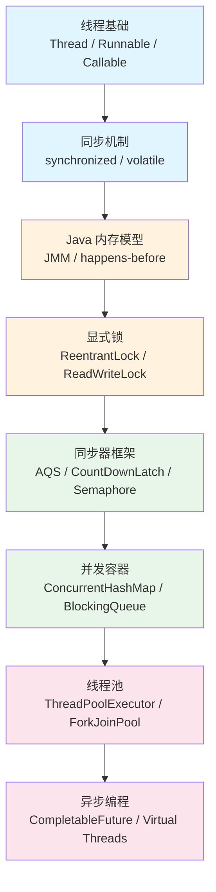

# 为什么需要并发：从单线程到多核时代

> 程序为什么不能一个一个地执行任务？并发到底解决了什么问题？它又引入了哪些新问题？本章从硬件演进和软件需求两个维度，解释并发存在的根本原因，厘清并发与并行的区别，并为你画出 Java 并发体系的全景地图。

## 1. 程序为什么要同时执行多个任务

### 1.1 从单核到多核的演进

2005 年以前，CPU 厂商提升性能的主要手段是**提高主频**。你可能还记得，从 Pentium III 的 500MHz 到 Pentium 4 的 3.8GHz，频率几乎翻了七倍。但这条路线在 2005 年前后撞上了物理墙——更高的频率意味着更高的功耗和散热需求，而芯片的功耗与频率的关系近似于：

```txt
P ∝ C × V² × f
```

其中 `f` 是频率，`V` 是电压，`C` 是电容。频率提升要求电压同步提高，功耗呈指数级增长。Intel 的 Prescott 核心（Pentium 4）就是典型的例子：3.8GHz 的 TDP 高达 115W，热量密度已经逼近风冷极限。

厂商转向了另一条路：**在一块芯片上放多个核心**。2005 年 Intel 发布了 Pentium D（双核），2006 年 Core 2 Duo 将这条路走通。今天，你笔记本上的 CPU 可能有 6-8 个核心，服务器上的 CPU 可能有 64 甚至 128 个核心。

这意味着什么？**单线程程序只能用到一个核心。** 如果你的程序只有一个执行流，那么无论 CPU 有多少个核心，你的程序都只能利用其中的一个。其余的核心在空转——这就是硬件层面的"驱动力"。

### 1.2 三大驱动力

并发的存在不是因为程序员喜欢复杂，而是因为现实需求逼迫我们：

**驱动力一：提升吞吐量（Throughput）**

想象一个 Web 服务器，处理一个请求需要 50ms。如果串行处理，1 秒最多处理 20 个请求。但如果有 4 个核心，我们可以同时处理 4 个请求，吞吐量直接翻 4 倍。这不是"快一点"的问题，而是业务能不能跑起来的问题。

```txt
单线程:   ──[req1]──[req2]──[req3]──[req4]──   → 20 req/s
多线程:   ──[req1]──[req3]──
          ──[req2]──[req4]──                    → 40 req/s（双核）
```

**驱动力二：降低响应时间（Latency）**

用户点击"导出报表"，后台需要做三件事：查询数据库（200ms）、生成图表（150ms）、打包文件（100ms）。串行执行需要 450ms。如果三件事之间没有依赖关系，三个线程并行执行，耗时等于最慢的那个——200ms。响应时间直接砍半以上。

**驱动力三：充分利用硬件资源**

现代 CPU 的一个核心并不只是"一个计算单元"。它有流水线、分支预测器、多级缓存。当一个线程因为等待 I/O（比如磁盘读取、网络请求）而阻塞时，这个核心就空闲了。操作系统通过线程调度，可以在一个线程等待 I/O 时切换到另一个线程，让 CPU 核心始终保持忙碌。

```txt
单线程（I/O 密集型场景）:
  CPU:  ██░░░░░░██░░░░░░██░░░░░░   （大量空闲）
  I/O:  ░░████░░░░████░░░░████░░

多线程:
  CPU:  ██AA██BB██CC██DD██AA██BB   （持续忙碌）
  I/O:  ░░CC░░DD░░AA░░BB░░CC░░DD
```

### 1.3 真实世界的例子：Web 服务器的进化

让我们用一个具体的例子来看并发的必要性。假设你在用 Java 写一个 HTTP 服务器。

**阶段一：单线程 accept 循环**

```java
// 最原始的服务器
ServerSocket server = new ServerSocket(8080);
while (true) {
    Socket client = server.accept();      // 阻塞等待连接
    handleRequest(client);                // 处理请求（可能 50-200ms）
    client.close();
}
```

瓶颈很直接：如果 `handleRequest` 耗时 100ms，那么每秒最多处理 10 个请求。第二个客户端必须等第一个请求处理完才能被接受。用户体验极差。

**阶段二：一请求一线程**

```java
// 每个请求一个线程
ServerSocket server = new ServerSocket(8080);
while (true) {
    Socket client = server.accept();
    new Thread(() -> handleRequest(client)).start();  // 新线程处理
}
```

吞吐量上来了——多个请求可以并行处理。但问题也来了：如果并发请求有 10000 个，就要创建 10000 个线程。每个线程 1MB 栈，光栈就吃掉 10GB 内存。线程创建和销毁的开销也不小。

**阶段三：线程池**

```java
// 用线程池复用线程
ExecutorService pool = Executors.newFixedThreadPool(200);
ServerSocket server = new ServerSocket(8080);
while (true) {
    Socket client = server.accept();
    pool.submit(() -> handleRequest(client));
}
```

用固定数量的线程（比如 200）处理所有请求。线程被复用，不会无限增长。这是传统 Java Web 服务器（Tomcat 的 BIO 模式）的基本思路。

**阶段四：NIO + 事件驱动**

```java
// Netty / Tomcat NIO 的思路
// 少量线程通过 Selector 监听大量连接的 I/O 事件
Selector selector = Selector.open();
// ... 注册 channel ...
while (true) {
    selector.select();  // 阻塞等待 I/O 事件
    for (SelectionKey key : selector.selectedKeys()) {
        if (key.isReadable()) {
            pool.submit(() -> processRequest(key));
        }
    }
}
```

少量线程通过 I/O 多路复用（`Selector`）监听大量连接，只有在数据真正准备好时才分配线程处理。这是 Netty、Vert.x 等框架的核心思路。

**阶段五：虚拟线程（JDK 21+）**

```java
// 每个请求一个虚拟线程，但开销极小
try (var executor = Executors.newVirtualThreadPerTaskExecutor()) {
    while (true) {
        Socket client = server.accept();
        executor.submit(() -> handleRequest(client));
    }
}
```

虚拟线程的栈内存按需分配（几百字节到几 KB），可以轻松创建百万个。代码风格像"一请求一线程"那么简单，性能却接近 NIO。这就是 JDK 21 带来的范式转变。

这个进化过程本身就回答了本章的核心问题：**并发不是可选的，它是服务端编程的基本要求。** 而 Java 的并发工具一直在演进，目标就是让开发者用更简单的方式写出更高性能的并发程序。

## 2. 并发与并行的区别

很多人把"并发"和"并行"混为一谈。它们解决的问题不同，实现的前提也不同。

### 2.1 定义与对比

| 维度 | 并发（Concurrency） | 并行（Parallelism） |
| :-- | :-- | :-- |
| 核心问题 | **结构**问题：如何组织多个任务 | **执行**问题：如何同时运行多个任务 |
| 关注点 | 任务之间的协调与切换 | 任务的同时执行 |
| 硬件要求 | 单核即可 | 至少需要多个核心 |
| 典型场景 | 单核 CPU 上跑 Web 服务器，通过时间片轮转处理多个请求 | 多核 CPU 上同时执行多个排序任务 |
| 类比 | 一个厨师轮流做多道菜（切完菜 A 去翻炒菜 B） | 多个厨师各做各的菜 |

Rob Pike（Go 语言创始人之一）的经典表述：

> Concurrency is about dealing with lots of things at once. Parallelism is about doing lots of things at once.

### 2.2 单核可行并发，多核才能并行

在单核 CPU 上，"同时执行多个任务"是**错觉**。操作系统通过时间片轮转（Time Slicing）让多个线程交替执行，每个线程每次运行几十毫秒，然后被强制切换出去。由于切换速度远快于人类感知，看起来"同时"在跑。这是**并发**。

在多核 CPU 上，多个线程可以真正地、物理地同时执行。两个线程在两个核心上同时运行，没有任何切换，这是**并行**。

```java
// 并行排序示例（Java 8+）
Arrays.parallelSort(largeArray);
// 底层：将数组拆分到多个核心上同时排序
```

Java 的 `ForkJoinPool` 就是一个典型的并行框架：它把大任务递归拆成小任务，分配到多个核心上并行执行，最后合并结果。

```txt
          ┌─────────────┐
          │  大任务排序   │
          └──────┬───────┘
           ┌─────┴─────┐
      ┌────┴────┐ ┌────┴────┐
      │ 左半排序 │ │ 右半排序 │   ← 并行执行
      └────┬────┘ └────┬────┘
           └─────┬─────┘
          ┌──────┴───────┐
          │   合并结果    │
          └──────────────┘
```

### 2.3 并发的多种形态

并发不只是"多线程"。它有多种实现形态，适用于不同场景：

| 形态 | 机制 | 代表技术 | 适用场景 |
| :-- | :-- | :-- | :-- |
| 多进程 | OS 进程隔离 | CGI、微服务 | 需要强隔离的场景 |
| 多线程 | OS 线程共享进程内存 | Java Thread、servlet | CPU 密集 + 通用服务端 |
| 事件驱动 | 单线程事件循环 + 非阻塞 I/O | Node.js、Netty | I/O 密集型 |
| 协程/虚拟线程 | 用户态调度的轻量级线程 | Go goroutine、Java Virtual Thread | 高并发 I/O |
| 数据并行 | 将数据拆分到多个核心 | SIMD、ForkJoinPool、parallelStream | 批量计算 |

**关键认知：** 写代码时，你设计的是并发（任务结构）。运行时，能否并行取决于硬件核心数和调度器。并发是编程模型问题，并行是执行模型问题。

## 3. 并发带来的核心问题

并发带来的收益是明确的，代价同样明确——它引入了单线程程序中根本不存在的问题。

### 3.1 数据竞争：count++ 的陷阱

看这段代码：

```java
public class Counter {
    private int count = 0;

    public void increment() {
        count++;  // 这不是原子操作！
    }

    public int getCount() {
        return count;
    }
}
```

`count++` 看起来是一行代码，但在 CPU 层面它包含三个步骤：

```txt
1. 读取 count 的当前值到寄存器  (LOAD)
2. 寄存器中的值加 1             (ADD)
3. 将寄存器的值写回 count       (STORE)
```

如果两个线程同时执行 `increment()`，可能发生以下交错：

```txt
时间    线程A                    线程B                    count
────────────────────────────────────────────────────────────────
t1      LOAD count (=0)                                    0
t2                               LOAD count (=0)           0
t3      ADD 1 (=1)                                         0
t4                               ADD 1 (=1)                0
t5      STORE 1                                            1
t6                               STORE 1                   1
```

两个线程各执行了一次 `count++`，但结果是 **1** 而不是 **2**。这就是**数据竞争（Data Race）**。

用代码验证：

```java
public class DataRaceDemo {
    private static int count = 0;

    public static void main(String[] args) throws InterruptedException {
        Thread t1 = new Thread(() -> {
            for (int i = 0; i < 100000; i++) count++;
        });
        Thread t2 = new Thread(() -> {
            for (int i = 0; i < 100000; i++) count++;
        });
        t1.start();
        t2.start();
        t1.join();
        t2.join();
        System.out.println("Expected: 200000, Actual: " + count);
    }
}
```

运行多次，你会得到不同的结果：可能是 134521，可能是 167893，几乎不可能是 200000。

### 3.2 共享可变状态的本质问题

数据竞争的根源是什么？是**共享可变状态（Shared Mutable State）**。

```txt
        ┌─────────┐     ┌─────────┐
        │ 线程 A   │     │ 线程 B  │
        └────┬────┘     └────┬────┘
             │               │
             │   读/写        │   读/写
             ▼               ▼
        ┌─────────────────────────┐
        │     共享可变变量 count    │
        └─────────────────────────┘
```

三个条件同时满足就会出问题：

| 条件 | 含义 | 消除手段 |
| :-- | :-- | :-- |
| **共享**（Shared） | 多个线程能访问同一个变量 | 线程封闭（ThreadLocal）、不可变对象 |
| **可变**（Mutable） | 变量的值可以被修改 | 不可变类（final 字段、不可变容器） |
| **状态**（State） | 变量的值代表某种程序状态 | 函数式编程（无副作用） |

消除任意一个条件，数据竞争就不会发生。这就是后面所有并发工具的设计哲学：

- `synchronized`、`Lock` → 保证同一时刻只有一个线程能修改共享状态
- `volatile` → 保证可见性，但不保证原子性
- `ConcurrentHashMap` → 内部做了分段加锁，保证线程安全
- `AtomicInteger` → 用 CAS 操作实现无锁的原子更新
- `ThreadLocal` → 让每个线程持有自己的副本，消除"共享"
- `String`、`Integer` → 不可变对象，消除"可变"

### 3.3 不只是数据竞争：并发 Bug 的分类

数据竞争只是并发问题的一种。实际开发中，你会遇到更多类型的并发 Bug：

| Bug 类型 | 描述 | 典型场景 | 后果 |
| :-- | :-- | :-- | :-- |
| **数据竞争** | 多线程同时读写共享变量，没有同步 | count++ 无保护 | 数据丢失、结果不一致 |
| **死锁** | 两个线程互相持有对方需要的锁，永远等待 | 线程 A 持有锁1 等锁2，线程B 持有锁2 等锁1 | 程序卡住不动 |
| **活锁** | 线程不断重试某个操作，但始终无法推进 | 两个人在走廊里互相让路，结果反复左右横跳 | CPU 空转，无进展 |
| **饥饿** | 某个线程始终得不到执行机会 | 低优先级线程被高优先级线程持续抢占 | 功能不工作 |
| **竞态条件** | 程序的正确性依赖于线程执行的时序 | 先检查后执行（check-then-act） | 偶发性 Bug，难以复现 |

其中**死锁**是最让人头疼的问题之一。看这个例子：

```java
public class DeadlockDemo {
    private static final Object lockA = new Object();
    private static final Object lockB = new Object();

    public static void main(String[] args) {
        // 线程1：先拿 lockA，再拿 lockB
        new Thread(() -> {
            synchronized (lockA) {
                System.out.println("Thread 1: holding lockA");
                try { Thread.sleep(100); } catch (InterruptedException e) {}
                synchronized (lockB) {
                    System.out.println("Thread 1: holding lockA + lockB");
                }
            }
        }).start();

        // 线程2：先拿 lockB，再拿 lockA
        new Thread(() -> {
            synchronized (lockB) {
                System.out.println("Thread 2: holding lockB");
                try { Thread.sleep(100); } catch (InterruptedException e) {}
                synchronized (lockA) {
                    System.out.println("Thread 2: holding lockB + lockA");
                }
            }
        }).start();
    }
}
```

两个线程各持有一把锁，又在等待对方释放锁。永远等下去——这就是死锁。用 `jstack` 工具可以检测到死锁，但更重要的是在设计阶段就避免它（比如统一按顺序获取锁）。

**核心教训：** 并发 Bug 有一个共同的特征——**不可重现**。它们依赖于特定的线程执行时序，而这个时序每次运行都可能不同。你可能跑了 1000 次没问题，第 1001 次就出错了。这就是为什么并发 Bug 是最难调试的 Bug 类型，也是为什么理解并发原理如此重要——你不能靠"试出来"来保证正确性，你必须从原理上保证。

## 4. Java 并发体系全景

Java 的并发体系不是一蹴而就的。从 JDK 1.0 的 `Thread` 和 `synchronized`，到 JDK 5 的 `java.util.concurrent`，到 JDK 8 的 `CompletableFuture`，到 JDK 21 的虚拟线程——它是一部逐步演进的历史。

### 4.1 全景图



### 4.2 后续章节导读地图

| 章节 | 主题 | 核心问题 | 依赖前置 |
| :-- | :-- | :-- | :-- |
| [第2章](./chapter-02-thread-model) | 线程：Java 的执行单元 | 线程是如何被创建、调度和销毁的？ | 无 |
| [第3章](./chapter-03-threadlocal) | 线程封闭：`ThreadLocal` | 每条线程持有独立副本，如何避免竞争？ | [第2章](./chapter-02-thread-model) |
| [第4章](./chapter-04-jmm) | Java 内存模型（JMM） | 线程之间如何看到彼此的写入？ | [第2章](./chapter-02-thread-model) |
| [第5章](./chapter-05-volatile) | `volatile` | 轻量级同步机制能保证什么、不能保证什么？ | [第4章](./chapter-04-jmm) |
| [第6章](./chapter-06-synchronized) | `synchronized` | Java 内置锁的本质是什么？锁如何升级？ | [第4章](./chapter-04-jmm)、[第5章](./chapter-05-volatile) |
| [第7章](./chapter-07-cas-atomic) | CAS 与原子类 | 无锁并发如何实现？CAS 的局限是什么？ | [第4章](./chapter-04-jmm) |
| [第8章](./chapter-08-locksupport-aqs) | `LockSupport` 与 AQS | `synchronized` 不够用时怎么办？AQS 如何统一并发工具？ | [第6章](./chapter-06-synchronized)、[第7章](./chapter-07-cas-atomic) |
| [第9章](./chapter-09-concurrent-collections) | 并发集合 | 如何在高并发下安全地使用集合？ | [第7章](./chapter-07-cas-atomic)、[第8章](./chapter-08-locksupport-aqs) |
| [第10章](./chapter-10-thread-pool) | 线程池 | 线程太多怎么办？如何复用和管理线程？ | [第8章](./chapter-08-locksupport-aqs)、[第9章](./chapter-09-concurrent-collections) |
| [第11章](./chapter-11-async-model) | 异步编程 | 从 `Future` 到 `CompletableFuture`，有哪些异步范式？ | [第10章](./chapter-10-thread-pool) |
| [第12章](./chapter-12-virtual-thread) | 虚拟线程与结构化并发 | JDK 21 之后，并发模型如何被重塑？ | [第2章](./chapter-02-thread-model)、[第10章](./chapter-10-thread-pool)、[第11章](./chapter-11-async-model) |
| [第13章](./chapter-13-diagnostics) | 诊断与优化 | 并发问题怎么查？性能怎么优化？ | 全部前置 |

**学习建议：** [第2章](./chapter-02-thread-model) 至 [第4章](./chapter-04-jmm) 是地基，必须扎实。[第5章](./chapter-05-volatile) 至 [第8章](./chapter-08-locksupport-aqs) 是核心同步机制，理解它们才能读懂 `java.util.concurrent` 的源码。[第9章](./chapter-09-concurrent-collections) 至 [第10章](./chapter-10-thread-pool) 是应用层，日常开发中用得最多。[第11章](./chapter-11-async-model) 至 [第12章](./chapter-12-virtual-thread) 是范式扩展，[第13章](./chapter-13-diagnostics)是工程实践。

### 4.3 Java 并发的历史里程碑

| JDK 版本 | 年份 | 关键并发特性 |
| :-- | :-- | :-- |
| JDK 1.0 | 1996 | `Thread`、`synchronized`、`wait/notify` |
| JDK 1.2 | 1998 | `Thread` 的改进，`ThreadLocal` |
| JDK 1.4 | 2002 | `java.nio`（非阻塞 I/O），`Selector` |
| JDK 5 | 2004 | `java.util.concurrent`（JUC），`Executor`、`Future`、`Lock`、`Atomic`、`ConcurrentHashMap` |
| JDK 6 | 2006 | `Phaser`、并发性能优化 |
| JDK 7 | 2011 | `ForkJoinPool`、`TransferQueue`、`StampedLock` |
| JDK 8 | 2014 | `CompletableFuture`、`parallelStream`、`LongAdder` |
| JDK 9 | 2017 | `Flow`（响应式流）、`CompletableFuture` 增强 |
| JDK 19 | 2022 | 虚拟线程（Preview） |
| JDK 21 | 2023 | 虚拟线程（正式）、Scoped Values、Structured Concurrency（Preview） |

JDK 5 是一个分水岭。在它之前，Java 并发基本靠 `Thread` + `synchronized` + `wait/notify` 三板斧。Doug Lea 的 `java.util.concurrent` 包的引入，让 Java 拥有了工业级的并发工具库。从那以后，Java 并发编程从"手搓线程"进入了"使用框架"的时代。

### 4.4 本书的学习路径

面对如此庞大的并发体系，初学者容易迷失方向。本书的编排遵循一个原则：**从底层原理到上层应用，每一章都回答一个核心问题。**

```txt
  原理层                        机制层                        应用层
┌──────────┐              ┌──────────┐              ┌──────────┐
│  为什么？  │              │          │              │          │
├──────────┤              │          │              │          │
│ 线程是什么 │              │          │              │          │
├──────────┤              │          │              │          │
│ThreadLocal│              │          │              │          │
├──────────┤              │          │              │          │
│   JMM    │              │          │              │          │
├──────────┤              │          │              │          │
│          │──▶ volatile  │          │              │          │
│          │──▶ sync/Mon  │──▶ 并发容器 │              │          │
│ 基础概念  │──▶ CAS/Atomic│──▶ 线程池  │              │          │
│          │──▶ Lock/AQS │──▶ 异步编程 │              │          │
│          │              │──▶ 虚拟线程 │              │          │
└──────────┘              └──────────┘──▶ 诊断优化  │          │
                                           └──────────┘
```

建议按顺序阅读。如果你已经有一定基础，可以跳过前两部分，从 [JMM](./chapter-04-jmm) 开始——它是理解后续所有内容的钥匙。

> **与本卷其他章节的关系：** 本章回答的是"为什么"的问题——为什么需要并发。[线程模型](./chapter-02-thread-model) 将回答"是什么"——Java 中的线程到底是什么东西；[线程封闭](./chapter-03-threadlocal) 引入线程封闭思路，先给出一条回避竞争的捷径；[JMM](./chapter-04-jmm) 回答"怎么保证正确性"——当多个线程同时访问数据时，Java 内存模型提供了哪些保证。如果你对本章提到的任何概念（如 CAS、AQS、ForkJoinPool、虚拟线程）感到陌生，不必担心，后续章节会逐一展开。
