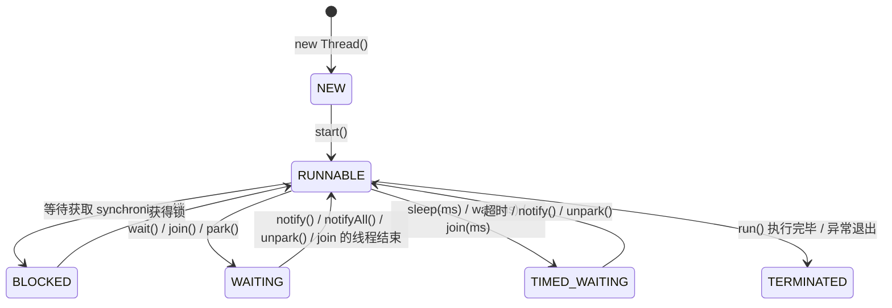

# Java 线程模型：执行单元如何被抽象

> Java 线程到底是什么？它和操作系统线程是什么关系？为什么不能无限制地创建线程？从 `Thread` 到 `CompletableFuture`，创建线程的方式经历了怎样的演进？线程在 JVM 内部有哪些状态，它们之间如何转换？本章将逐一拆解这些问题，帮你建立对 Java 线程模型的完整认知。

## 1. 线程是什么

### 1.1 进程与线程：两个维度的"执行"

在操作系统中，**进程（Process）** 和 **线程（Thread）** 是两个经常被混淆但本质不同的概念。

| 维度 | 进程 | 线程 |
| :-- | :-- | :-- |
| 定义 | 资源分配的基本单位 | CPU 调度的基本执行单位 |
| 内存空间 | 独立的虚拟地址空间 | 共享所属进程的地址空间 |
| 通信方式 | IPC（管道、Socket、共享内存等） | 直接读写共享变量 |
| 创建开销 | 大（需要分配独立地址空间、页表等） | 小（只需分配栈和少量元数据） |
| 崩溃影响 | 一个进程崩溃不影响其他进程 | 一个线程崩溃可能导致整个进程终止 |

简单来说：**进程是"资源容器"，线程是"执行流"**。一个进程可以包含多个线程，它们共享进程的内存空间、文件描述符等资源，但各自拥有独立的程序计数器（PC）、栈和寄存器状态。

```txt
┌────────────────────────────────────────────────────┐
│                  进程 (Process)                     │
│                                                    │
│  ┌─────────────┐  ┌─────────────┐  ┌────────────┐  │
│  │  线程 A      │  │  线程 B     │  │  线程 C     │  │
│  │  ┌────┐     │  │  ┌─────┐    │  │  ┌────┐    │  │
│  │  │栈 A │    │  │  │栈 B  │    │  │  │栈 C     │  │
│  │  └────┘     │  │  └─────┘    │  │  └────┘    │  │
│  │  PC / 寄存器 │  │  PC / 寄存器 │  │  PC / 寄存器│  │
│  └─────────────┘  └─────────────┘  └────────────┘  │
│                                                    │
│  ┌────────────────────────────────────────┐        │
│  │          共享内存区域（堆、方法区）        │        │
│  └────────────────────────────────────────┘        │
│  ┌────────────────────────────────────────┐        │
│  │          共享资源（文件描述符等）          │        │
│  └────────────────────────────────────────┘        │
└────────────────────────────────────────────────────┘
```

### 1.2 为什么需要线程而非多进程

用多进程也能实现"同时做多件事"，为什么还要引入线程？核心原因有三：

1. **共享数据更方便**：线程天然共享堆内存，不需要 IPC 那套复杂机制
2. **创建和切换开销更小**：线程创建比进程快 10-100 倍，上下文切换也更轻量
3. **响应性更好**：GUI 程序中，后台线程处理耗时任务，UI 线程保持响应

当然，共享也是一把双刃剑——多个线程同时读写共享变量，正是并发 bug 的根源。这一点我们在第 4 章（JMM）和后续章节中会详细讨论。

## 2. Java Thread 的本质

### 2.1 1:1 线程模型

Java 的线程模型经历过多次演变，但自 HotSpot JVM 成为主流以来，采用的是 **1:1 线程模型**：

```txt
Java Thread 对象  ──1:1──►  Native Thread (OS 线程)  ──►  OS Scheduler  ──►  CPU Core
```

每创建一个 `java.lang.Thread` 对象，JVM 就会在操作系统层面创建一个对应的原生线程。这个原生线程由操作系统的调度器管理，最终被分配到某个 CPU 核心上执行。

```java
Thread t = new Thread(() -> System.out.println("Hello"));
t.start(); // JVM 调用 pthread_create() (Linux) 或 CreateThread() (Windows)
```

这意味着：

- **Java 线程的调度策略由操作系统决定**（通常是时间片轮转 + 优先级调度）
- **Java 线程的并发度受 OS 线程数限制**
- **线程切换涉及用户态/内核态切换**，有一定开销

> **历史注脚**：早期的 JVM（如 Green Thread）采用 N:1 模型——多个 Java 线程映射到一个 OS 线程，由 JVM 自行调度。这种方式在多核时代完全失去了意义，早已被淘汰。而 Go 语言的 goroutine 采用 M:N 模型，由 Go 运行时在少量 OS 线程上调度大量 goroutine，这在轻量级并发场景下有明显优势。

### 2.2 为什么不能无限制创建线程

1:1 模型带来一个直接后果：Java 线程的规模上限，由操作系统对 OS 线程的资源约束决定。

每个 OS 线程都需要分配独立的栈空间。在典型的 64 位 Linux 系统上：

| 资源 | 默认值 | 说明 |
| :-- | :-- | :-- |
| 线程栈大小 | 1 MB（可通过 `-Xss` 调整） | 每个线程独占 |
| `/proc/sys/kernel/threads-max` | 系统级上限 | 系统所有线程总数 |
| `/proc/sys/vm/max_map_count` | ~65530 | 限制内存映射区域数 |
| PID 上限 | `/proc/sys/kernel/pid_max` | 进程/线程共用 PID 空间 |

粗略估算：1000 个线程 ≈ 1 GB 栈内存。再加上内核侧的 `task_struct`、内核栈等开销，实际占用更多。

```java
// 演示线程创建的极限
public class ThreadLimit {
    public static void main(String[] args) {
        int count = 0;
        try {
            while (true) {
                new Thread(() -> {
                    try { Thread.sleep(Long.MAX_VALUE); }
                    catch (InterruptedException e) {}
                }).start();
                count++;
            }
        } catch (OutOfMemoryError e) {
            System.out.println("最多创建 " + count + " 个线程");
        }
    }
}
// 典型输出（取决于系统配置）：最多创建 ~4000 个线程
```

这就是为什么在高并发场景下，需要线程池（`ExecutorService`）来复用线程，而不是为每个任务创建新线程。线程池的内容详见第 10 章。

而 1:1 模型的另一条突围路径，是从根本上改变线程与 OS 资源的绑定关系——这就是 Java 21 引入 Virtual Thread 的动机。

### 2.3 Virtual Thread：JDK 21+ 的新选择

JDK 21 正式引入的 **Virtual Thread（虚拟线程）** 是 Java 线程模型的重大变革。它采用 M:N 模型——大量虚拟线程被映射到少量平台线程（Platform Thread，即传统的 OS 线程）上：

```txt
┌─────────────────────────────────────────────────┐
│              Virtual Threads (M)                │
│  ┌─────┐ ┌─────┐ ┌─────┐ ┌─────┐ ┌─────┐       │
│  │ VT1 │ │ VT2 │ │ VT3 │ │ VT4 │ │ VT5 │ ...   │
│  └──┬──┘ └──┬──┘ └──┬──┘ └──┬──┘ └──┬──┘       │
│     │       │       │       │       │           │
│     └───────┴───────┼───────┴───────┘           │
│                     │                           │
│              ┌──────┴──────┐                    │
│              │  Scheduler  │                    │
│              └──────┬──────┘                    │
│    ┌────────────────┼────────────────┐          │
│    │                │                │          │
│  ┌─┴──┐         ┌──┴──┐         ┌──┴──┐        │
│  │ PT1│         │ PT2 │         │ PT3 │        │
│  │(OS)│         │(OS) │         │(OS) │        │
│  └────┘         └─────┘         └─────┘        │
└─────────────────────────────────────────────────┘
```

虚拟线程的栈帧存储在堆内存中（而非 OS 分配的固定栈空间），可以动态扩展和收缩。创建一个虚拟线程的开销仅约几百字节，**理论上可以创建数百万个**。它的调度由 JVM 内部的 `ForkJoinPool` 完成，当虚拟线程执行阻塞 I/O 时，JVM 会自动将其从平台线程上卸载（unmount），让平台线程去执行其他虚拟线程。

```java
// 创建虚拟线程
try (var executor = Executors.newVirtualThreadPerTaskExecutor()) {
    for (int i = 0; i < 100_000; i++) {
        executor.submit(() -> {
            // 模拟阻塞 I/O
            Thread.sleep(Duration.ofSeconds(1));
            return "done";
        });
    }
} // 10 万个虚拟线程，但只用了少量平台线程
```

| 维度 | Platform Thread（传统） | Virtual Thread（JDK 21+） |
| :-- | :-- | :-- |
| 映射关系 | 1:1（Java Thread → OS Thread） | M:N（多对少） |
| 栈内存 | OS 分配，默认 1MB | 堆内存，按需增长（初始几KB） |
| 创建开销 | 高（~1ms + OS 资源） | 极低（~微秒级） |
| 调度 | OS 内核调度器 | JVM 内部 ForkJoinPool |
| 适用场景 | CPU 密集型任务 | I/O 密集型任务（Web 服务、数据库查询） |

> **注意**：虚拟线程并非万能药。对于 CPU 密集型任务，虚拟线程没有优势（因为平台线程数 ≈ CPU 核心数已经是最优配置）。虚拟线程的价值在于 I/O 密集型场景——用少量 OS 线程支撑海量并发连接。虚拟线程的完整机制、pinning 陷阱与结构化并发详见第 12 章。

## 3. 创建线程的方式演进

Java 创建异步执行单元的方式经历了四个阶段的演进，每一步都是对前一步局限性的回应。

### 3.1 继承 Thread（JDK 1.0）

最原始的方式，直接继承 `Thread` 类并重写 `run()` 方法：

```java
public class MyThread extends Thread {
    @Override
    public void run() {
        System.out.println("Thread running: " + Thread.currentThread().getName());
    }
}

// 启动
new MyThread().start();
```

**局限**：Java 只支持单继承，一旦继承了 `Thread`，就无法再继承其他类。这在实际项目中非常受限。

### 3.2 实现 Runnable（JDK 1.0）

将"要执行的任务"从"执行线程"中分离出来：

```java
Runnable task = () -> System.out.println("Runnable running");
new Thread(task).start();
```

**优势**：接口可以多实现，任务与线程解耦，可以被线程池复用。
**局限**：没有返回值，无法声明受检异常。

### 3.3 Callable + Future（JDK 5.0）

`java.util.concurrent` 包引入了 `Callable<V>` 接口和 `Future<V>` 接口，解决了返回值和异常的问题：

```java
Callable<Integer> callable = () -> {
    // 模拟耗时计算
    Thread.sleep(1000);
    return 42;
};

ExecutorService executor = Executors.newSingleThreadExecutor();
Future<Integer> future = executor.submit(callable);

// get() 会阻塞直到结果就绪
try {
    Integer result = future.get(); // 阻塞
    System.out.println("结果: " + result);
} catch (ExecutionException e) {
    System.err.println("任务执行异常: " + e.getCause());
} finally {
    executor.shutdown();
}
```

**优势**：有返回值、可抛异常、可取消。
**局限**：`Future.get()` 是阻塞的，不支持链式组合，无法表达"任务 A 完成后执行任务 B"这种依赖关系。

### 3.4 CompletableFuture（JDK 8.0）

JDK 8 引入的 `CompletableFuture` 是对 `Future` 的全面增强，支持链式调用、组合、异常处理：

```java
CompletableFuture.supplyAsync(() -> {
    // 异步查询用户信息
    return queryUser(userId);
}).thenApply(user -> {
    // 用户信息拿到后，异步查询订单
    return queryOrders(user.getId());
}).thenAccept(orders -> {
    // 订单拿到后，处理结果
    orders.forEach(System.out::println);
}).exceptionally(ex -> {
    // 任意阶段异常都会被捕获
    System.err.println("出错: " + ex.getMessage());
    return null;
});
```

### 3.5 四种方式对比

| 方式 | 引入版本 | 返回值 | 异常声明 | 可组合性 | 线程池支持 | 适用场景 |
| :-- | :-- | :-- | :-- | :-- | :-- | :-- |
| `Thread` | 1.0 | ❌ | ❌ | ❌ | ❌ | 简单原型 |
| `Runnable` | 1.0 | ❌ | ❌ | ❌ | ✅ | 无返回值的任务 |
| `Callable+Future` | 5.0 | ✅ | ✅ | ❌ | ✅ | 需要返回值的一次性任务 |
| `CompletableFuture` | 8.0 | ✅ | ✅ | ✅ | ✅ | 异步编排、流水线 |

> **实践建议**：在现代 Java 开发中，直接使用 `CompletableFuture` 配合线程池是最佳实践。`Thread` 和 `Runnable` 仅在简单场景或学习阶段使用。

## 4. 线程生命周期

### 4.1 六种状态

`java.lang.Thread.State` 枚举定义了线程的六种状态。理解这些状态及其转换，是排查并发问题的基本功。



| 状态 | 含义 | 典型触发场景 |
| :-- | :-- | :-- |
| **NEW** | 线程对象已创建，尚未调用 `start()` | `new Thread(runnable)` |
| **RUNNABLE** | 可运行状态（包括正在运行和等待 CPU 调度） | `start()` 后；从 BLOCKED/WAITING/TIMED_WAITING 恢复 |
| **BLOCKED** | 等待获取 `synchronized` 锁 | 进入 `synchronized` 块时锁被其他线程持有 |
| **WAITING** | 无限期等待，需要其他线程显式唤醒 | `Object.wait()`、`Thread.join()`、`LockSupport.park()` |
| **TIMED_WAITING** | 有限期等待，超时后自动恢复 | `Thread.sleep(ms)`、`wait(ms)`、`join(ms)` |
| **TERMINATED** | 线程执行完毕或因异常终止 | `run()` 正常返回；未捕获的异常 |

### 4.2 各状态详解

**NEW 状态**

```java
Thread t = new Thread(() -> {});
System.out.println(t.getState()); // NEW
// 此时线程对象已存在，但操作系统层面还没有对应的原生线程
```

**RUNNABLE 状态**

```java
t.start();
System.out.println(t.getState()); // RUNNABLE
// 注意：RUNNABLE 不代表"正在运行"，而是"可以运行"
// 它包含了传统操作系统中的 Ready 和 Running 两个子状态
```

这里有一个常见的困惑：为什么没有 `RUNNING` 状态？因为在 JVM 的线程模型中，**调度由 OS 内核完成**，JVM 无法精确知道线程此刻是在 CPU 上执行还是在等待队列中。所以统一用 `RUNNABLE` 表示"有能力运行"。

**BLOCKED 状态**

```java
Object lock = new Object();

Thread t1 = new Thread(() -> {
    synchronized (lock) {
        try { Thread.sleep(5000); } catch (InterruptedException e) {}
    }
});

Thread t2 = new Thread(() -> {
    synchronized (lock) { // t1 持有锁，t2 进入 BLOCKED
        System.out.println("Got lock");
    }
});

t1.start();
Thread.sleep(100);
t2.start();
Thread.sleep(100);
System.out.println(t2.getState()); // BLOCKED
```

**WAITING 状态**

```java
Thread t = new Thread(() -> {
    try {
        Thread.currentThread().join(); // 等待自己结束——实际上会永远等待
    } catch (InterruptedException e) {}
});
t.start();
Thread.sleep(100);
System.out.println(t.getState()); // WAITING
```

**TIMED_WAITING 状态**

```java
Thread t = new Thread(() -> {
    try {
        Thread.sleep(1000);
    } catch (InterruptedException e) {}
});
t.start();
Thread.sleep(100);
System.out.println(t.getState()); // TIMED_WAITING
```

**TERMINATED 状态**

```java
Thread t = new Thread(() -> {});
t.start();
t.join(); // 等待 t 结束
System.out.println(t.getState()); // TERMINATED
```

### 4.3 线程中断机制

中断（Interrupt）是 Java 线程协作的重要机制。它不是强制终止线程，而是一种**协作式的通知机制**——被中断的线程可以自行决定如何响应。

三个关键 API：

| 方法 | 作用 | 特点 |
| :-- | :-- | :-- |
| `thread.interrupt()` | 设置线程的中断标志为 `true` | 如果线程在 `sleep`/`wait`/`join` 中，会抛出 `InterruptedException` 并清除标志 |
| `thread.isInterrupted()` | 查询中断标志 | 不清除标志 |
| `Thread.interrupted()` | 查询**当前线程**的中断标志并清除 | 静态方法，注意会清除标志 |

```java
// 响应中断的正确模式
public class InterruptDemo {
    public static void main(String[] args) throws InterruptedException {
        Thread worker = new Thread(() -> {
            while (!Thread.currentThread().isInterrupted()) {
                try {
                    // 执行任务...
                    System.out.println("Working...");
                    Thread.sleep(500);
                } catch (InterruptedException e) {
                    // sleep 被中断时会抛出此异常，同时清除中断标志
                    System.out.println("收到中断信号，准备退出");
                    // 重新设置中断标志（可选，取决于是否需要让上层感知）
                    Thread.currentThread().interrupt();
                    break;
                }
            }
            System.out.println("线程退出");
        });

        worker.start();
        Thread.sleep(2000);
        worker.interrupt(); // 通知 worker 停止
        worker.join();
    }
}
```

> **常见陷阱**：吞掉 `InterruptedException`（空 catch 块）是极其常见的错误。这会导致线程无法正确感知中断信号，从而无法优雅地停止。正确的做法要么是向上抛出，要么在 catch 中重新设置中断标志。

### 4.4 守护线程（Daemon Thread）

Java 线程分为两类：**用户线程**和**守护线程**。JVM 会在所有用户线程结束后退出，而不管守护线程是否还在运行。

```java
Thread daemon = new Thread(() -> {
    while (true) {
        doBackgroundWork();  // 后台监控、日志刷新等
    }
});
daemon.setDaemon(true);  // 必须在 start() 之前设置
daemon.start();
// 当所有用户线程结束后，这个守护线程会被 JVM 强制终止
```

| 特性 | 用户线程 | 守护线程 |
| :-- | :-- | :-- |
| JVM 退出行为 | 所有用户线程结束后 JVM 才退出 | 不阻止 JVM 退出 |
| 典型用途 | 业务逻辑线程 | GC 线程、JIT 编译线程、监控线程 |
| 资源清理 | 可以安全地清理资源 | **不安全**——可能在任何时候被终止 |
| 默认类型 | `new Thread()` 默认是用户线程 | 需要显式 `setDaemon(true)` |

**注意：** 守护线程创建的子线程默认也是守护线程。不要在守护线程中执行需要清理资源的操作（如关闭文件、释放连接），因为它可能在执行到一半时被强制终止。

### 4.5 线程状态的监控工具

在实际开发中，你需要监控线程状态来排查问题。常用工具：

| 工具 | 用途 | 命令/方法 |
| :-- | :-- | :-- |
| `jstack` | 导出线程堆栈，检测死锁 | `jstack <pid>` |
| `jconsole` | 图形化监控线程状态 | `jconsole` |
| `VisualVM` | 功能更强大的图形化工具 | `jvisualvm` |
| `ThreadMXBean` | 编程方式获取线程信息 | `ManagementFactory.getThreadMXBean()` |
| `Arthas` | 阿里开源的 Java 诊断工具 | `thread`、`thread -b`（检测死锁） |

```java
// 编程方式监控线程
ThreadMXBean tmx = ManagementFactory.getThreadMXBean();
long[] threadIds = tmx.getAllThreadIds();
for (long id : threadIds) {
    ThreadInfo info = tmx.getThreadInfo(id);
    System.out.printf("%s: %s%n", info.getThreadName(), info.getThreadState());
}

// 检测死锁
long[] deadlockedThreads = tmx.findDeadlockedThreads();
if (deadlockedThreads != null) {
    System.out.println("检测到死锁！涉及线程: " + Arrays.toString(deadlockedThreads));
}
```

## 5. 本章小结

本章从操作系统的线程概念出发，梳理了 Java 线程模型的核心知识：

1. **线程是 CPU 调度的基本单位**，与进程（资源分配的基本单位）有本质区别
2. **HotSpot 采用 1:1 线程模型**，每个 Java 线程对应一个 OS 线程，受 OS 资源限制
3. **创建线程的方式不断演进**：从 `Thread` 到 `CompletableFuture`，逐步解决组合性、返回值、异常处理等问题
4. **线程有六种状态**，理解状态转换是排查并发问题的基础
5. **中断是协作式的通知机制**，不是强制终止

> **与 Project Loom 的关系**：本章介绍的 1:1 线程模型和线程状态机是理解传统 Java 并发的基础。Virtual Thread 改变了线程的调度方式（由 JVM 而非 OS 调度），但 JMM 的规则（第 4 章）、线程安全的编程范式（第 5-9 章）依然完全适用。无论底层是平台线程还是虚拟线程，happens-before 规则不变，`volatile` 和 `synchronized` 的语义不变。
