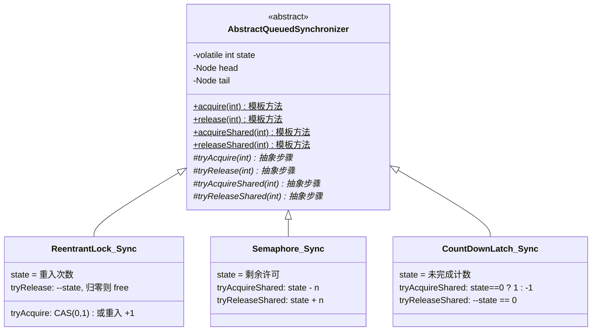
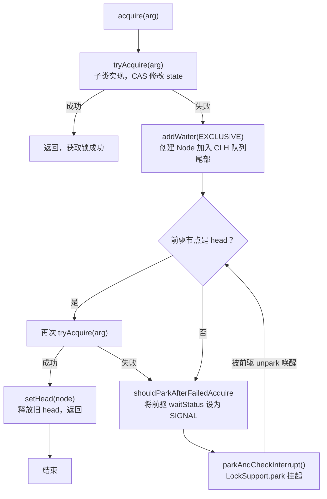
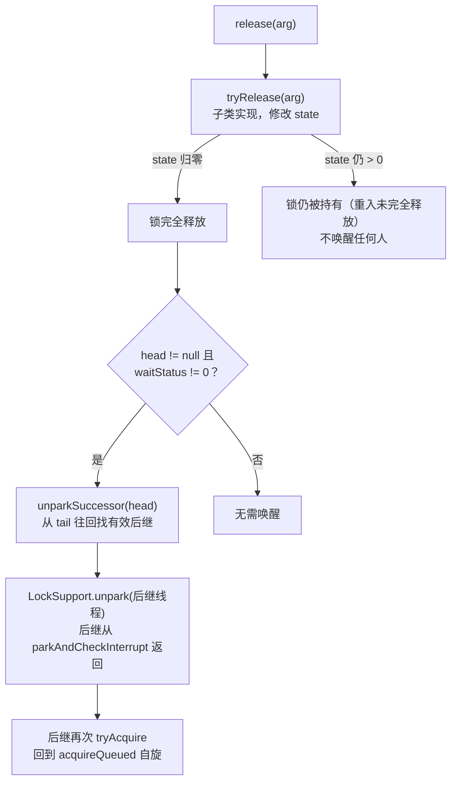

# `LockSupport` 与 AQS：并发工具的骨架

> `ReentrantLock`、`Semaphore`、`CountDownLatch`、`CyclicBarrier`——四种表面完全不同的工具，为什么源码都藏在同一个基类里？

第 6 章的 `synchronized` 把互斥锁封装在 JVM 内部。开发者只有一个开关：`synchronized`/不 `synchronized`。这一章讨论的是另一条路：**把锁的实现搬到 Java 代码层面**，让"如何挂起线程"、"如何组织等待队列"、"如何唤醒"这些机制变得可编程。这条路的起点是 `LockSupport`，终点是 AQS。走完这一章，回头再看 `java.util.concurrent.locks` 和 `java.util.concurrent` 包里绝大多数工具，会发现它们其实只有一个骨架。

## 1. `synchronized` 走不到的地方

### 1.1 五个 `synchronized` 做不到的诉求

`synchronized` 的语义是"要么拿到锁进入临界区，要么阻塞等"。真到线上，业务几乎每天都在提出更细的要求：

| 需求 | `synchronized` 的答案 |
| :-- | :-- |
| "我最多等 3 秒，拿不到就走" | 做不到 |
| "我等锁的时候允许被 `interrupt` 打断" | 做不到 |
| "同一把锁，读线程之间不要互斥" | 做不到 |
| "等的时间越久越优先，别让新来的插队" | 做不到 |
| "生产者等'非满'、消费者等'非空'，两条队列别搅在一起" | 做不到（只有一个 `_WaitSet`） |

不是 `synchronized` 设计得差，而是它把选择权全部下放到了 JVM 内部——JVM 只做互斥这一种语义。任何超出互斥的诉求，都需要一套 Java 层可编程的锁基础设施。

### 1.2 把锁搬到 Java 层，需要什么

如果不再依赖 `monitorenter`/`monitorexit`，一把互斥锁至少要自己回答三个问题：

- **状态用什么表达**：几把锁、有没有人持锁、重入了几次
- **争锁失败的线程放到哪里**：等待队列的数据结构、入队方式
- **挂起和唤醒怎么实现**：谁把线程挂起、谁把它叫醒

第一个问题的答案是：**一个 `volatile int` + CAS**。第二个问题的答案是：**一条 FIFO 双向链表**。第三个问题的答案是：**`LockSupport.park` / `unpark`**。

这三样加在一起就是 AQS 的骨架。但要理解 AQS 的挂起/唤醒是怎么发生的，得先看第三样——`LockSupport`。

## 2. `LockSupport`：许可证式挂起

### 2.1 `park` / `unpark` 的语义

`java.util.concurrent.locks.LockSupport` 只有两个核心静态方法：

```java
LockSupport.park();                 // 挂起当前线程
LockSupport.park(Object blocker);   // 同上，附带阻塞原因，dump 时能看到

LockSupport.unpark(Thread t);       // 唤醒指定线程
```

它对每条线程维护一张**许可证（permit）**：

- `unpark(t)` 把 t 的许可证置为"可用"
- `park()` 检查当前线程的许可证：可用则消耗掉后立即返回，不可用则挂起，直到有人调用 `unpark`

许可证是一个二值状态——不是计数器。连续两次 `unpark` 只会保留一张许可证，第二张被忽略。

### 2.2 三点关键差异

`LockSupport` 与 `Object.wait/notify` 表面上都能挂起线程，但用途完全不同：

| 维度 | `wait` / `notify` | `park` / `unpark` |
| :-- | :-- | :-- |
| 是否需要持锁 | 必须持有对象的 Monitor，否则 `IllegalMonitorStateException` | 不需要 |
| 唤醒目标 | 从 `_WaitSet` 里挑一个（`notify` 不确定，`notifyAll` 全部） | 精确指定某条线程 |
| `unpark` / `notify` 早于挂起 | 无效，`notify` 时如果没人在 wait，什么都不发生 | 有效，许可证保留，后续 `park` 立即返回 |
| 中断行为 | 抛 `InterruptedException` | `park` 直接返回，需自行检查 `Thread.interrupted()` |

**"唤醒可以先于挂起"** 是许可证语义带来的关键性质。用 `wait/notify` 实现一个"线程 A 通知 B"的原语，要小心 A 的 `notify` 早于 B 的 `wait` 的时序——一旦跑到前面，B 就会永远睡下去。`park/unpark` 不存在这个时序坑。

### 2.3 一个可以自己写的简易锁

用 `park`/`unpark` 就能拼一把最简的互斥锁：

```java
public class SimpleLock {
    private final AtomicBoolean locked = new AtomicBoolean(false);
    private final Queue<Thread> waiters = new ConcurrentLinkedQueue<>();

    public void lock() {
        Thread current = Thread.currentThread();
        while (!locked.compareAndSet(false, true)) {
            waiters.offer(current);
            // 二次检查：可能就在这一瞬间锁被释放了
            if (locked.get()) {
                LockSupport.park(this);
            }
            waiters.remove(current);
        }
    }

    public void unlock() {
        locked.set(false);
        Thread next = waiters.peek();
        if (next != null) LockSupport.unpark(next);
    }
}
```

这段代码正确性不够强（缺失公平性、可能丢唤醒、无重入），但它揭示了一个事实：**"CAS 抢状态 + 队列排队 + `park/unpark` 挂起唤醒"就是一把锁的最小工作集**。AQS 做的事，本质上就是把这套模式提炼成一个可扩展的框架。

### 2.4 底层实现的一句话交代

`LockSupport.park` 最终委托到 `Unsafe.park`，Linux 上进入 `pthread_cond_wait`。挂起的线程状态在 Java 层是 `WAITING`，OS 层进入睡眠，不消耗 CPU。这也是 AQS 得以在**未拿到锁的线程上不空转**的技术底座。

## 3. AQS 的三件套

### 3.1 一个 `state` + 一个 CLH 队列 + 一套 Node 状态

`AbstractQueuedSynchronizer`（AQS）的内部结构：

```txt
     ┌──────────────────────────────────────────────┐
     │        AbstractQueuedSynchronizer            │
     │                                              │
     │   volatile int state          ← 同步状态       │
     │                                              │
     │   Node head ─→ Node ─→ Node ─→ Node ← tail   │
     │        │        │       │       │            │
     │        │      thread=B thread=C thread=D     │
     │        │     ws=SIGNAL ws=SIGNAL   ws=0      │
     │      (虚节点)                                 │
     └──────────────────────────────────────────────┘
```

- **`state`**：`volatile int`。语义由子类决定——`ReentrantLock` 里它是"重入次数"，`Semaphore` 里它是"剩余许可数"，`CountDownLatch` 里它是"未完成计数"。修改通过 `compareAndSetState` 保证原子性。
- **CLH 队列**：一条 FIFO 双向链表，节点类型是 `Node`。抢锁失败的线程被封装成 Node 挂到队尾。队头是一个"虚节点"（sentinel），当前持锁线程本身不在队列中——head 是"下一个要被唤醒的候选人的前驱"。
- **Node 的 `waitStatus`**：一个 `int` 字段，编码了节点的四种状态。

### 3.2 Node 的四种状态

| 常量 | 值 | 含义 |
| :-- | :-- | :-- |
| `SIGNAL` | -1 | 当前节点释放锁时**必须**唤醒后继 |
| `CANCELLED` | 1 | 线程被中断/超时放弃排队，节点作废 |
| `CONDITION` | -2 | 节点当前挂在某个 `Condition` 的条件队列里 |
| `PROPAGATE` | -3 | 共享模式下用于把"释放"事件继续向后传播 |
| 0 | 0 | 初始状态 / 已消费掉 SIGNAL |

一条完整的排队线程通常经历：`0 → SIGNAL → 被唤醒后消费掉 → 0`。理解这四个状态，AQS 里让人头晕的 CAS 就有了坐标。

### 3.3 模板方法模式：分离"如何获取"与"失败后怎么办"

AQS 用模板方法把工作切成两半：

**AQS 已经写好的（不变部分）**：

- CLH 队列的入队 / 出队 / 前驱状态维护
- `LockSupport.park` / `unpark` 挂起唤醒
- 中断响应
- 超时控制
- 公平/非公平策略骨架

**子类需要实现的（变化部分）**：

| 方法 | 语义 | 何时实现 |
| :-- | :-- | :-- |
| `tryAcquire(int)` | 独占模式：尝试获取，成功 true 失败 false | `ReentrantLock` 等独占锁 |
| `tryRelease(int)` | 独占模式：尝试释放，state 归零返回 true | 独占锁 |
| `tryAcquireShared(int)` | 共享模式：返回剩余许可，负数表示失败 | `Semaphore` / `CountDownLatch` |
| `tryReleaseShared(int)` | 共享模式：释放并返回是否需要传播 | 共享同步器 |
| `isHeldExclusively()` | 当前线程是否独占持有 | 支持 `Condition` 时需实现 |

子类不需要碰队列、park、中断处理——那些 AQS 已经解决过一次，之后所有子类共用。这就是"用一个 state + 一个队列统一万物"能成立的原因：只要业务逻辑能编码进 `state`，AQS 就能把它跑成一个正确的同步器。



## 4. 独占模式与共享模式

AQS 从入口就分成两条路径：`acquire` / `release` 走独占，`acquireShared` / `releaseShared` 走共享。骨架相同，唤醒策略不同。

### 4.1 独占模式：先尝试，再入队，再挂起

`ReentrantLock` 是独占模式的典型。`acquire` 的骨架：

```java
public final void acquire(int arg) {
    if (!tryAcquire(arg) &&
        acquireQueued(addWaiter(Node.EXCLUSIVE), arg))
        selfInterrupt();
}
```

三步走：

**第一步 `tryAcquire`（子类实现）**：非公平模式直接 CAS 抢，公平模式先看队列有没有前驱。

```java
// NonfairSync 非公平模式
final boolean nonfairTryAcquire(int acquires) {
    Thread current = Thread.currentThread();
    int c = getState();
    if (c == 0) {
        if (compareAndSetState(0, acquires)) {
            setExclusiveOwnerThread(current);
            return true;
        }
    } else if (current == getExclusiveOwnerThread()) {   // 重入
        setState(c + acquires);
        return true;
    }
    return false;
}
```

```java
// FairSync 公平模式：多一行前驱检查
if (c == 0) {
    if (!hasQueuedPredecessors() && compareAndSetState(0, acquires)) {
        setExclusiveOwnerThread(current);
        return true;
    }
}
```

**第二步 `addWaiter`（入队）**：把当前线程包成 Node 挂到队尾。快速路径是"tail 非空 + 一次 CAS"，慢路径 `enq` 用自旋 CAS 处理"队列尚未初始化"的边界。

**第三步 `acquireQueued`（自旋 + 挂起）**：

```java
for (;;) {
    Node p = node.predecessor();
    if (p == head && tryAcquire(arg)) {   // 前驱是 head，再试一次
        setHead(node);
        p.next = null;                     // help GC
        return interrupted;
    }
    if (shouldParkAfterFailedAcquire(p, node))
        interrupted |= parkAndCheckInterrupt();
}
```

`shouldParkAfterFailedAcquire` 做的事是——**把前驱节点的 `waitStatus` 置为 `SIGNAL`**。这一步的语义是"我要睡了，你解锁时记得叫我"。这个契约让后续的释放变得极简。

`parkAndCheckInterrupt` 内部就是 §8.2 讲的 `LockSupport.park(this)`。线程从此挂起，直到前驱调用 `unpark`。

把这三步串起来，完整的 `acquire` 流程如下：



整个过程中，`shouldParkAfterFailedAcquire` 可能需要多次自旋：如果前驱节点是 `CANCELLED` 状态（线程超时或被中断放弃），就跳过它往前找一个有效的前驱，再把那个前驱的 `waitStatus` 设为 `SIGNAL`。这个清理过程保证了队列中 `CANCELLED` 节点不会阻塞后续节点的唤醒链。

### 4.2 独占模式的 `release`：只干两件事

```java
public final boolean release(int arg) {
    if (tryRelease(arg)) {                 // state 归零？
        Node h = head;
        if (h != null && h.waitStatus != 0)
            unparkSuccessor(h);            // 唤醒后继
        return true;
    }
    return false;
}
```

`tryRelease` 由子类决定"归零"的条件。`ReentrantLock` 里必须减到 0 才算真释放——重入了三次要 `unlock` 三次。归零后，`unparkSuccessor` 找到队列里第一个未取消的节点，`LockSupport.unpark`。被唤醒的线程从 `acquireQueued` 的 `park` 处返回，回到自旋，再次 `tryAcquire`。



`unparkSuccessor` 里藏着一个反直觉的细节：找后继时**从 tail 往回遍历**。原因是入队的顺序是"先设 prev，再 CAS tail，最后设 prev.next"——`next` 指针可能是过时的，`prev` 链才是可靠的。

### 4.3 共享模式：唤醒之后还要接力

`Semaphore.acquire(1)` / `CountDownLatch.await` 走共享路径：

```java
public final void acquireShared(int arg) {
    if (tryAcquireShared(arg) < 0)
        doAcquireShared(arg);
}
```

`tryAcquireShared` 返回值语义与独占版不同：**负数=失败，非负数=成功且剩余资源=返回值**。剩余资源大于 0 时，被唤醒的线程要**继续把这个"仍有资源"的信号传给后继**。

举一个 `CountDownLatch` 的场景：

```txt
CountDownLatch(3)：三条线程 A / B / C 都在 await
队列： head → NodeA → NodeB → NodeC ← tail

外部调用 countDown 三次，state = 0。
最后一次 countDown 唤醒 NodeA。
```

如果只唤醒 A，B 和 C 就永远睡下去了。共享模式必须让 A 醒来后**继续 unpark B**、B 醒来后**继续 unpark C**——这就是传播（propagation）。

实现集中在 `doReleaseShared`：

```java
private void doReleaseShared() {
    for (;;) {
        Node h = head;
        if (h != null && h != tail) {
            int ws = h.waitStatus;
            if (ws == Node.SIGNAL) {
                if (!compareAndSetWaitStatus(h, Node.SIGNAL, 0))
                    continue;
                unparkSuccessor(h);
            } else if (ws == 0 &&
                       !compareAndSetWaitStatus(h, 0, Node.PROPAGATE))
                continue;
        }
        if (h == head) break;    // head 没变，链条走完
    }
}
```

`PROPAGATE` 状态的用途就在这里：即便当前节点已经把 `SIGNAL` 消费掉，只要 `state` 里还有资源，链条上的下一个节点也应当被叫醒。

### 4.4 独占 vs 共享的核心差异

| 维度 | 独占模式 | 共享模式 |
| :-- | :-- | :-- |
| 同一时刻持有者 | 1 | 多个 |
| `state` 语义 | 是否被占 / 重入计数 | 剩余许可 / 未完成计数 |
| 获取失败判据 | `tryAcquire` 返回 false | `tryAcquireShared` 返回负数 |
| 释放后唤醒 | 只唤醒队首后继 | 唤醒后继并沿链传播 |
| 典型工具 | `ReentrantLock` / `ReadWriteLock` 写锁部分 | `Semaphore` / `CountDownLatch` / 读锁部分 |

## 5. `Condition`：AQS 里的等待队列

`ReentrantLock.newCondition()` 得到一个 `Condition` 对象。它替代 `Object.wait/notify`，能力上超过后者。

### 5.1 两条独立的队列

一个 AQS 内部只有一条 CLH **同步队列**（排队争锁的）。但可以挂**多个条件队列**——每个 `Condition` 一条：

```txt
同步队列（一条，AQS 内建）
   head → Node → Node → Node ← tail
           争锁排队者

Condition_notEmpty 条件队列（挂在 lock 上）
   firstWaiter → Node → Node ← lastWaiter
                在 notEmpty 上 await 的线程

Condition_notFull 条件队列（挂在同一个 lock 上）
   firstWaiter → Node ← lastWaiter
                在 notFull 上 await 的线程
```

节点在两条队列之间迁移：

- **`await()`**：从"当前持锁线程"→ 释放锁 → 加入指定 `Condition` 的条件队列尾 → `park`
- **`signal()`**：把条件队列的第一个节点摘下来 → 转移到同步队列尾 → 等待被锁释放时唤醒

**关键**：`signal` 不代表"立刻运行"。被 `signal` 的线程只是从"等条件"变成"等锁"，还得排队争锁——和 `wait/notify` 是一样的。

### 5.2 生产者-消费者用两条 Condition 精确唤醒

```java
private final ReentrantLock lock = new ReentrantLock();
private final Condition notFull  = lock.newCondition();
private final Condition notEmpty = lock.newCondition();

public void put(E e) throws InterruptedException {
    lock.lock();
    try {
        while (isFull()) notFull.await();     // 只挂在 notFull 上
        enqueue(e);
        notEmpty.signal();                    // 精确唤一个消费者
    } finally { lock.unlock(); }
}

public E take() throws InterruptedException {
    lock.lock();
    try {
        while (isEmpty()) notEmpty.await();   // 只挂在 notEmpty 上
        E e = dequeue();
        notFull.signal();                     // 精确唤一个生产者
    } finally { lock.unlock(); }
}
```

用 `wait/notify` 实现同样的语义，只能用 `notifyAll` 把生产者和消费者一起叫起来，让每条线程醒来后自己重判——这就是"惊群"。`Condition` 把两条队列拆开，每次 `signal` 只精准唤一个方向的线程。

### 5.3 `Condition` vs `wait/notify`

| 维度 | `wait/notify` | `Condition` |
| :-- | :-- | :-- |
| 队列数量 | 一个（Monitor 的 `_WaitSet`） | 多个（每次 `newCondition` 一条） |
| 唤醒精度 | `notifyAll` 惊群，`notify` 随机挑 | `signal` 只唤指定条件的线程 |
| 可中断等待 | `wait()` 支持 | `await()` 支持，另有 `awaitUninterruptibly` |
| 超时等待 | `wait(ms)` | `await(t, unit)` / `awaitUntil(deadline)` |
| 前置要求 | 必须在 `synchronized` 块内 | 必须在 `lock/unlock` 内 |

`await` 的超时组合也比 `wait` 丰富——`awaitNanos` 返回剩余时间、`awaitUntil` 用绝对时间。前者适合"再等 500ms 就走"，后者适合"11 点前必须返回"。

## 6. 基于 AQS 的工具矩阵

`java.util.concurrent.locks` 与 `java.util.concurrent` 里几乎所有同步工具都是 AQS 子类。它们的差异，落到源码上就是四行 `try*` 方法的写法不同。

### 6.1 一张矩阵

| 工具 | 模式 | `state` 语义 | 典型用途 |
| :-- | :-- | :-- | :-- |
| `ReentrantLock` | 独占 | 0 空闲；n 表示同一线程重入 n 次 | 通用互斥 |
| `ReentrantReadWriteLock` | 独占 + 共享 | 高 16 位 = 读锁持有数；低 16 位 = 写锁重入 | 读多写少 |
| `StampedLock` | 独占 + 共享 + 乐观读 | 版本戳（含锁状态） | 读极多、读操作极短 |
| `Semaphore` | 共享 | 剩余许可数 | 限流、资源池 |
| `CountDownLatch` | 共享（一次性） | 未完成计数 | 等 N 件事都完成 |
| `CyclicBarrier` | 用 `ReentrantLock` + `Condition` 组合，而非直接 AQS | —— | 一批线程互相等到齐再一起走 |

`CyclicBarrier` 是唯一没有直接继承 AQS 的常用工具——它自己组合 `Lock` + `Condition` 就够用。列在这里方便一同选型。

### 6.2 `ReentrantReadWriteLock`：一个 `int` 同时管理读写

用 32 位 `state` 的高低位分别记两种锁：

```txt
state (32 bit)
┌───────────────────────┬───────────────────────┐
│    高 16 位             │    低 16 位            │
│    读锁持有数           │    写锁重入次数        │
│    (共享模式)          │    (独占模式)         │
└───────────────────────┴───────────────────────┘
```

`state != 0` 且低 16 位为 0 时，说明"有读锁在，无写锁"——新读线程可以并发进入。这样一次 CAS 就能同时判读锁和写锁，位分割设计让并发状态管理不需要额外字段。

代价是理论上限——最多 65535 个并发读、65535 次写锁重入。业务里几乎不会撞到，但排查时值得记住。

### 6.3 `StampedLock`：乐观读绕开了 CAS

`ReentrantReadWriteLock` 有一个跑不掉的问题：**写线程饥饿**。读远多于写时，读锁一直有人持有，写请求永远等不到"读锁数归零"。

`StampedLock` 用三档模式解决：

```java
StampedLock lock = new StampedLock();

// 1. 悲观写锁（独占）
long stamp = lock.writeLock();
try { /* 写 */ } finally { lock.unlockWrite(stamp); }

// 2. 悲观读锁（共享）
long stamp = lock.readLock();
try { /* 读 */ } finally { lock.unlockRead(stamp); }

// 3. 乐观读（不加锁！）
long stamp = lock.tryOptimisticRead();
int x = point.x, y = point.y;
if (!lock.validate(stamp)) {         // 期间被写过？
    stamp = lock.readLock();          // 降级到悲观读
    try { x = point.x; y = point.y; }
    finally { lock.unlockRead(stamp); }
}
```

乐观读完全不做 CAS，也不上屏障——只读一个版本号，读完检验期间有没有写发生过。**读多、读操作短**的场景，乐观读的成本几乎为零。

限制：`StampedLock` 不可重入，也不支持 `Condition`。它是一个"高性能读写锁"，不是 `ReentrantLock` 的替代品。

### 6.4 `Lock` vs `synchronized`：三维对比

`Lock` 提供的新能力，付出的代价，与 `synchronized` 的对照：

| 维度 | `synchronized` | `Lock` |
| :-- | :-- | :-- |
| 可中断获取 | ❌ | ✅ `lockInterruptibly()` |
| 超时获取 | ❌ | ✅ `tryLock(t, unit)` |
| 非阻塞尝试 | ❌ | ✅ `tryLock()` |
| 公平 / 非公平 | 仅非公平 | 构造时可选 |
| 条件队列数量 | 一条 | 多条（`newCondition`） |
| 非块结构（跨方法加解锁） | ❌ | ✅ |
| 出错自动释放 | 编译器保证 | 必须 `try/finally` 手写 |
| JIT 优化 | 锁消除、锁粗化 | 无对应优化 |

选型规则很好记：

- **没有 `Lock` 才有的能力诉求** → 用 `synchronized`；简单且 JIT 会替你做优化
- **需要超时 / 中断 / 公平 / 多条件队列 / 跨方法持锁** → 用 `Lock`
- **写少读多且读操作短** → `StampedLock`
- **写少读多但需要重入或 `Condition`** → `ReentrantReadWriteLock`

```java
// ❌ Lock 忘了 try/finally，异常路径漏解锁
lock.lock();
doSomething();       // 抛异常，锁永远不释放
lock.unlock();

// ✅ 强制 try/finally
lock.lock();
try {
    doSomething();
} finally {
    lock.unlock();
}
```

这是 `Lock` 相比 `synchronized` 最容易踩的坑。`synchronized` 的 `monitorexit` 有异常处理路径保底（见第 6 章 §6.2.1），`Lock` 没有——`unlock` 必须写在 `finally` 里。

## 7. 本章小结

| 问题 | 根源 | 解决方案 |
| :-- | :-- | :-- |
| 需要超时/中断/公平的锁 | `synchronized` 把选择权关在 JVM 内部 | `LockSupport` 把挂起/唤醒暴露给 Java 层 |
| 唤醒可能早于挂起造成丢失 | `notify` 无许可证语义 | `LockSupport.unpark` 的许可证保留 |
| 每种同步器都要写一套等待队列 | 队列与业务耦合 | AQS 抽出"state + CLH + park/unpark"骨架 |
| 独占与共享的唤醒规则不同 | 一个持有者 vs 多个持有者 | 共享模式的 `PROPAGATE` 传播 |
| 多种等待条件混在一个 Monitor 里 | `_WaitSet` 只有一个 | `Condition` 每个一条独立队列 |
| 读多写少下写线程饥饿 | `ReadWriteLock` 允许无限读并发 | `StampedLock` 的乐观读 |
| `Lock` 忘解锁导致永久阻塞 | 无编译器保底 | `unlock` 强制放 `finally` |
