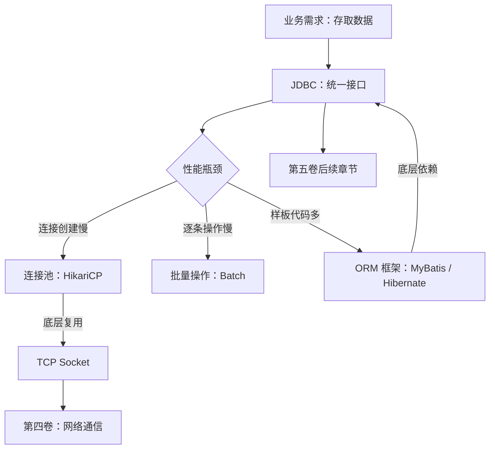

# JDBC：性能瓶颈与连接池

> 本页与 [JDBC：Java 数据访问的底层抽象](./chapter-02-jdbc.md) 配套，重点说明常见性能瓶颈、连接池原理和参数取舍。

## 1. JDBC 的性能瓶颈

JDBC 给了我们统一的数据访问接口，但在实际使用中，朴素的 JDBC 编程存在几个明显的性能瓶颈。理解这些瓶颈，才能理解后续章节中各种优化手段的由来。

### 1.1 连接创建慢

每次调用 `DriverManager.getConnection()` 或 `dataSource.getConnection()`，底层都要执行：

```txt
客户端                              数据库服务器
  │                                    │
  │──── 1. TCP 三次握手 ──────────────→ │  ~1-5ms（同机房）
  │                                    │
  │──── 2. 认证握手（用户名/密码）──────→  │  ~5-20ms
  │                                    │
  │←─── 3. 认证成功，连接建立 ──────────  │
  │                                    │
  │  总计：~10-50ms                     │
```

看起来不多？考虑一个高并发场景：每秒 1000 个请求，每个请求都要创建新连接，那就是每秒 10-50 秒的纯等待时间。而且这个代价是**每条 SQL 前都要付出的**，严重时连接创建的开销甚至超过了 SQL 执行本身。

**根因：** 连接创建涉及 TCP 握手（第四卷网络知识）和数据库认证，是 I/O 密集操作，无法避免。

**解法：** 连接池——预先创建一批连接，请求来了直接借，用完还回去。详见 2.6 节。

### 1.2 逐条插入慢

假设你要插入 10000 条用户数据：

```java
for (User user : users) {
    PreparedStatement ps = conn.prepareStatement(
        "INSERT INTO users (name, email) VALUES (?, ?)"
    );
    ps.setString(1, user.getName());
    ps.setString(2, user.getEmail());
    ps.executeUpdate();  // 每次执行 = 一次网络往返
    ps.close();
}
```

每次 `executeUpdate()` 都是一次完整的**请求-响应**网络往返。10000 条数据 = 10000 次网络往返，延迟叠加起来非常可观。

```java
// 优化：批量操作
PreparedStatement ps = conn.prepareStatement(
    "INSERT INTO users (name, email) VALUES (?, ?)"
);
for (User user : users) {
    ps.setString(1, user.getName());
    ps.setString(2, user.getEmail());
    ps.addBatch();           // 加入批次，不发送
}
ps.executeBatch();           // 一次性发送所有数据
```

批量操作将多次网络往返合并为一次，性能提升可达 **10-100 倍**。

### 1.3 模板代码多

这个问题在 2.3.2 节已经讨论过。JDBC 的样板代码（获取连接、关闭资源、异常处理、ResultSet 映射）不仅让代码臃肿，还增加了出错的概率——忘记关闭连接导致连接泄漏，异常处理不当导致事务不回滚。

### 1.4 瓶颈总结

| 问题 | 根因 | 代价 | 解决方向 |
| :-- | :-- | :-- | :-- |
| 连接创建慢 | TCP 握手 + 数据库认证（I/O 操作） | 每次 10-50ms | 连接池（HikariCP） |
| 逐条操作慢 | 每次 SQL 一次网络往返 | N 条数据 = N 次 RTT | 批量操作（Batch） |
| 模板代码多 | 重复的连接/资源/映射代码 | 开发效率低、易出错 | ORM 框架封装 |

注意一个有趣的规律：**前两个是运行时性能问题，第三个是开发时效率问题。** JDBC 本身是一个"薄"抽象——它忠实反映了数据库操作的真实代价（连接昂贵、网络有延迟），而不是试图隐藏它们。这种设计哲学在今天看来是正确的：把优化的空间留给上层框架，而不是在底层做魔法。

## 2. JDBC 与连接池

连接池是解决 JDBC 性能瓶颈的最重要手段，也是现代 Java 应用的标准配置。理解连接池，需要先理解"为什么连接这么贵"。

### 2.1 创建一个连接的代价

当 Java 应用调用 `dataSource.getConnection()` 时，底层发生了什么？

```txt
Java 应用                           操作系统                    数据库服务器
   │                                  │                           │
   │── 1. 创建 Socket ──────────────→│                           │
   │                                  │── 2. TCP 三次握手 ────────→│
   │                                  │←── SYN-ACK ───────────────│
   │                                  │── 3. ACK ────────────────→│
   │                                  │                           │
   │←── 4. Socket 建立 ──────────────│                           │
   │                                  │                           │
   │── 5. 发送认证请求（用户名/密码）──→│──────────────────────────→│
   │                                  │←── 6. 认证结果 ───────────│
   │←─────────────────────────────────│                           │
   │                                  │                           │
   │── 7. 发送初始化命令（字符集等）──→│──────────────────────────→│
   │←── 8. 连接就绪 ─────────────────────────────────────────────│
   │                                  │                           │
   │  总计：至少 2-3 次网络往返 + TCP 握手                          │
   │  耗时：同机房 10-50ms，跨机房可能 100ms+                      │
```

这还只是建立连接。连接建立后，还可能需要设置字符集、时区、事务隔离级别等。整个过程涉及**系统调用（Socket 创建）、网络 I/O（TCP 握手 + 认证）、数据库资源分配（线程 + 内存）**，代价远比执行一条简单 SQL 要高。

### 2.2 连接池的基本原理

连接池的核心思想就两个字：**复用。**

```txt
不使用连接池：
  请求 1 → 创建连接 → 执行 SQL → 关闭连接
  请求 2 → 创建连接 → 执行 SQL → 关闭连接
  请求 3 → 创建连接 → 执行 SQL → 关闭连接
  每次都要付出连接创建的代价

使用连接池：
  启动时 → 预先创建 10 个连接，放入池中
  
  请求 1 → 从池中借出连接 → 执行 SQL → 连接归还池中
  请求 2 → 从池中借出连接 → 执行 SQL → 连接归还池中
  请求 3 → 从池中借出连接 → 执行 SQL → 连接归还池中
  连接创建代价只付出一次
```

连接池的实现原理并不复杂：

```java
public class SimpleConnectionPool {
    private final BlockingQueue<Connection> pool;
    
    public SimpleConnectionPool(DataSource ds, int size) throws SQLException {
        pool = new LinkedBlockingQueue<>(size);
        for (int i = 0; i < size; i++) {
            pool.offer(ds.getConnection());  // 启动时预创建
        }
    }
    
    // 借出：从池中取一个连接
    public Connection getConnection() throws InterruptedException {
        return pool.take();  // 池空了就阻塞等待
    }
    
    // 归还：还回池中（而不是真正关闭）
    public void release(Connection conn) {
        pool.offer(conn);
    }
}
```

真实的连接池（如 HikariCP）还要处理连接有效性检测、空闲连接回收、最大等待时间和泄漏检测等问题。上面的 BlockingQueue 只展示核心思想：借出并归还，而不是为每个请求重新创建和销毁连接。

### 2.3 连接池的关键参数

| 参数 | 含义 | 典型值 | 注意事项 |
| :-- | :-- | :-- | :-- |
| `minimumIdle` | 最小空闲连接数 | 5-10 | 过小导致冷启动慢 |
| `maximumPoolSize` | 最大连接数 | 10-20 | 过大浪费数据库资源 |
| `connectionTimeout` | 获取连接的最大等待时间 | 30s | 超时应快速失败 |
| `idleTimeout` | 空闲连接存活时间 | 10min | 过长浪费资源 |
| `maxLifetime` | 连接最大存活时间 | 默认 30min，仅作起点 | 应比数据库或基础设施限制提前数秒 |

**最大连接数怎么设？** 没有适用于所有数据库的“CPU × 2 + 磁盘数”公式。应从低值开始，结合并发请求量、事务持有连接的时长、数据库有效并发能力和压测结果调整；观察等待连接的请求、慢 SQL、数据库锁等待与 CPU 饱和后再扩容。连接池既复用连接，也把不可控的排队延迟限制在可观察、可快速失败的范围内。

### 2.4 连接池与 TCP 的关系

连接池复用的不只是 Java 对象，更是底层的 **TCP Socket 连接**。每个 `Connection` 对象内部持有一个 Socket，连接池让多个请求**分时复用**同一个 Socket，避免了反复创建和销毁 TCP 连接的开销。

这与第四卷中讨论的 TCP 连接管理一脉相承：

- **TCP 三次握手**：连接创建时必须完成，耗时取决于网络延迟
- **TCP Keep-Alive**：长连接需要心跳保活，防止中间设备（防火墙、NAT）断开空闲连接
- **TCP 连接复用**：连接池本质上是应用层的连接复用，与 HTTP Keep-Alive 的思想一致

理解了这些底层原理，你就能明白为什么连接池参数（如 `maxLifetime`、空闲检测）的设计是这样的——它们是在应对 TCP 层面的真实约束。

## 3. 本页小结

JDBC 是 Java 数据访问的基石，它的设计哲学是“**薄抽象**“——忠实地暴露数据库操作的真实代价，而不是试图隐藏它们。这既是它的优点（透明、可控），也是它的缺点（样板代码多、开发效率低）。

回顾本章的核心知识点：

1. **JDBC 的价值**：一套标准接口，屏蔽底层数据库差异，所有 ORM 框架都建立在它之上
2. **四个核心接口**：`DataSource` → `Connection` → `PreparedStatement` → `ResultSet`，形成一条清晰的创建链
3. **PreparedStatement 的两个价值**：防 SQL 注入（参数与代码分离）+ 预编译性能（执行计划缓存）
4. **三个性能瓶颈**：连接创建慢（→ 连接池）、逐条操作慢（→ 批量）、样板代码多（→ ORM）
5. **连接池的本质**：复用 TCP 连接，避免反复握手和认证的开销



JDBC 到此讲完数据库的「统一接口」这一层。接口之下，SQL 的执行流程、索引原理、锁与事务隔离这些数据库内核知识，由 [MySQL](../../mysql/index.md) 与 [PostgreSQL](../../postgresql/01-pg-unique/chapter-01-pg-overview.md) 专题承接；接口之上，连接池、批处理与链路排查见后文 [数据访问性能优化](./chapter-05-performance.md)。
