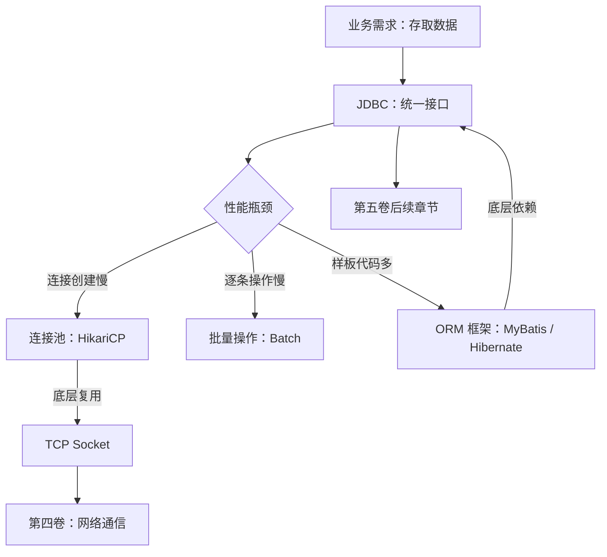

# JDBC：Java 数据访问的底层抽象

> 上一章我们理解了持久化的必要性——Java 对象必须跨越 JVM 生命周期存入数据库。但"存进去"和"取出来"具体怎么做？每种数据库（MySQL、Oracle、PostgreSQL）都有自己的通信协议和 C API，难道每换一种数据库就要重写一遍数据访问代码？本章要回答的核心问题是：**JDBC 如何用一套统一的 Java 接口，屏蔽底层数据库的差异，让开发者用同一套代码操作所有关系数据库？** 我们将从 JDBC 存在的历史原因出发，拆解它的核心接口与编程模型，分析它的性能瓶颈，并揭示它作为所有 ORM 框架底层基础的真正地位。

## 1. JDBC 为什么存在

### 1.1 没有 JDBC 的年代

想象一下 1990 年代中期的 Java 开发场景。你要连接 MySQL，需要用 MySQL 提供的 C 语言客户端库（`libmysqlclient`），通过 JNI 调用本地方法。你要换成 Oracle，又得换成 Oracle 的 OCI（Oracle Call Interface）库。每种数据库的 API 完全不同：函数名不同、参数不同、错误码不同、资源释放方式不同。

```java
// 假设的"无 JDBC"时代——连接 MySQL
native void mysql_connect(String host, int port, String user, String pwd);
native ResultSet mysql_query(String sql);
native void mysql_close();

// 连接 Oracle——完全不同的 API
native void oci_logon(String tnsName, String user, String pwd);
native void oci_execute(String sql);
native void oci_logoff();
```

这意味着：**换数据库 = 重写数据访问层。** 对于需要支持多种数据库的企业应用来说，这是一场噩梦。

### 1.2 JDBC 的价值：统一抽象

1997 年，Sun 公司在 JDK 1.1 中引入了 JDBC（Java Database Connectivity）规范。它的核心设计思想非常简单：

**定义一套标准接口，让各数据库厂商提供自己的实现（驱动）。**

```java
// 无论底层是 MySQL、Oracle 还是 PostgreSQL，代码写法完全一样
Connection conn = DriverManager.getConnection(url, user, password);
PreparedStatement ps = conn.prepareStatement("SELECT * FROM users WHERE id = ?");
ps.setLong(1, 1001L);
ResultSet rs = ps.executeQuery();
```

这就是经典的**面向接口编程**——应用代码只依赖 JDBC 标准接口（`java.sql.*`），具体实现由各厂商的 JDBC 驱动（Driver）提供。换数据库？只需要换个驱动 JAR 包和连接 URL，业务代码一行不动。

| 维度 | 没有 JDBC | 有了 JDBC |
|------|----------|----------|
| API 统一性 | 每个数据库一套 API | 一套 `java.sql.*` 接口 |
| 换数据库成本 | 重写数据访问层 | 换驱动 + 换 URL |
| 代码可移植性 | 几乎为零 | 高（SQL 方言除外） |
| 驱动管理 | 厂商各自为政 | 标准化 Driver 接口 |

### 1.3 JDBC 是 ORM 的地基

在后续章节中我们会学习 MyBatis、Hibernate/JPA 等 ORM 框架。但请记住一个关键事实：**所有 Java ORM 框架，无论上层多么花哨，底层都是通过 JDBC 与数据库通信的。**


理解 JDBC，就是理解 Java 数据访问的"基岩层"。它不是最优雅的 API，但它是所有上层建筑的地基。

## 2. 核心接口

JDBC 的 API 设计围绕四个核心接口展开，每个接口有明确的职责边界和生命周期。理解它们，就理解了 JDBC 的骨架。

### 2.1 DataSource——连接的工厂

`DataSource` 是获取数据库连接的入口。它的职责很简单：**知道怎么连接数据库，能给你一个 Connection。**

```java
// 方式一：DriverManager（早期方式，硬编码连接信息）
Connection conn = DriverManager.getConnection(
    "jdbc:mysql://localhost:3306/mydb", "root", "password"
);

// 方式二：DataSource（推荐方式，配置与代码分离）
DataSource ds = new MysqlDataSource();
ds.setUrl("jdbc:mysql://localhost:3306/mydb");
ds.setUser("root");
ds.setPassword("password");
Connection conn = ds.getConnection();
```

为什么推荐 `DataSource`？因为它支持连接池、支持 JNDI 查找、支持分布式事务。在实际生产环境中，你几乎不会直接 `new MysqlDataSource()`，而是使用连接池框架（如 HikariCP）提供的 `DataSource` 实现。这一点我们在 2.6 节详细展开。

### 2.2 Connection——一次数据库会话

`Connection` 代表与数据库的一个**物理连接**（底层是一个 TCP Socket）。它是一个有状态的对象：维护事务状态、设置隔离级别、缓存 PreparedStatement。

```java
Connection conn = dataSource.getConnection();
try {
    conn.setAutoCommit(false);          // 开启手动事务
    // ... 执行多条 SQL ...
    conn.commit();                       // 提交事务
} catch (SQLException e) {
    conn.rollback();                     // 回滚事务
    throw e;
} finally {
    conn.close();                        // 归还连接（如果是连接池，close = 归还）
}
```

**关键认知：Connection 是昂贵资源。** 创建一个 Connection 意味着一次 TCP 三次握手 + 数据库认证过程，耗时几十到几百毫秒。这就是为什么生产环境必须使用连接池（2.6 节详述）。

### 2.3 PreparedStatement——SQL 的执行者

`PreparedStatement` 代表一条**预编译的 SQL 语句**。它负责两件事：接受参数绑定，执行 SQL 并返回结果。

```java
// 创建 PreparedStatement（此时 SQL 发送到数据库进行预编译）
PreparedStatement ps = conn.prepareStatement(
    "SELECT id, name, email FROM users WHERE age > ? AND city = ?"
);

// 绑定参数（? 占位符从 1 开始编号）
ps.setInt(1, 18);
ps.setString(2, "北京");

// 执行查询
ResultSet rs = ps.executeQuery();
```

为什么用 `PreparedStatement` 而不是普通的 `Statement`？两个原因，我们在 2.4 节详细讨论：**防 SQL 注入**和**预编译性能**。

### 2.4 ResultSet——查询结果的游标

`ResultSet` 是查询结果的**迭代器**。它维护一个游标，初始指向第一行之前，每次调用 `next()` 移动到下一行。

```java
ResultSet rs = ps.executeQuery();
while (rs.next()) {
    Long id = rs.getLong("id");
    String name = rs.getString("name");
    String email = rs.getString("email");
    // 把每一行数据映射为 Java 对象
    User user = new User(id, name, email);
    users.add(user);
}
```

`ResultSet` 默认是**只读、只向前**的游标（`TYPE_FORWARD_ONLY`），这意味着你不能往回翻。这个设计是有意为之——只向前的游标性能最好，内存占用最小，适合绝大多数场景。

### 2.5 接口对比总览

| 接口 | 类比 | 职责 | 生命周期 | 实现方 |
|------|------|------|---------|--------|
| `DataSource` | 工厂 | 创建连接 | 应用级（通常单例） | 数据库厂商 / 连接池框架 |
| `Connection` | 一次会话 | 维护事务，创建 Statement | 一次业务操作 | JDBC 驱动 |
| `PreparedStatement` | 一条命令 | 绑定参数，执行 SQL | 一次查询/更新 | JDBC 驱动 |
| `ResultSet` | 一份报告 | 迭代查询结果 | 一次查询结果 | JDBC 驱动 |

生命周期关系如下：

```text
DataSource（应用级，长期存活）
  └─ 创建 → Connection（一次会话，用完关闭/归还）
       └─ 创建 → PreparedStatement（一次 SQL 执行）
            └─ 产生 → ResultSet（一次查询结果，遍历完关闭）
```

**每一个层级都是上一层的产物：** DataSource 生产 Connection，Connection 生产 PreparedStatement，PreparedStatement 生产 ResultSet。理解这个创建链，就理解了 JDBC 的对象模型。

## 3. JDBC 编程模板

让我们写一个完整的 JDBC 代码，从头到尾走一遍：查询指定年龄以上的用户列表。

### 3.1 完整示例

```java
public List<User> findUsersByAge(int minAge) throws SQLException {
    List<User> users = new ArrayList<>();
    
    // 1. 获取连接
    Connection conn = null;
    PreparedStatement ps = null;
    ResultSet rs = null;
    
    try {
        conn = dataSource.getConnection();
        
        // 2. 创建 PreparedStatement
        ps = conn.prepareStatement(
            "SELECT id, name, email, age FROM users WHERE age > ?"
        );
        ps.setInt(1, minAge);
        
        // 3. 执行查询
        rs = ps.executeQuery();
        
        // 4. 遍历结果集，映射为 Java 对象
        while (rs.next()) {
            User user = new User();
            user.setId(rs.getLong("id"));
            user.setName(rs.getString("name"));
            user.setEmail(rs.getString("email"));
            user.setAge(rs.getInt("age"));
            users.add(user);
        }
        
    } finally {
        // 5. 关闭资源（注意关闭顺序：ResultSet → PreparedStatement → Connection）
        if (rs != null) try { rs.close(); } catch (SQLException ignored) {}
        if (ps != null) try { ps.close(); } catch (SQLException ignored) {}
        if (conn != null) try { conn.close(); } catch (SQLException ignored) {}
    }
    
    return users;
}
```

### 3.2 模板代码的痛苦

仔细审视这段代码，你会发现**真正的业务逻辑只有 5 行**（SQL 和结果映射），剩下的全是样板代码：

| 代码部分 | 行数 | 是否业务逻辑 |
|---------|------|------------|
| 获取连接 | 2 行 | ❌ 基础设施 |
| 创建 Statement + 绑定参数 | 4 行 | 部分（SQL 是，绑定是样板） |
| 执行查询 | 1 行 | ❌ 基础设施 |
| 遍历 ResultSet → 映射对象 | 8 行 | ❌ 纯样板（手动 getter → setter） |
| 关闭资源（try-catch-finally） | 4 行 | ❌ 基础设施 |
| **合计** | **~25 行** | **仅 1 行 SQL 是业务逻辑** |

这就是 JDBC 的核心痛点：**样板代码太多，业务逻辑被淹没在基础设施代码中。** 写一个查询尚且如此，一个真实业务方法可能涉及多次查询、更新、事务控制，代码量会爆炸式增长。

```java
// Java 7 引入 try-with-resources 后，资源关闭稍微优雅了一些
try (Connection conn = dataSource.getConnection();
     PreparedStatement ps = conn.prepareStatement(sql)) {
    ps.setInt(1, minAge);
    try (ResultSet rs = ps.executeQuery()) {
        while (rs.next()) {
            // 映射逻辑
        }
    }
}
```

try-with-resources 解决了资源关闭的样板问题，但**ResultSet 到 Java 对象的映射**仍然是手动的、重复的、易错的。这正是 ORM 框架要解决的核心问题——第 3、4 章的主题。

## 4. PreparedStatement 与 SQL 注入

`PreparedStatement` 不仅仅是一个"写法更优雅"的替代品。它解决了一个**安全问题**和一个**性能问题**。

### 4.1 SQL 注入：拼接字符串的代价

假设你要根据用户名查询用户信息，用字符串拼接的方式：

```java
// 危险代码！
String name = request.getParameter("name");  // 用户输入
String sql = "SELECT * FROM users WHERE name = '" + name + "'";
Statement stmt = conn.createStatement();
ResultSet rs = stmt.executeQuery(sql);
```

正常情况下，用户输入 `张三`，生成的 SQL 是：

```sql
SELECT * FROM users WHERE name = '张三'
```

没问题。但如果攻击者输入的是：

```text
' OR '1'='1' --
```

生成的 SQL 变成：

```sql
SELECT * FROM users WHERE name = '' OR '1'='1' --'
```

`WHERE` 条件永远为真，`--` 注释掉了后面的代码。**攻击者绕过了身份验证，拿到了整张用户表的数据。** 这就是 SQL 注入——OWASP Top 10 安全漏洞之一，至今仍在真实世界中频繁被利用。

更危险的注入：

```text
'; DROP TABLE users; --
```

这会直接**删除你的用户表**。

### 4.2 PreparedStatement 的参数化查询

`PreparedStatement` 通过**参数占位符 `?`** 将 SQL 结构与数据彻底分离：

```java
// 安全代码
String name = request.getParameter("name");
PreparedStatement ps = conn.prepareStatement(
    "SELECT * FROM users WHERE name = ?"
);
ps.setString(1, name);  // 参数作为纯数据传递，不会被解析为 SQL
ResultSet rs = ps.executeQuery();
```

无论用户输入什么，`?` 处的内容都**只被当作数据值，永远不会被解析为 SQL 命令**。即使输入 `' OR '1'='1' --`，数据库也只会把它当作一个普通的字符串去匹配，不会改变 SQL 的逻辑结构。

```text
┌──────────────────────────────────────────────────────┐
│              字符串拼接（危险）                          │
│                                                      │
│  SQL 语法 + 用户输入 → 混合成一条完整 SQL → 发给数据库    │
│  ↑ 数据和代码没有边界，注入就发生在这里                    │
└──────────────────────────────────────────────────────┘

┌──────────────────────────────────────────────────────┐
│           PreparedStatement（安全）                     │
│                                                      │
│  SQL 模板（带 ?）→ 先发送给数据库预编译                   │
│  参数值 → 独立发送，只作为绑定值                          │
│  ↑ 数据和代码完全分离，注入无从发生                       │
└──────────────────────────────────────────────────────┘
```

### 4.3 预编译带来的性能收益

除了安全性，`PreparedStatement` 还有性能优势。数据库有一个预编译（Prepared Statement）功能。MySQL 5.0+、PostgreSQL、Oracle 都支持这套协议，当你发送一条带 `?` 的 SQL 给数据库时，数据库会：

```text
JDBC 驱动                              数据库服务器
  │                                       │
  │── 1. COM_STMT_PREPARE ──────────────→ │  发送带 ? 的 SQL 模板
  │     "SELECT * FROM users WHERE id = ?"│
  │                                       │  → 解析语法
  │                                       │  → 生成执行计划
  │                                       │  → 缓存，返回 statement_id = 7
  │←─ 2. statement_id = 7  ────────────── │
  │                                       │
  │── 3. COM_STMT_EXECUTE ──────────────→ │  后续执行只需传 id + 参数
  │     statement_id=7, params=[1001]     │  → 直接拿缓存的执行计划运行
  │←─ 4. 结果集 ─────────────────────────  │
  │                                       │
  │── 5. COM_STMT_EXECUTE ──────────────→ │  换个参数再执行
  │     statement_id=7, params=[1002]     │  → 跳过解析和优化
  │←─ 6. 结果集 ────────────────────────── │
```

第一次执行时，SQL 模板（带 `?`）通过 `COM_STMT_PREPARE` 命令发给数据库，数据库完成三件事：

1. **解析 SQL**：检查语法、验证表和列的存在
2. **优化执行计划**：选择最优的索引和查询策略
3. **缓存执行计划**：返回一个 `statement_id`，后续通过这个 ID 引用

后续用不同参数执行同一条 SQL 时，驱动只发 `COM_STMT_EXECUTE`（statement_id + 参数值），数据库跳过解析和优化，直接使用缓存的执行计划。对于高频查询（如根据 ID 查用户），这个优化非常显著。

需要注意的是，JDBC 驱动可以有两种方式实现 `PreparedStatement`：

| 方式 | 工作机制 | 优点 | 缺点 |
| :-- | :-- | :-- | :-- |
| 服务端预编译 | 将带 `?` 的 SQL 发给数据库预编译，得到 statement_id，后续靠 id 执行 | 执行计划可跨请求复用，性能最优 | 多一次网络往返（PREPARE + EXECUTE） |
| 客户端模拟 | 驱动本地把参数值拼成完整 SQL，用普通 `Statement` 协议发给数据库 | 无额外 PREPARE 往返 | 每次都需要数据库重新解析和优化 |

MySQL Connector/J 默认使用客户端模拟模式——`useServerPrepStmts` 默认为 `false`。这是出于兼容性考虑：某些早期 MySQL 版本的服务端预编译有 bug，而且一次 PREPARE + 一次 EXECUTE 对单次执行的查询反而是负优化。只有明确设置 `useServerPrepStmts=true&cachePrepStmts=true` 时才启用服务端预编译，此时才能获得执行计划缓存的收益。

```java
// 同一条 SQL 模板，执行 1000 次，只解析和优化一次
PreparedStatement ps = conn.prepareStatement(
    "SELECT * FROM users WHERE id = ?"
);
for (long id : userIds) {
    ps.setLong(1, id);
    ResultSet rs = ps.executeQuery();
    // 处理结果...
    rs.close();
}
```

**一句话总结：PreparedStatement 的两个价值——安全靠参数化，性能靠预编译。** 在现代 Java 开发中，没有任何理由使用裸的 `Statement`。

## 5. JDBC 的性能瓶颈

JDBC 给了我们统一的数据访问接口，但在实际使用中，朴素的 JDBC 编程存在几个明显的性能瓶颈。理解这些瓶颈，才能理解后续章节中各种优化手段的由来。

### 5.1 连接创建慢

每次调用 `DriverManager.getConnection()` 或 `dataSource.getConnection()`，底层都要执行：

```text
客户端                              数据库服务器
  │                                    │
  │──── 1. TCP 三次握手 ──────────────→ │  ~1-5ms（同机房）
  │                                    │
  │──── 2. 认证握手（用户名/密码）──────→  │  ~5-20ms
  │                                    │
  │←─── 3. 认证成功，连接建立 ──────────  │
  │                                    │
  │  总计：~10-50ms                     │
```

看起来不多？考虑一个高并发场景：每秒 1000 个请求，每个请求都要创建新连接，那就是每秒 10-50 秒的纯等待时间。而且这个代价是**每条 SQL 前都要付出的**，严重时连接创建的开销甚至超过了 SQL 执行本身。

**根因：** 连接创建涉及 TCP 握手（第四卷网络知识）和数据库认证，是 I/O 密集操作，无法避免。

**解法：** 连接池——预先创建一批连接，请求来了直接借，用完还回去。详见 2.6 节。

### 5.2 逐条插入慢

假设你要插入 10000 条用户数据：

```java
for (User user : users) {
    PreparedStatement ps = conn.prepareStatement(
        "INSERT INTO users (name, email) VALUES (?, ?)"
    );
    ps.setString(1, user.getName());
    ps.setString(2, user.getEmail());
    ps.executeUpdate();  // 每次执行 = 一次网络往返
    ps.close();
}
```

每次 `executeUpdate()` 都是一次完整的**请求-响应**网络往返。10000 条数据 = 10000 次网络往返，延迟叠加起来非常可观。

```java
// 优化：批量操作
PreparedStatement ps = conn.prepareStatement(
    "INSERT INTO users (name, email) VALUES (?, ?)"
);
for (User user : users) {
    ps.setString(1, user.getName());
    ps.setString(2, user.getEmail());
    ps.addBatch();           // 加入批次，不发送
}
ps.executeBatch();           // 一次性发送所有数据
```

批量操作将多次网络往返合并为一次，性能提升可达 **10-100 倍**。

### 5.3 模板代码多

这个问题在 2.3.2 节已经讨论过。JDBC 的样板代码（获取连接、关闭资源、异常处理、ResultSet 映射）不仅让代码臃肿，还增加了出错的概率——忘记关闭连接导致连接泄漏，异常处理不当导致事务不回滚。

### 5.4 瓶颈总结

| 问题 | 根因 | 代价 | 解决方向 |
|------|------|------|---------|
| 连接创建慢 | TCP 握手 + 数据库认证（I/O 操作） | 每次 10-50ms | 连接池（HikariCP） |
| 逐条操作慢 | 每次 SQL 一次网络往返 | N 条数据 = N 次 RTT | 批量操作（Batch） |
| 模板代码多 | 重复的连接/资源/映射代码 | 开发效率低、易出错 | ORM 框架封装 |

注意一个有趣的规律：**前两个是运行时性能问题，第三个是开发时效率问题。** JDBC 本身是一个"薄"抽象——它忠实反映了数据库操作的真实代价（连接昂贵、网络有延迟），而不是试图隐藏它们。这种设计哲学在今天看来是正确的：把优化的空间留给上层框架，而不是在底层做魔法。

## 6. JDBC 与连接池

连接池是解决 JDBC 性能瓶颈的最重要手段，也是现代 Java 应用的标准配置。理解连接池，需要先理解"为什么连接这么贵"。

### 6.1 创建一个连接的代价

当 Java 应用调用 `dataSource.getConnection()` 时，底层发生了什么？

```text
Java 应用                           操作系统                    数据库服务器
   │                                  │                           │
   │── 1. 创建 Socket ──────────────→│                           │
   │                                  │── 2. TCP 三次握手 ────────→│
   │                                  │←── SYN-ACK ───────────────│
   │                                  │── 3. ACK ────────────────→│
   │                                  │                           │
   │←── 4. Socket 建立 ──────────────│                           │
   │                                  │                           │
   │── 5. 发送认证请求（用户名/密码）──→│──────────────────────────→│
   │                                  │←── 6. 认证结果 ───────────│
   │←─────────────────────────────────│                           │
   │                                  │                           │
   │── 7. 发送初始化命令（字符集等）──→│──────────────────────────→│
   │←── 8. 连接就绪 ─────────────────────────────────────────────│
   │                                  │                           │
   │  总计：至少 2-3 次网络往返 + TCP 握手                          │
   │  耗时：同机房 10-50ms，跨机房可能 100ms+                      │
```

这还只是建立连接。连接建立后，还可能需要设置字符集、时区、事务隔离级别等。整个过程涉及**系统调用（Socket 创建）、网络 I/O（TCP 握手 + 认证）、数据库资源分配（线程 + 内存）**，代价远比执行一条简单 SQL 要高。

### 6.2 连接池的基本原理

连接池的核心思想就两个字：**复用。**

```text
不使用连接池：
  请求 1 → 创建连接 → 执行 SQL → 关闭连接
  请求 2 → 创建连接 → 执行 SQL → 关闭连接
  请求 3 → 创建连接 → 执行 SQL → 关闭连接
  每次都要付出连接创建的代价

使用连接池：
  启动时 → 预先创建 10 个连接，放入池中
  
  请求 1 → 从池中借出连接 → 执行 SQL → 连接归还池中
  请求 2 → 从池中借出连接 → 执行 SQL → 连接归还池中
  请求 3 → 从池中借出连接 → 执行 SQL → 连接归还池中
  连接创建代价只付出一次
```

连接池的实现原理并不复杂：

```java
public class SimpleConnectionPool {
    private final BlockingQueue<Connection> pool;
    
    public SimpleConnectionPool(DataSource ds, int size) throws SQLException {
        pool = new LinkedBlockingQueue<>(size);
        for (int i = 0; i < size; i++) {
            pool.offer(ds.getConnection());  // 启动时预创建
        }
    }
    
    // 借出：从池中取一个连接
    public Connection getConnection() throws InterruptedException {
        return pool.take();  // 池空了就阻塞等待
    }
    
    // 归还：还回池中（而不是真正关闭）
    public void release(Connection conn) {
        pool.offer(conn);
    }
}
```

当然，真实的连接池（如 HikariCP）要处理更多问题：连接有效性检测、空闲连接回收、最大等待时间、连接泄漏检测等。但核心思想就是这个 BlockingQueue——**借出和归还，而不是创建和销毁。**

### 6.3 连接池的关键参数

| 参数 | 含义 | 典型值 | 注意事项 |
|------|------|--------|---------|
| `minimumIdle` | 最小空闲连接数 | 5-10 | 过小导致冷启动慢 |
| `maximumPoolSize` | 最大连接数 | 10-20 | 过大浪费数据库资源 |
| `connectionTimeout` | 获取连接的最大等待时间 | 30s | 超时应快速失败 |
| `idleTimeout` | 空闲连接存活时间 | 10min | 过长浪费资源 |
| `maxLifetime` | 连接最大存活时间 | 30min | 避免数据库单方面断开 |

**最大连接数怎么设？** 一个经验公式：`maximumPoolSize = CPU 核心数 * 2 + 磁盘数`。数据库连接不是越多越好——每个连接都占用数据库端的线程和内存，过多连接反而会导致数据库性能下降。连接池的本质是**排队机制**：当所有连接都在使用时，新请求排队等待，而不是无限制地创建新连接。

### 6.4 连接池与 TCP 的关系

连接池复用的不只是 Java 对象，更是底层的 **TCP Socket 连接**。每个 `Connection` 对象内部持有一个 Socket，连接池让多个请求**分时复用**同一个 Socket，避免了反复创建和销毁 TCP 连接的开销。

这与第四卷中讨论的 TCP 连接管理一脉相承：

- **TCP 三次握手**：连接创建时必须完成，耗时取决于网络延迟
- **TCP Keep-Alive**：长连接需要心跳保活，防止中间设备（防火墙、NAT）断开空闲连接
- **TCP 连接复用**：连接池本质上是应用层的连接复用，与 HTTP Keep-Alive 的思想一致

理解了这些底层原理，你就能明白为什么连接池参数（如 `maxLifetime`、空闲检测）的设计是这样的——它们是在应对 TCP 层面的真实约束。

## 7. 小结

JDBC 是 Java 数据访问的基石，它的设计哲学是“**薄抽象**“——忠实地暴露数据库操作的真实代价，而不是试图隐藏它们。这既是它的优点（透明、可控），也是它的缺点（样板代码多、开发效率低）。

回顾本章的核心知识点：

1. **JDBC 的价值**：一套标准接口，屏蔽底层数据库差异，所有 ORM 框架都建立在它之上
2. **四个核心接口**：`DataSource` → `Connection` → `PreparedStatement` → `ResultSet`，形成一条清晰的创建链
3. **PreparedStatement 的两个价值**：防 SQL 注入（参数与代码分离）+ 预编译性能（执行计划缓存）
4. **三个性能瓶颈**：连接创建慢（→ 连接池）、逐条操作慢（→ 批量）、样板代码多（→ ORM）
5. **连接池的本质**：复用 TCP 连接，避免反复握手和认证的开销



JDBC 到此讲完数据库的「统一接口」这一层。接口之下，SQL 的执行流程、索引原理、锁与事务隔离这些数据库内核知识，由 [MySQL](../../mysql/01-basics/chapter-01-overview.md) 与 [PostgreSQL](../../postgresql/01-pg-unique/chapter-01-pg-overview.md) 专题承接；接口之上，连接池、批处理与链路排查见下一章 [性能优化](./chapter-05-performance.md)。
