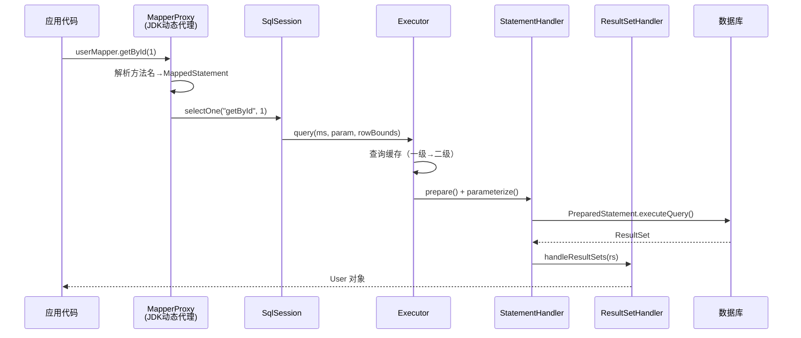
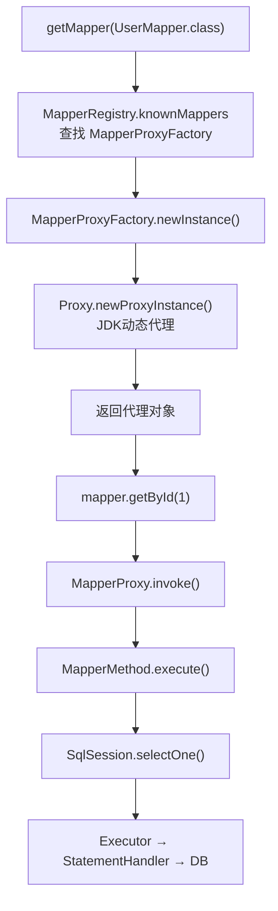

# MyBatis：SQL 映射框架

> 当 JDBC 的模板代码淹没了业务逻辑，当手写 ResultSet 映射成为机械劳动，我们是否可以找到一种方式——**让开发者专注于 SQL 本身，而把繁琐的映射和连接管理交给框架**？MyBatis 的答案是：SQL 由你写，映射由我做。

## 1. 为什么需要 MyBatis

### 1.1 JDBC 的三大痛点

每个写过 JDBC 的 Java 开发者都经历过这样的"仪式感"：

```java
// 一个简单的查询，需要多少行代码？
public User findById(int id) {
    Connection conn = null;
    PreparedStatement ps = null;
    ResultSet rs = null;
    User user = null;
    try {
        conn = DriverManager.getConnection(url, user, pwd);
        String sql = "SELECT id, name, email FROM users WHERE id = ?";
        ps = conn.prepareStatement(sql);
        ps.setInt(1, id);
        rs = ps.executeQuery();
        if (rs.next()) {
            user = new User();
            user.setId(rs.getInt("id"));
            user.setName(rs.getString("name"));
            user.setEmail(rs.getString("email"));
        }
    } catch (SQLException e) {
        throw new RuntimeException(e);
    } finally {
        // 还要关闭三个资源，每个都要 try-catch...
        closeQuietly(rs, ps, conn);
    }
    return user;
}
```

**痛点一：模板代码泛滥。** 获取连接、创建 Statement、设置参数、处理结果集、关闭资源——这些与业务无关的代码占据了方法的 80%。每个方法都在重复同样的"仪式"。

**痛点二：SQL 与 Java 代码混杂。** SQL 字符串以字符串字面量的形式嵌在 Java 代码中，IDE 无法提供语法高亮和检查，修改 SQL 需要重新编译 Java 类。当 SQL 变复杂时，代码的可读性急剧下降。

**痛点三：结果集映射是体力活。** `ResultSet.getString("column_name")` 与 `User.setName()` 之间的映射完全是机械劳动。字段多了容易出错，改了表结构要逐个排查，而且无法复用。

### 1.2 MyBatis 的设计哲学

MyBatis 选择了**半自动化**的路线。这与 Hibernate 等全自动化 ORM 框架形成了鲜明对比：

| 维度 | JDBC | MyBatis | Hibernate/JPA |
| :-- | :-- | :-- | :-- |
| SQL 控制 | 完全手动 | **开发者手写 SQL** | 框架自动生成 |
| 对象映射 | 手动 ResultSet → Object | **XML/注解声明式映射** | 全自动映射 |
| 学习成本 | 低（但繁琐） | 中 | 高 |
| 灵活性 | 最高 | **高（原生 SQL 能力保留）** | 受 HQL/Criteria 限制 |
| 适用场景 | 简单项目 | **复杂 SQL、性能敏感** | CRUD 为主、对象模型驱动 |

MyBatis 的核心理念可以用一句话概括：**SQL 是开发者的领地，框架不越界**。

它不做 SQL 生成，不做自动关联查询，不强制你使用面向对象的方式操作数据库。它做的事情只有一件——把你写的 SQL 和 Java 对象之间建立映射关系，然后高效地执行。

这种"克制"恰恰是 MyBatis 在中国市场占据统治地位的原因：当你的业务查询是 20 行的多表 JOIN 加窗口函数时，任何自动生成 SQL 的框架都会成为阻碍。

## 2. 核心流程

### 2.1 从一次查询说起

当你调用 `userMapper.getById(1)` 时，背后发生了什么？



### 2.2 六大核心组件

整个执行链路涉及六个核心组件，各司其职：


| 组件 | 职责 | 类比 |
| :-- | :-- | :-- |
| **SqlSession** | 对话入口，提供 CRUD API | 银行柜台窗口 |
| **Executor** | SQL 执行引擎，管理缓存和事务 | 银行后台审批员 |
| **StatementHandler** | 创建和管理 JDBC Statement | 业务表单填写员 |
| **ParameterHandler** | 将 Java 参数设置到 SQL 占位符 | 数据录入员 |
| **ResultSetHandler** | 将 ResultSet 转换为 Java 对象 | 结果翻译官 |
| **MappedStatement** | 封装一条 SQL 的所有信息（id、SQL文本、参数类型、结果映射…） | 业务档案袋 |

## 3. Mapper 动态代理

### 3.1 一个"魔法"的真相

这是 MyBatis 最让人困惑也最优雅的设计：你定义一个 Java 接口，不写任何实现类，就能直接调用它执行 SQL。

```java
// 定义接口，仅此而已
public interface UserMapper {
    @Select("SELECT * FROM users WHERE id = #{id}")
    User getById(int id);

    List<User> findByStatus(@Param("status") String status);
}

// 直接使用，无需实现类
UserMapper mapper = sqlSession.getMapper(UserMapper.class);
User user = mapper.getById(1);  // SQL 被执行了！
```

没有实现类，调用却能执行 SQL——这不是魔法，而是 **JDK 动态代理**。

### 3.2 代理机制解析

MyBatis 的做法分为两步：

**第一步：注册 Mapper。** `SqlSession.getMapper(UserMapper.class)` 调用链最终到达 `MapperRegistry`，它从 `knownMappers`（一个 `Map<Class<?>, MapperProxyFactory>`）中取出对应的工厂。

**第二步：创建代理。** `MapperProxyFactory.newInstance()` 使用 JDK 动态代理创建代理对象：

```java
// MapperProxyFactory 的核心代码（简化）
public class MapperProxyFactory<T> {
    private final Class<T> mapperInterface;

    protected T newInstance(MapperProxy<T> mapperProxy) {
        return (T) Proxy.newProxyInstance(
            mapperInterface.getClassLoader(),
            new Class[]{mapperInterface},
            mapperProxy  // InvocationHandler
        );
    }
}
```

当你调用 `mapper.getById(1)` 时，`MapperProxy.invoke()` 被触发：

```java
// MapperProxy.invoke() 核心逻辑（简化）
public Object invoke(Object proxy, Method method, Object[] args) {
    // Object 类的方法（toString, hashCode 等）直接放行
    if (Object.class.equals(method.getDeclaringClass())) {
        return method.invoke(this, args);
    }
    // 从缓存中获取 MapperMethod，首次调用时解析
    final MapperMethod mapperMethod = cachedMapperMethod(method);
    // 执行 SQL
    return mapperMethod.execute(sqlSession, args);
}
```

整个过程的时序如下：



### 3.3 方法与 SQL 的绑定

`MapperMethod` 是方法与 SQL 之间的桥梁。它的构造过程会解析 Mapper 接口的每个方法，将其与 `MappedStatement`（即 XML 或注解中定义的 SQL）关联：

```java
// MapperMethod 的 execute 方法（简化）
public Object execute(SqlSession sqlSession, Object[] args) {
    Object result;
    switch (command.getType()) {
        case INSERT:  result = sqlSession.insert(command.getName(), args); break;
        case UPDATE:  result = sqlSession.update(command.getName(), args); break;
        case DELETE:  result = sqlSession.delete(command.getName(), args); break;
        case SELECT:
            if (method.returnsMany()) {
                result = sqlSession.selectList(command.getName(), args);
            } else {
                result = sqlSession.selectOne(command.getName(), args);
            }
            break;
        default: throw new BindingException("Unknown execution method");
    }
    return result;
}
```

注意 `command.getName()` 返回的就是 SQL 的唯一标识（如 `com.example.mapper.UserMapper.getById`），这个标识就是 XML 中 `<select id="getById">` 的完整路径。

### 3.4 横向联系：反射与代理

这里用到的 `java.lang.reflect.Proxy` 是 JDK 反射 API 的一部分。在第一卷《Java 语言》中我们详细讨论了反射机制——MyBatis 的 Mapper 代理正是反射在框架设计中的经典应用。

同时，这种"不修改原始代码、在调用前后插入额外逻辑"的模式，与第六卷将要讨论的 AOP（面向切面编程）异曲同工。区别在于 MyBatis 用 JDK 动态代理手写实现，而 Spring AOP 抽象了这一模式，提供了声明式的切面编程。

## 4. 缓存机制

### 4.1 为什么需要缓存

数据库访问的成本远高于内存操作。一次简单的 SELECT 查询，涉及网络往返（通常 1-5ms）、SQL 解析、查询计划生成、磁盘 I/O 等环节。对于同一个 SqlSession 内重复执行的相同查询，缓存可以显著减少数据库压力。

MyBatis 提供了两级缓存，各有其适用场景和局限。

### 4.2 一级缓存：SqlSession 级别

一级缓存是 MyBatis 默认开启的本地缓存，其作用域限定在单个 `SqlSession` 内。

```java
SqlSession session = sqlSessionFactory.openSession();
UserMapper mapper = session.getMapper(UserMapper.class);

// 第一次查询：命中数据库
User user1 = mapper.getById(1);  // SQL: SELECT * FROM users WHERE id = 1

// 第二次相同查询：命中一级缓存，不发 SQL
User user2 = mapper.getById(1);  // 无 SQL 执行！

// user1 == user2 → true（同一个对象引用）
```

**缓存失效的四种触发条件：**

| 触发条件 | 说明 |
| :-- | :-- |
| 执行 `update`/`insert`/`delete` | 任何写操作都会清空当前 SqlSession 的缓存 |
| 调用 `session.commit()` | 提交事务时清空缓存 |
| 调用 `session.close()` | 关闭会话时缓存自然消亡 |
| 调用 `session.clearCache()` | 手动清空 |

**核心数据结构：** 一级缓存底层是一个 `HashMap`，key 由 `Statement ID + 参数 + SQL + 分页信息` 组成。

```java
// BaseExecutor 中的缓存实现（简化）
public abstract class BaseExecutor implements Executor {
    protected PerpetualCache localCache = new PerpetualCache("LocalCache");

    public <E> List<E> query(MappedStatement ms, Object parameter, ...) {
        CacheKey key = createCacheKey(ms, parameter, rowBounds, boundSql);
        return query(ms, parameter, rowBounds, resultHandler, key);
    }

    public <E> List<E> query(..., CacheKey key) {
        // 先查缓存
        List<E> list = (List<E>) localCache.getObject(key);
        if (list == null) {
            // 缓存未命中，查数据库
            list = queryFromDatabase(ms, parameter, ...);
            localCache.putObject(key, list);  // 写入缓存
        }
        return list;
    }
}
```

### 4.3 二级缓存：Mapper 级别

二级缓存的作用域跨越 `SqlSession`，同一个 Mapper 下的所有 SqlSession 共享。

```xml
<!-- 开启二级缓存 -->
<cache eviction="LRU"
       flushInterval="60000"
       size="1024"
       readOnly="true"/>
```

**二级缓存的工作机制：**


**关键注意事项：**

1. **二级缓存默认关闭**，需要在 Mapper XML 中显式配置 `<cache/>`。
2. **数据在 commit 后才可见**——SqlSession A 查询的数据，只有在 A 提交后，SqlSession B 才能从二级缓存中读到。
3. **对象必须实现 `Serializable`**——因为二级缓存可能涉及序列化存储。
4. **Spring 整合后一级缓存"失效"**——Spring 将每个数据库操作包装在独立的 SqlSession 中（通过 `SqlSessionTemplate`），因此在 Service 层的两个方法调用之间，一级缓存实际上不共享。

### 4.4 Spring 整合后的一级缓存陷阱

```java
@Service
public class UserService {
    @Autowired
    private UserMapper userMapper;

    public void doSomething() {
        User u1 = userMapper.getById(1);  // SqlSession-1
        // ... 中间可能经过事务管理器 ...
        User u2 = userMapper.getById(1);  // SqlSession-2（不同的 SqlSession！）
        // u1 == u2 → false！一级缓存未命中！
    }
}
```

这不是 bug，而是设计决策。Spring 的 `SqlSessionTemplate` 在每次 Mapper 调用时获取新的 `SqlSession`（从 `SqlSessionFactory` 中获取），调用完成后立即关闭。这是为了保证每个数据库操作都在正确的事务上下文中执行。

**实践建议：** 在 Spring 环境中，不要依赖 MyBatis 的一级缓存。如果需要跨请求的缓存，使用 Spring Cache（如 Redis、Caffeine）作为替代。

### 4.5 二级缓存的陷阱

二级缓存看似美好——跨 SqlSession 共享，减少数据库调用。但它有几个隐蔽的坑：

**陷阱一：跨 namespace 脏读**

二级缓存是 namespace 级别的（一个 Mapper 一个缓存）。如果两个 Mapper 操作同一张表，缓存不会互相通知：

```java
// UserMapper.xml
<select id="getById" resultType="User">SELECT * FROM user WHERE id = #{id}</select>

// AdminMapper.xml（也操作 user 表）
<update id="updateUser">UPDATE user SET name = #{name} WHERE id = #{id}</update>

// 场景：
User u1 = userMapper.getById(1);     // 查到 name=Tom，缓存
adminMapper.updateUser(1, "Jerry");   // 更新数据库，但 UserMapper 的缓存不知道！
User u2 = userMapper.getById(1);     // 命中缓存，返回 Tom（脏数据！）
```

**陷阱二：跨 SqlSessionFactory 不共享**

如果有多个数据源（多库场景），每个 `SqlSessionFactory` 有独立的二级缓存，互不可见。

**陷阱三：事务提交后才写入缓存**

二级缓存的数据在事务提交后才真正写入缓存。如果事务回滚，缓存不会有脏数据——但如果在事务内读了数据，事务外又读了，两次结果可能不一致。

**结论：生产环境慎用 MyBatis 二级缓存。** 用 Spring Cache + Redis 代替——缓存失效、更新通知、分布式一致性都有成熟的解决方案。

## 5. 插件机制

### 5.1 拦截器模型

MyBatis 的插件机制基于**责任链模式**，允许你在 SQL 执行的四个关键环节插入自定义逻辑。

```java
@Intercepts({
    @Signature(
        type = StatementHandler.class,
        method = "prepare",
        args = {Connection.class, Integer.class}
    )
})
public class SlowSqlPlugin implements Interceptor {

    @Override
    public Object intercept(Invocation invocation) throws Throwable {
        long start = System.currentTimeMillis();
        Object result = invocation.proceed();  // 执行原始逻辑
        long elapsed = System.currentTimeMillis() - start;

        if (elapsed > 500) {  // 超过 500ms 视为慢 SQL
            StatementHandler handler = (StatementHandler) invocation.getTarget();
            BoundSql boundSql = handler.getBoundSql();
            log.warn("慢SQL警告 [{}ms]: {}", elapsed, boundSql.getSql());
        }
        return result;
    }
}
```

### 5.2 四个拦截点


| 拦截对象 | 典型场景 | 示例 |
| :-- | :-- | :-- |
| **Executor** | 二级缓存实现、拦截 update/query | 自定义缓存策略 |
| **ParameterHandler** | 参数加密、类型转换 | 手机号脱敏 |
| **StatementHandler** | SQL 改写、分页、慢 SQL 监控 | **PageHelper 分页插件** |
| **ResultSetHandler** | 结果集后处理、字段解密 | 敏感字段解密 |

### 5.3 插件的底层实现

MyBatis 在初始化时，会对被拦截的对象进行**层层代理包装**：

```java
// Configuration 中的 pluginAll 方法
public void pluginAll(Object target) {
    for (Interceptor interceptor : interceptors) {
        target = interceptor.plugin(target);
        // 实际调用 Plugin.wrap(target, interceptor)
    }
    return target;
}

// Plugin.wrap 核心逻辑
public static Object wrap(Object target, Interceptor interceptor) {
    Map<Class<?>, Set<Method>> signatureMap = getSignatureMap(interceptor);
    Class<?> type = target.getClass();
    Class<?>[] interfaces = getAllInterfaces(type, signatureMap);
    if (interfaces.length > 0) {
        // 创建 JDK 动态代理
        return Proxy.newProxyInstance(
            type.getClassLoader(),
            interfaces,
            new Plugin(target, interceptor, signatureMap)
        );
    }
    return target;
}
```

如果配置了多个插件，它们会形成嵌套代理——最外层的插件最先被调用，形成责任链。

### 5.4 实战：分页插件 PageHelper

PageHelper 是国内使用最广泛的 MyBatis 插件之一，它通过拦截 `StatementHandler.prepare()` 方法，在原始 SQL 前添加分页逻辑：

```java
// 使用方式
PageHelper.startPage(1, 10);  // 第 1 页，每页 10 条
List<User> users = userMapper.selectAll();
// 实际执行的 SQL：SELECT * FROM users LIMIT 10 OFFSET 0

// PageHelper 内部做了什么？
// 1. 拦截 StatementHandler.prepare()
// 2. 获取原始 SQL: "SELECT * FROM users"
// 3. 改写为: "SELECT * FROM users LIMIT 10 OFFSET 0"
// 4. 同时执行 COUNT 查询获取总数
```

## 6. 动态 SQL

### 6.1 为什么需要动态 SQL

实际业务中，查询条件往往不固定。用户可能按姓名搜索，也可能按状态筛选，或者同时按多个条件组合查询。如果为每种组合写一条 SQL，组合爆炸会导致维护灾难。

MyBatis 的动态 SQL 通过 XML 标签，根据运行时参数动态拼装 SQL 片段。

### 6.2 核心标签详解

```xml
<select id="findUsers" resultType="User">
    SELECT * FROM users
    <where>
        <if test="name != null and name != ''">
            AND name LIKE CONCAT('%', #{name}, '%')
        </if>
        <if test="status != null">
            AND status = #{status}
        </if>
        <if test="minAge != null">
            AND age >= #{minAge}
        </if>
        <if test="maxAge != null">
            AND age <= #{maxAge}
        </if>
    </where>
    ORDER BY id DESC
</select>
```

`<where>` 标签的智能之处：它会自动去除多余的 `AND`/`OR` 前缀，且如果内部所有条件都不满足，则不会生成 `WHERE` 子句。

**各标签速查：**

| 标签 | 作用 | 关键行为 |
| :-- | :-- | :-- |
| `<if>` | 条件判断 | `test` 属性使用 OGNL 表达式 |
| `<choose>/<when>/<otherwise>` | 多选一（类似 switch） | 只执行第一个匹配的分支 |
| `<where>` | 智能 WHERE | 自动去除多余 AND/OR |
| `<set>` | 智能 SET（UPDATE 用） | 自动去除多余逗号 |
| `<foreach>` | 遍历集合 | 常用于 IN 查询和批量插入 |
| `<trim>` | 自定义前缀/后缀处理 | where/set 的底层实现 |
| `<sql>/<include>` | SQL 片段复用 | 类似代码中的方法提取 |

### 6.3 choose/when：互斥条件

当多个条件互斥时（如排序策略只能选一种），使用 `choose`：

```xml
<select id="findUsers" resultType="User">
    SELECT * FROM users
    <where>
        <if test="keyword != null">
            AND (name LIKE #{keyword} OR email LIKE #{keyword})
        </if>
    </where>
    <choose>
        <when test="orderBy == 'name'">ORDER BY name ASC</when>
        <when test="orderBy == 'age'">ORDER BY age DESC</when>
        <otherwise>ORDER BY id DESC</otherwise>
    </choose>
</select>
```

### 6.4 foreach：集合遍历

`foreach` 是处理 `IN` 查询和批量操作的利器：

```xml
<!-- IN 查询 -->
<select id="findByIds" resultType="User">
    SELECT * FROM users WHERE id IN
    <foreach collection="ids" item="id" open="(" separator="," close=")">
        #{id}
    </foreach>
</select>
<!-- 生成：SELECT * FROM users WHERE id IN (1, 2, 3) -->

<!-- 批量插入 -->
<insert id="batchInsert">
    INSERT INTO users (name, email) VALUES
    <foreach collection="list" item="user" separator=",">
        (#{user.name}, #{user.email})
    </foreach>
</insert>
<!-- 生成：INSERT INTO users (name, email) VALUES ('Tom', 'tom@x.com'), ('Jerry', 'jerry@x.com') -->
```

### 6.5 动态 SQL 的本质

MyBatis 的动态 SQL 并非简单的字符串拼接。它使用 **OGNL 表达式引擎** 解析 `test` 条件，通过 `SqlNode` 树形结构组织 SQL 片段，最终由 `DynamicSqlSource` 在运行时生成最终的 `BoundSql`。


每个 XML 标签被解析为对应的 `SqlNode` 实现（`IfSqlNode`、`ForEachSqlNode`、`WhereSqlNode` 等），运行时根据参数值决定是否输出该节点的内容。

### 6.6 实战：复杂条件查询

一个贴近真实业务的例子——电商订单搜索：

```xml
<select id="searchOrders" resultType="OrderVO">
    SELECT o.id, o.order_no, o.total_amount, o.status,
           u.name AS user_name, u.phone
    FROM orders o
    LEFT JOIN users u ON o.user_id = u.id
    <where>
        <if test="orderNo != null">
            AND o.order_no = #{orderNo}
        </if>
        <if test="statusList != null and statusList.size > 0">
            AND o.status IN
            <foreach collection="statusList" item="s" open="(" separator="," close=")">
                #{s}
            </foreach>
        </if>
        <if test="startDate != null">
            AND o.create_time >= #{startDate}
        </if>
        <if test="endDate != null">
            AND o.create_time &lt;= #{endDate}
        </if>
        <if test="minAmount != null">
            AND o.total_amount >= #{minAmount}
        </if>
        <if test="keyword != null and keyword != ''">
            AND (u.name LIKE CONCAT('%', #{keyword}, '%')
                 OR u.phone LIKE CONCAT('%', #{keyword}, '%'))
        </if>
    </where>
    ORDER BY o.create_time DESC
</select>
```

这段 SQL 可以根据传入参数的不同组合，动态生成不同的查询——只传 `statusList` 就按状态筛选，加上 `startDate` 就加时间范围，再加 `keyword` 就支持模糊搜索。一个 XML 抵得上几十条硬编码 SQL。

## 7. 本章小结

| 要点 | 核心结论 |
| :-- | :-- |
| MyBatis 定位 | SQL 映射框架，不是 ORM。SQL 由开发者掌控 |
| 核心机制 | Mapper 接口 → JDK 动态代理 → SqlSession → Executor → JDBC |
| 一级缓存 | SqlSession 级别，Spring 整合后不可依赖 |
| 二级缓存 | Mapper 级别，跨 SqlSession，需手动开启 |
| 插件机制 | 责任链模式，四个拦截点，分页/监控/加密的基础设施 |
| 动态 SQL | OGNL + SqlNode 树，一个 XML 适配多种查询条件 |

