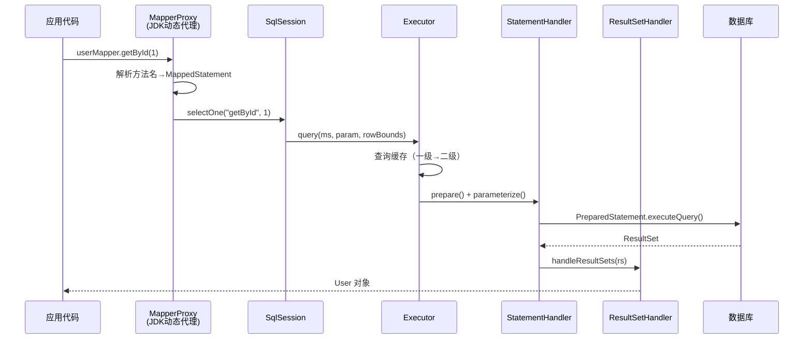
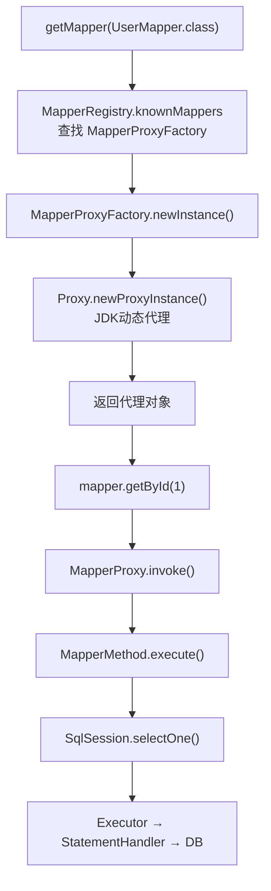

# MyBatis：SQL 映射框架

> 本页解释 MyBatis 的核心流程、动态代理、缓存和插件机制。Spring Boot 中的配置、事务集成与 `SqlSessionTemplate` 用法见 [MyBatis 集成](../../spring/04-data-access/chapter-02-mybatis-integration.md)。

> 当 JDBC 的模板代码淹没了业务逻辑，当手写 ResultSet 映射成为机械劳动，我们是否可以找到一种方式——**让开发者专注于 SQL 本身，而把繁琐的映射和连接管理交给框架**？MyBatis 的答案是：SQL 由你写，映射由我做。

## 1. 为什么需要 MyBatis

### 1.1 JDBC 的三大痛点

每个写过 JDBC 的 Java 开发者都经历过这样的"仪式感"：

```java
// 一个简单的查询，需要多少行代码？
public User findById(int id) {
    Connection conn = null;
    PreparedStatement ps = null;
    ResultSet rs = null;
    User user = null;
    try {
        conn = DriverManager.getConnection(url, user, pwd);
        String sql = "SELECT id, name, email FROM users WHERE id = ?";
        ps = conn.prepareStatement(sql);
        ps.setInt(1, id);
        rs = ps.executeQuery();
        if (rs.next()) {
            user = new User();
            user.setId(rs.getInt("id"));
            user.setName(rs.getString("name"));
            user.setEmail(rs.getString("email"));
        }
    } catch (SQLException e) {
        throw new RuntimeException(e);
    } finally {
        // 还要关闭三个资源，每个都要 try-catch...
        closeQuietly(rs, ps, conn);
    }
    return user;
}
```

**痛点一：模板代码泛滥。** 获取连接、创建 Statement、设置参数、处理结果集、关闭资源——这些与业务无关的代码占据了方法的 80%。每个方法都在重复同样的"仪式"。

**痛点二：SQL 与 Java 代码混杂。** SQL 字符串以字符串字面量的形式嵌在 Java 代码中，IDE 无法提供语法高亮和检查，修改 SQL 需要重新编译 Java 类。当 SQL 变复杂时，代码的可读性急剧下降。

**痛点三：结果集映射是体力活。** `ResultSet.getString("column_name")` 与 `User.setName()` 之间的映射完全是机械劳动。字段多了容易出错，改了表结构要逐个排查，而且无法复用。

### 1.2 MyBatis 的设计哲学

MyBatis 选择了**半自动化**的路线。这与 Hibernate 等全自动化 ORM 框架形成了鲜明对比：

| 维度 | JDBC | MyBatis | Hibernate/JPA |
| :-- | :-- | :-- | :-- |
| SQL 控制 | 完全手动 | **开发者手写 SQL** | 框架自动生成 |
| 对象映射 | 手动 ResultSet → Object | **XML/注解声明式映射** | 全自动映射 |
| 学习成本 | 低（但繁琐） | 中 | 高 |
| 灵活性 | 最高 | **高（原生 SQL 能力保留）** | 受 HQL/Criteria 限制 |
| 适用场景 | 简单项目 | **复杂 SQL、性能敏感** | CRUD 为主、对象模型驱动 |

MyBatis 的核心理念可以用一句话概括：**SQL 是开发者的领地，框架不越界**。

它不做 SQL 生成，不做自动关联查询，不强制你使用面向对象的方式操作数据库。它做的事情只有一件——把你写的 SQL 和 Java 对象之间建立映射关系，然后高效地执行。

这种"克制"恰恰是 MyBatis 在中国市场占据统治地位的原因：当你的业务查询是 20 行的多表 JOIN 加窗口函数时，任何自动生成 SQL 的框架都会成为阻碍。

## 2. 核心流程

### 2.1 从一次查询说起

当你调用 `userMapper.getById(1)` 时，背后发生了什么？



### 2.2 六大核心组件

整个执行链路涉及六个核心组件，各司其职：


| 组件 | 职责 | 类比 |
| :-- | :-- | :-- |
| **SqlSession** | 对话入口，提供 CRUD API | 银行柜台窗口 |
| **Executor** | SQL 执行引擎，管理缓存和事务 | 银行后台审批员 |
| **StatementHandler** | 创建和管理 JDBC Statement | 业务表单填写员 |
| **ParameterHandler** | 将 Java 参数设置到 SQL 占位符 | 数据录入员 |
| **ResultSetHandler** | 将 ResultSet 转换为 Java 对象 | 结果翻译官 |
| **MappedStatement** | 封装一条 SQL 的所有信息（id、SQL文本、参数类型、结果映射…） | 业务档案袋 |

## 3. Mapper 动态代理

### 3.1 一个"魔法"的真相

这是 MyBatis 最让人困惑也最优雅的设计：你定义一个 Java 接口，不写任何实现类，就能直接调用它执行 SQL。

```java
// 定义接口，仅此而已
public interface UserMapper {
    @Select("SELECT * FROM users WHERE id = #{id}")
    User getById(int id);

    List<User> findByStatus(@Param("status") String status);
}

// 直接使用，无需实现类
UserMapper mapper = sqlSession.getMapper(UserMapper.class);
User user = mapper.getById(1);  // SQL 被执行了！
```

没有实现类，调用却能执行 SQL——这不是魔法，而是 **JDK 动态代理**。

### 3.2 代理机制解析

MyBatis 的做法分为两步：

**第一步：注册 Mapper。** `SqlSession.getMapper(UserMapper.class)` 调用链最终到达 `MapperRegistry`，它从 `knownMappers`（一个 `Map<Class<?>, MapperProxyFactory>`）中取出对应的工厂。

**第二步：创建代理。** `MapperProxyFactory.newInstance()` 使用 JDK 动态代理创建代理对象：

```java
// MapperProxyFactory 的核心代码（简化）
public class MapperProxyFactory<T> {
    private final Class<T> mapperInterface;

    protected T newInstance(MapperProxy<T> mapperProxy) {
        return (T) Proxy.newProxyInstance(
            mapperInterface.getClassLoader(),
            new Class[]{mapperInterface},
            mapperProxy  // InvocationHandler
        );
    }
}
```

当你调用 `mapper.getById(1)` 时，`MapperProxy.invoke()` 被触发：

```java
// MapperProxy.invoke() 核心逻辑（简化）
public Object invoke(Object proxy, Method method, Object[] args) {
    // Object 类的方法（toString, hashCode 等）直接放行
    if (Object.class.equals(method.getDeclaringClass())) {
        return method.invoke(this, args);
    }
    // 从缓存中获取 MapperMethod，首次调用时解析
    final MapperMethod mapperMethod = cachedMapperMethod(method);
    // 执行 SQL
    return mapperMethod.execute(sqlSession, args);
}
```

整个过程的时序如下：



### 3.3 方法与 SQL 的绑定

`MapperMethod` 是方法与 SQL 之间的桥梁。它的构造过程会解析 Mapper 接口的每个方法，将其与 `MappedStatement`（即 XML 或注解中定义的 SQL）关联：

```java
// MapperMethod 的 execute 方法（简化）
public Object execute(SqlSession sqlSession, Object[] args) {
    Object result;
    switch (command.getType()) {
        case INSERT:  result = sqlSession.insert(command.getName(), args); break;
        case UPDATE:  result = sqlSession.update(command.getName(), args); break;
        case DELETE:  result = sqlSession.delete(command.getName(), args); break;
        case SELECT:
            if (method.returnsMany()) {
                result = sqlSession.selectList(command.getName(), args);
            } else {
                result = sqlSession.selectOne(command.getName(), args);
            }
            break;
        default: throw new BindingException("Unknown execution method");
    }
    return result;
}
```

注意 `command.getName()` 返回的就是 SQL 的唯一标识（如 `com.example.mapper.UserMapper.getById`），这个标识就是 XML 中 `<select id="getById">` 的完整路径。

### 3.4 横向联系：反射与代理

这里用到的 `java.lang.reflect.Proxy` 是 JDK 反射 API 的一部分。在第一卷《Java 语言》中我们详细讨论了反射机制——MyBatis 的 Mapper 代理正是反射在框架设计中的经典应用。

同时，这种"不修改原始代码、在调用前后插入额外逻辑"的模式，与第六卷将要讨论的 AOP（面向切面编程）异曲同工。区别在于 MyBatis 用 JDK 动态代理手写实现，而 Spring AOP 抽象了这一模式，提供了声明式的切面编程。

## 4. 缓存机制

### 4.1 为什么需要缓存

数据库访问的成本远高于内存操作。一次简单的 SELECT 查询，涉及网络往返（通常 1-5ms）、SQL 解析、查询计划生成、磁盘 I/O 等环节。对于同一个 SqlSession 内重复执行的相同查询，缓存可以显著减少数据库压力。

MyBatis 提供了两级缓存，各有其适用场景和局限。

### 4.2 一级缓存：SqlSession 级别

一级缓存是 MyBatis 默认开启的本地缓存，其作用域限定在单个 `SqlSession` 内。

```java
SqlSession session = sqlSessionFactory.openSession();
UserMapper mapper = session.getMapper(UserMapper.class);

// 第一次查询：命中数据库
User user1 = mapper.getById(1);  // SQL: SELECT * FROM users WHERE id = 1

// 第二次相同查询：命中一级缓存，不发 SQL
User user2 = mapper.getById(1);  // 无 SQL 执行！

// user1 == user2 → true（同一个对象引用）
```

**缓存失效的四种触发条件：**

| 触发条件 | 说明 |
| :-- | :-- |
| 执行 `update`/`insert`/`delete` | 任何写操作都会清空当前 SqlSession 的缓存 |
| 调用 `session.commit()` | 提交事务时清空缓存 |
| 调用 `session.close()` | 关闭会话时缓存自然消亡 |
| 调用 `session.clearCache()` | 手动清空 |

**核心数据结构：** 一级缓存底层是一个 `HashMap`，key 由 `Statement ID + 参数 + SQL + 分页信息` 组成。

```java
// BaseExecutor 中的缓存实现（简化）
public abstract class BaseExecutor implements Executor {
    protected PerpetualCache localCache = new PerpetualCache("LocalCache");

    public <E> List<E> query(MappedStatement ms, Object parameter, ...) {
        CacheKey key = createCacheKey(ms, parameter, rowBounds, boundSql);
        return query(ms, parameter, rowBounds, resultHandler, key);
    }

    public <E> List<E> query(..., CacheKey key) {
        // 先查缓存
        List<E> list = (List<E>) localCache.getObject(key);
        if (list == null) {
            // 缓存未命中，查数据库
            list = queryFromDatabase(ms, parameter, ...);
            localCache.putObject(key, list);  // 写入缓存
        }
        return list;
    }
}
```

### 4.3 二级缓存：Mapper 级别

二级缓存的作用域跨越 `SqlSession`，同一个 Mapper 下的所有 SqlSession 共享。

```xml
<!-- 开启二级缓存 -->
<cache eviction="LRU"
       flushInterval="60000"
       size="1024"
       readOnly="true"/>
```

**二级缓存的工作机制：**


**关键注意事项：**

1. **二级缓存默认关闭**，需要在 Mapper XML 中显式配置 `<cache/>`。
2. **数据在 commit 后才可见**——SqlSession A 查询的数据，只有在 A 提交后，SqlSession B 才能从二级缓存中读到。
3. **对象必须实现 `Serializable`**——因为二级缓存可能涉及序列化存储。
4. **Spring 整合后一级缓存"失效"**——Spring 将每个数据库操作包装在独立的 SqlSession 中（通过 `SqlSessionTemplate`），因此在 Service 层的两个方法调用之间，一级缓存实际上不共享。

### 4.4 Spring 整合后的一级缓存陷阱

```java
@Service
public class UserService {
    @Autowired
    private UserMapper userMapper;

    public void doSomething() {
        User u1 = userMapper.getById(1);  // SqlSession-1
        // ... 中间可能经过事务管理器 ...
        User u2 = userMapper.getById(1);  // SqlSession-2（不同的 SqlSession！）
        // u1 == u2 → false！一级缓存未命中！
    }
}
```

这不是 `SqlSessionTemplate` 永远“一调用一新会话”的固定行为。它会根据当前 Spring 事务状态取得对应会话：处于事务中时复用事务管理器绑定的会话，不在事务中时才自行获取并在调用结束后关闭。同一事务中的操作通常共享同一会话；不同事务或无事务调用之间则不应假定一级缓存连续命中。

**实践建议：** 在 Spring 环境中，不要把跨方法或跨请求读取一致性的责任交给 MyBatis 一级缓存。如需共享缓存，可在应用层引入 Spring Cache 等抽象，但它位于数据访问层之外，作用域、失效策略、序列化和一致性语义都不同于 MyBatis 一级缓存。

### 4.5 二级缓存的陷阱

二级缓存看似美好——跨 SqlSession 共享，减少数据库调用。但它有几个隐蔽的坑：

**陷阱一：跨 namespace 脏读**

二级缓存是 namespace 级别的（一个 Mapper 一个缓存）。如果两个 Mapper 操作同一张表，缓存不会互相通知：

```java
// UserMapper.xml
<select id="getById" resultType="User">SELECT * FROM user WHERE id = #{id}</select>

// AdminMapper.xml（也操作 user 表）
<update id="updateUser">UPDATE user SET name = #{name} WHERE id = #{id}</update>

// 场景：
User u1 = userMapper.getById(1);     // 查到 name=Tom，缓存
adminMapper.updateUser(1, "Jerry");   // 更新数据库，但 UserMapper 的缓存不知道！
User u2 = userMapper.getById(1);     // 命中缓存，返回 Tom（脏数据！）
```

**陷阱二：跨 SqlSessionFactory 不共享**

如果有多个数据源（多库场景），每个 `SqlSessionFactory` 有独立的二级缓存，互不可见。

**陷阱三：事务提交后才写入缓存**

二级缓存的数据在事务提交后才真正写入缓存。如果事务回滚，缓存不会有脏数据——但如果在事务内读了数据，事务外又读了，两次结果可能不一致。

**结论：生产环境慎用 MyBatis 二级缓存。** 可评估在应用层使用 Spring Cache + Redis，但要自行设计键、TTL、旁路失效或版本控制，并处理数据库与缓存之间的最终一致性和并发读写问题；Redis 本身不会自动提供这些业务语义。


核心流程和缓存说明了 MyBatis 如何组织一次数据库访问。下一页继续扩展执行链路：插件如何拦截语句，以及动态 SQL 如何在运行时组织查询。

> **下一页：** [MyBatis 插件机制与动态 SQL](./chapter-05-mybatis-plugins-dynamic-sql.md)
