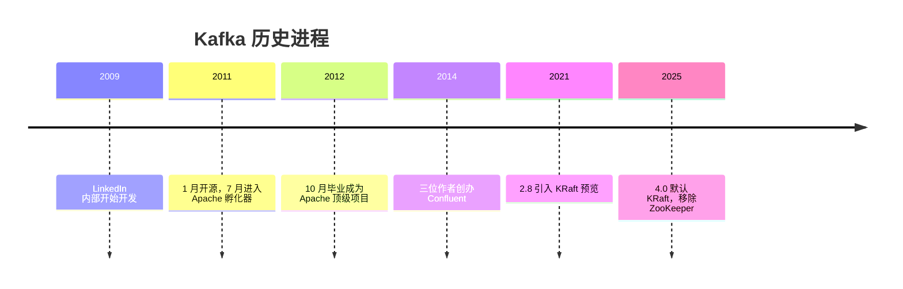

# Kafka 概览

> Kafka 是分布式流处理平台，本质是一个可持久化、可回溯、高吞吐的分布式追加日志。本章给出 Kafka 的来历、现状、特性与性能数据，帮助快速建立全貌认知。

## 1. 什么是 Kafka

Apache Kafka 是分布式流处理平台，由 LinkedIn 开发，2011 年开源。它的本质是一个**分布式追加日志系统**——消息只能追加写入，不能修改，消费者按偏移量顺序读取。

```txt
Producer → [消息0][消息1][消息2][消息3]... → Consumer
           ──────── 追加日志（Partition）────────
```

Kafka 的三重身份：

| 身份 | 说明 |
| :-- | :-- |
| 消息队列 | 发布/订阅模式，解耦生产者和消费者 |
| 存储系统 | 持久化到磁盘，支持回溯消费 |
| 流处理平台 | Kafka Streams 实时处理数据流 |

## 2. 起源、历史与现状

### 2.1 诞生与创作者

Kafka 诞生于 LinkedIn 内部，用于解决实时数据管道问题。2009 年前后，LinkedIn 需要实时处理网站活动流与运营指标，当时的批处理管线延迟以小时计，无法及时发现异常。团队先调研 ActiveMQ，但它无法横向扩展、Broker 故障会阻塞客户端连接，于是决定自建基础设施。

核心创作者是三位 LinkedIn 工程师：**Jay Kreps**（团队负责人，此前负责分布式 KV 存储 Voldemort）、**Neha Narkhede**、**Jun Rao**（稍后加入）。项目于 2009 年 11 月启动，2011 年 1 月开源，7 月进入 Apache 孵化器，2012 年 10 月毕业成为 Apache 顶级项目。2014 年三人离开 LinkedIn 创办 Confluent，专注 Kafka 商业化。

命名取自作家 Franz Kafka——Jay Kreps 认为 Kafka 是「一个为写入而优化的系统」。

来源：[Apache 孵化器提案](https://cwiki.apache.org/confluence/plugins/viewsource/viewpagesrc.action?pageId=134742808)、[Wikipedia](https://en.wikipedia.org/wiki/Apache_Kafka)

### 2.2 时间线



版本里程碑：

| 版本 | 里程碑 |
| :-- | :-- |
| 0.8 | 引入副本机制 |
| 0.10 | 引入 Kafka Streams |
| 0.11 | 引入事务和 Exactly Once 语义 |
| 2.0 | 引入 AdminClient API |
| 2.8 | 引入 KRaft（预览） |
| 3.3 | KRaft 生产就绪 |
| 4.0 | 默认 KRaft，移除 ZooKeeper |

### 2.3 现状与使用规模

Kafka 采用 Apache License 2.0，主要用 Scala 与 Java 编写，最新版本以[官方下载页](https://kafka.apache.org/downloads)为准。架构上已完成从 ZooKeeper 到 KRaft 的迁移：4.0 起默认 KRaft、移除 ZooKeeper 依赖，元数据由内建 Raft 共识管理，不再需要单独维护 ZooKeeper 集群。商业上，Confluent 提供 Confluent Cloud（托管服务）与 Confluent Platform（自托管企业版）。

Kafka 是数据流事实标准：超过 80% 的 Fortune 500 企业使用（[IBM](https://www.ibm.com/cn-zh/think/insights/getting-started-with-kafka-client-metrics)），生产环境组织数超过 15 万（[Kafka Summit 2024](http://www.euranova.eu/confluent-strategic-move-continues-kafka-summit-2024)）。诞生地 LinkedIn 维护超过 100 个集群、4000 多个 Broker，每天处理超过 7 万亿条消息（[LinkedIn Engineering](https://engineering.linkedin.com/teams/data/data-infrastructure/streams/kafka)）。代表用户覆盖互联网、金融、出行、零售：Netflix、Uber、Airbnb、Goldman Sachs、PayPal、Walmart 等。

## 3. 核心特性

| 特性 | 说明 |
| :-- | :-- |
| 高吞吐 | 顺序写入 + 零拷贝 + 批处理，单集群百万级消息/秒 |
| 低延迟 | 端到端毫秒级 |
| 持久化 | 消息落盘，可配置保留时间，支持回溯消费 |
| 水平扩展 | 分区机制，加 Broker 即可扩容 |
| 容错 | 多副本 + ISR，单节点故障不影响服务 |
| 流处理 | Kafka Streams 实时处理数据流 |
| 数据集成 | Kafka Connect 连接外部系统 |
| 生态 | Schema Registry、ksqlDB、管理工具与云托管服务 |

## 4. 为什么快

Kafka 的高吞吐来自四个机制，各一句话概括，深度见对应文档：

- **顺序写入**：消息追加到日志文件末尾，用顺序磁盘写换取吞吐。见 [日志分段与索引](../05-storage-internals/chapter-01-log-segment.md)。
- **零拷贝**：`sendfile()` 跳过用户态，数据从内核缓冲区直达网卡，减少 CPU 拷贝。见 [Page Cache 与零拷贝](../05-storage-internals/chapter-02-page-cache.md)。
- **批量发送**：消息攒批再发，减少网络往返与 TCP 开销。
- **页缓存**：消息写入操作系统页缓存而非 JVM 堆，读取未落盘消息时直接从内存返回。

## 5. 性能 Benchmark

Benchmark 数据依赖消息大小、压缩、副本因子、硬件与网络，只能作为上界参考。

### 5.1 LinkedIn 2014 基准

三台廉价机器（6 核 Xeon、32GB 内存、7200RPM SATA、1GbE），100 字节小消息。[来源](https://engineering.linkedin.com/kafka/benchmarking-apache-kafka-2-million-writes-second-three-cheap-machines)

| 场景 | 吞吐量 | 带宽 |
| :-- | :-- | :-- |
| 单生产者，无副本 | 821,557 条/秒 | 78.3 MB/s |
| 单生产者，3 副本异步 | 786,980 条/秒 | 75.1 MB/s |
| 单生产者，3 副本同步 | 421,823 条/秒 | 40.2 MB/s |
| 3 生产者，3 副本异步 | 2,024,032 条/秒 | 193.0 MB/s |
| 单消费者 | 940,521 条/秒 | 89.7 MB/s |
| 3 消费者 | 2,615,968 条/秒 | 249.5 MB/s |

端到端延迟：中位数 2ms，99 分位 3ms，99.9 分位 14ms。

### 5.2 Confluent 2020 对比基准

Confluent 用 OpenMessaging Benchmark 在 3 节点云硬件上对比（1KB 消息、3 副本）。[来源](https://www.confluent.io/blog/kafka-fastest-messaging-system/)

| 系统 | 峰值吞吐 | p99 延迟（200 MB/s 负载） |
| :-- | :-- | :-- |
| Kafka | 605 MB/s | 5 ms |
| Pulsar | 305 MB/s | 25 ms |
| RabbitMQ（镜像） | 38 MB/s | 仅 30 MB/s 负载下 1ms，更高负载延迟急剧恶化 |

## 6. 典型使用场景

| 场景 | 说明 | 代表用户 |
| :-- | :-- | :-- |
| 日志收集 | 应用日志 → Kafka → ELK | LinkedIn、Netflix |
| 事件驱动 | 服务间异步通信 | Uber、Airbnb |
| 数据管道 | MySQL → Debezium → Kafka → 数仓 | 大多数数据团队 |
| 流式处理 | Kafka → Flink/Streams → 结果 | 实时风控、推荐 |
| 指标监控 | 应用指标 → Kafka → Prometheus | 运维监控 |
