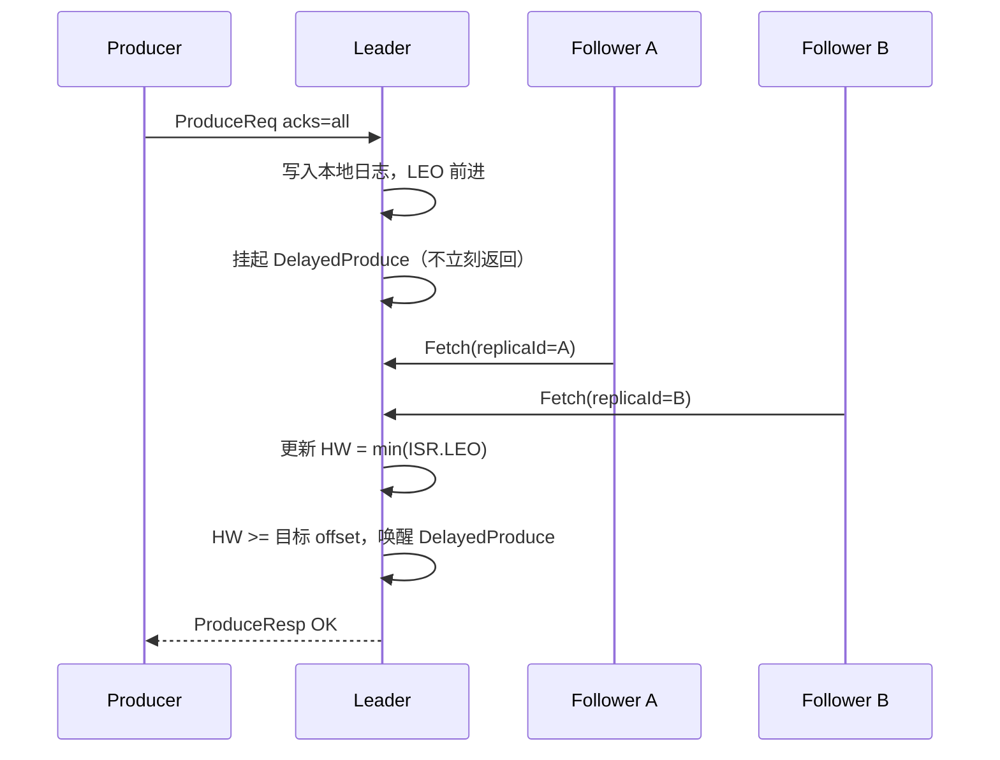

# 副本与 ISR

> 副本机制是 Kafka 可靠性的物理基础。但"多存几份"只是表象——真正的难点在于：多个副本之间怎么保持同步？谁来决定哪些副本"够格"？Leader 宕机时怎么选新 Leader 而不丢数据？这些问题的答案都指向一个核心概念：ISR（In-Sync Replicas）。

## 1. 从一个最基本的问题开始

假设你有一个 Partition，消息只存在一台 Broker 上。这台 Broker 的磁盘坏了，数据永久丢失。

最直觉的解法：多存几份。把同样的数据复制到 3 台 Broker 上，坏了一台还有两台。

但这个"复制"不是简单的拷贝。你需要回答一连串问题：

- 谁来处理读写请求？三个副本都能接请求吗？
- 如果三个副本都能接写入，写入顺序怎么保证？
- Follower 复制数据的速度跟不上 Leader 怎么办？
- Leader 宕机了，从剩下的副本里选新 Leader，选谁？怎么选？

Kafka 对这些问题的回答构成了它的副本模型：**Leader 独占读写，Follower 只管复制，ISR 管理同步状态**。

## 2. 为什么读写必须只走 Leader

这是 Kafka 副本模型的第一个关键决策。如果允许多个副本同时接写入：

```txt
Producer A → Broker 1（Leader）: 写入 msg1
Producer B → Broker 2（Follower）: 写入 msg2

Broker 1 的日志: [msg1, msg2]
Broker 2 的日志: [msg2, msg1]  ← 顺序反了
```

两个副本的写入顺序无法保证一致——没有全局时钟，网络延迟也不同。顺序一旦分叉，消费者从不同副本读到的数据就不一样，一致性彻底崩溃。

如果允许 Follower 接读：

```txt
Consumer → Broker 2（Follower）: 读取 offset 100
但 Broker 2 还没从 Leader 同步到 offset 100
→ Consumer 读不到，或者读到旧数据
```

所以 Kafka 的选择是：**Leader 独占读写，Follower 只做一件事——从 Leader 拉数据**。这个设计牺牲了读写负载均衡，换来了最简单的一致性保证。

## 3. LEO 和 HW：两个关键偏移量

LEO 由每个副本各自维护；HW 则由 Leader 统一计算。这两个偏移量决定了"消费者能看到哪些数据"：

**LEO（Log End Offset）**：本地日志末尾的下一个待写入位置。换句话说，这个副本已经写到了哪。

**HW（High Watermark）**：所有**同步副本**中最小的 LEO。换句话说，"确认所有同步副本都已经写入"的边界。它全局只有一个值，且只有 Leader 计算——Leader 掌握所有同步副本的 LEO，取最小即可。Follower 本地也有一个 HW 字段，但不是自己算的，而是 Leader 在下一次 Fetch 响应中捎带过去的。这个捎带有延迟，所以同一时刻各副本本地存的 HW 可能不一致：概念上只有一个，物理上每个副本各存一份。

```txt
Leader LEO = 150
Follower A LEO = 148
Follower B LEO = 145

HW = min(150, 148, 145) = 145
```

**消费者只能读到 HW 之前的消息**。为什么？因为 HW 之前的消息意味着"所有同步副本都已写入"——即使 Leader 立刻宕机，切换到任意同步副本，这些消息都还在。HW 之后的消息只存在于部分副本中，如果现在让消费者读到，Leader 宕机后这条消息可能丢失，消费者已经处理了但数据没了，这就是数据不一致。

HW 的设计是 Kafka 可靠性的核心：它在"消费者能看到的数据"和"所有副本都确认的数据"之间画了一条线。

## 4. ISR：哪些副本"够格" {#isr-definition}

**ISR（In-Sync Replicas）是一份动态名单：记录当前与 Leader 保持同步的副本，Leader 自身也在名单内。它决定两件事——`acks=all` 写入要等谁确认、Leader 宕机后从谁中选新 Leader。**

不是所有 Follower 都有资格参与 HW 的计算。只有 **ISR（In-Sync Replicas）** 中的副本才被算在内。

ISR 是"与 Leader 保持同步的副本集合"，包含 Leader 自身。Leader 为每个 Follower 记录一个时间戳 `lastCaughtUpTimeMs`——该 Follower 上一次完全追上 Leader LEO 的时刻。是否留在 ISR 取决于时间窗口，而非实时比较：Follower 在 `replica.lag.time.max.ms`（默认 30 秒）内追平过 Leader 的 LEO，就仍在 ISR；一旦 `当前时间 - lastCaughtUpTimeMs` 超过该阈值，才被移出。

这里容易误解：**"追上"指 `follower.LEO >= leader.LEO`，而非追到 `leader.HW`，也非每时每刻都必须相等**。Leader 的 LEO 在持续写入时不断前进，Follower 无需时刻追平——只要它的拉取速度不低于 Leader 的写入速度，就会周期性追平一次，每次追平都刷新 `lastCaughtUpTimeMs`。只有长期追不上（时间窗口内从未追平）才会被移出 ISR。

ISR 是动态的：

```txt
正常：ISR = {Leader, Follower1, Follower2}
Follower2 变慢：ISR = {Leader, Follower1}（Follower2 被移出）
Follower2 恢复：ISR = {Leader, Follower1, Follower2}（重新加入）
```

ISR 收缩意味着"确认写入成功的副本数减少"。如果 ISR 收缩到只剩 Leader，配合 `min.insync.replicas=2`，Broker 会拒绝 `acks=all` 的写入——因为 ISR 中的副本数不足。

## 5. acks=all 的完整时序

理解了 LEO、HW、ISR，才能真正理解 `acks=all` 的含义：



`acks=all` 的语义是：**消息写入所有 ISR 副本后才算成功**。它不是等所有副本都写入——OSR（落后的副本）不算在内。这就是为什么 ISR 的管理如此重要：ISR 太大，写入延迟高；ISR 太小，可靠性下降。

## 6. Leader Epoch：为什么不能只靠 HW 做截断

先划清边界：**Leader Epoch 解决的是"副本之间日志如何对齐"的问题，与消费者如何消费消息无关。** 消费者能读到哪条消息，只取决于该消息是否越过 HW（§3）；Leader 是否换届、epoch 如何变化，都不改变消费者的读进度。Leader Epoch 只在一个副本重启回来、需要把本地多出的分叉日志截断一部分以对齐新 Leader 时生效。

### 6.1 问题：截断到哪才算准

一个副本（旧 Leader 或掉队的 Follower）重启后，本地日志可能比新 Leader 多出一段分叉数据，必须截断。唯一的问题是：**截断到哪才算准。**

旧方案按副本本地的 HW 截断，但 HW 是滞后的值（只在 Fetch 响应中更新），可能把"其实已确认"的消息误删。看这个例子——B 是 Leader，A 是 Follower：

```txt
T1: B 写入 m1、m2，B 的 LEO = 2
    A 已拉取到 m2，A 的 LEO = 2
    但 A 尚未收到 B 发来的新 HW，A 本地 HW 仍 = 1
T2: A 重启
    旧规则：按本地 HW = 1 截断 → m2 被删
T3: B 宕机，A 当选新 Leader
    m2 已被 A 误删，永久丢失
```

根源在于：HW 滞后于实际同步进度，用它做截断决策不可靠。

### 6.2 epoch 是什么

**epoch 本身是一个单调递增的整数，每次 Leader 换届就 +1，标记日志的"任期"**——每条消息都能追溯到是哪一任 Leader 期间写入的。

但光有整数还不够定位。为找到两条日志的"公共前缀"，Kafka 还要为每个 epoch 记录它上任时的起始 offset，形成 `epoch → startOffset` 的映射，把日志切成一段段：`epoch=1` 对应 offset 0~99，`epoch=2` 对应 offset 100~150。

### 6.3 新的截断协议

**Leader Epoch**（[KIP-101](https://cwiki.apache.org/confluence/display/KAFKA/KIP-101)）让 Follower 不再凭本地 HW 猜测，而是直接问 Leader。协议三步：

```txt
1. Follower 重启，向 Leader 报告："我日志里最后一次是在第 X 任 Leader 下写的"
2. Leader 查自己的 epoch 记录，返回 endOffset：
   - 若 X 是 Leader 当前这一任 → 返回 Leader 的 LEO（双方同代，无需截断）
   - 若 X 是更早的任 → 返回"第 X 任之后那一任的 startOffset"（截断跨代多出的部分）
3. Follower 把本地 LEO 大于返回值的部分截断，然后正常拉取对齐
```

回到 6.1 的例子，新协议下的结果：

```txt
A 重启后问 B："我最后一次是第几任写的"（双方同代，epoch 都是 0）
B 答："你我同代，我的 LEO = 2"
A 的 LEO = 2，无需截断，m2 保留
之后 B 宕机，A 当选新 Leader，m2 不丢
```

关键在于第 2 步：Leader 用 epoch 精确定位"两条日志的公共前缀在哪里"。epoch 单调递增，公共前缀必然是某个 epoch 的边界，比用可能过时的 HW 可靠得多。


## 7. Leader 选举 {#leader-election}

### 7.1 正常选举

Leader 所在 Broker 宕机后，Controller 从当前 ISR 中选第一个成员作为新 Leader。为什么是 ISR？因为 ISR 中的副本与 Leader 同步，选它不会丢数据。为什么是"第一个"？因为副本列表的顺序是创建时确定的，第一个成员就是 preferred replica，选它有利于负载均衡。

### 7.2 Unclean Leader 选举 {#unclean-leader-election}

如果 ISR 为空呢？所有同步副本都挂了，只剩下 OSR（落后的副本）。这时候有两个选择：

- **禁止 Unclean 选举**：分区不可用，等 ISR 成员恢复。不丢数据，但服务中断。
- **允许 Unclean 选举**：从 OSR 中选 Leader。服务可用，但 OSR 副本中缺失的数据永久丢失。

`unclean.leader.election.enable=false`（推荐）意味着宁可不可用也不丢数据。这个选择取决于你的业务：金融交易不能丢数据，日志收集可以容忍少量丢失。

## 8. ISR 变更的传播

ISR 变更不是 Leader 自己说了算。Leader 发起变更请求（`AlterPartitionRequest`），但最终决定权在 Controller：

```txt
Leader → Controller: "ISR 变了，新 ISR 是 {我, F1}"
Controller: 校验后写入元数据日志
Controller → 所有 Broker: 广播变更
```

为什么要绕这一圈？因为 ISR 状态必须在 Leader 换届过程中也保持全局一致。如果 Leader 自己管理 ISR，两个 Broker 可能同时认为自己是 Leader，各自维护了不同的 ISR，集群就会出现"脑裂"。Controller 是唯一权威源，保证 ISR 状态的全局一致性。

## 9. 关键配置

| 参数 | 为什么这样设 |
| :-- | :-- |
| `default.replication.factor=3` | 3 副本是可靠性和成本的平衡点——坏了一台还有两台 |
| `min.insync.replicas=2` | 配合 acks=all，保证至少两个副本有数据 |
| `unclean.leader.election.enable=false` | 宁可不可用也不丢数据 |
| `replica.lag.time.max.ms=30000` | 保持默认。调小会因 GC 停顿、网络抖动触发 spurious shrink |

## 10. 监控

| 指标 | 含义 | 为什么重要 |
| :-- | :-- | :-- |
| `UnderReplicatedPartitions` | ISR 少于 RF 的分区数 | > 0 说明有副本掉队 |
| `UnderMinIsrPartitionCount` | ISR 少于 min.insync.replicas 的分区数 | > 0 说明 acks=all 已开始拒写 |
| `IsrShrinksPerSec` | ISR 收缩频率 | 频繁抖动说明参数与实际不匹配 |
| `UncleanLeaderElectionsPerSec` | Unclean 选举次数 | > 0 意味着真实的数据丢失 |

ISR 频繁收缩的排查见 [ISR 频繁收缩](../05-troubleshooting/chapter-02-isr-shrink.md)。
