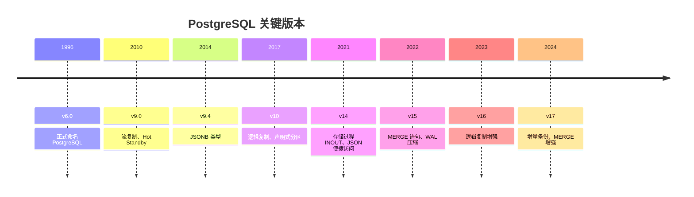

# 为什么选 PostgreSQL

> **核心问题**：从 MySQL 转过来的人，PG 到底强在哪？什么场景该选 PG？

## 1. 设计哲学

PostgreSQL 的核心设计原则与 MySQL 有本质区别：

| 维度 | PostgreSQL | MySQL |
|------|-----------|-------|
| **SQL 标准** | 严格遵循 | 部分宽松（如 GROUP BY） |
| **可扩展性** | 类型、索引、语言均可扩展 | 扩展能力有限 |
| **数据完整性** | 强，约束和触发器完善 | 弱，部分约束不支持 |
| **MVCC 实现** | 旧版本存堆表，需 VACUUM | Undo Log，自动回收 |

PG 是「功能全面的通用数据库」，MySQL 是「简单场景下的高性能数据库」。

## 2. PG 独有的核心优势

### 2.1 类型系统

PG 的类型系统远超 MySQL：

- **数组类型**：`TEXT[]`、`INT[]`，支持 GIN 索引
- **范围类型**：`tsrange`、`int4range`，支持 `@>` 包含查询
- **JSONB**：二进制存储，支持 GIN 索引，查询性能远超 MySQL JSON
- **枚举、复合类型、DOMAIN**：自定义类型体系
- **网络地址**：`INET`、`CIDR`，支持网络运算

### 2.2 索引类型

MySQL 主要只有 B-tree，PG 提供：

| 索引类型 | 适用场景 |
|---------|---------|
| B-tree | 通用，等值/范围/排序 |
| GIN | JSONB、数组、全文检索 |
| GiST | 地理信息、范围类型 |
| BRIN | 超大时序表，索引极小 |
| Hash | 纯等值查询 |

### 2.3 SQL 能力

PG 的 SQL 方言更强：

- **窗口函数**：完整支持，MySQL 8.0+ 才部分支持
- **CTE 递归**：查询树形结构
- **RETURNING**：INSERT/UPDATE/DELETE 后直接返回数据
- **INSERT ON CONFLICT**：原生 UPSERT
- **FILTER 子句**：条件聚合
- **DISTINCT ON**：PG 独有语法
- **LATERAL JOIN**：相关子查询优化

### 2.4 事务与并发

- 默认 Read Committed（不是 RR）
- **SSI**：真正的 Serializable，乐观并发控制，性能远优于 MySQL 的加锁实现
- **4 种行锁**：FOR UPDATE / FOR NO KEY UPDATE / FOR SHARE / FOR KEY SHARE
- **咨询锁**：PG 独有的应用层锁
- **SKIP LOCKED**：任务队列利器

### 2.5 可扩展性

PG 的扩展机制让它不只是一个数据库：

- `pg_stat_statements`：查询统计
- `pg_trgm`：模糊搜索
- `pgvector`：向量搜索（AI 场景）
- `TimescaleDB`：时序数据
- `PostGIS`：空间数据
- `pg_cron`：定时任务

## 3. 选型决策

| 选 PostgreSQL | 选 MySQL |
|:---|:---|
| JSON/JSONB 数据存储与查询 | 高并发简单 CRUD |
| 复杂分析查询（窗口函数、CTE） | 团队对 MySQL 更熟悉 |
| 需要多种索引类型 | 需要简单快速部署 |
| 严格 SQL 标准 | 国内云厂商支持更完善 |
| 地理信息（PostGIS） | 成熟生态、文档丰富 |
| 需要扩展能力（向量、时序） | 读写性能优先 |

## 4. 版本聚焦

本站聚焦 **v14 / v15 / v16** 版本，覆盖 JSONB、窗口函数、CTE、MVCC/VACUUM 等核心特性。

