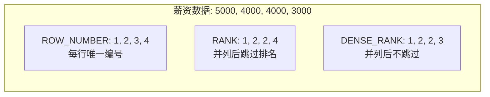

# 窗口函数

> **核心问题**：窗口函数解决了什么问题？ROW_NUMBER、RANK、DENSE_RANK 有什么区别？

## 1. 它解决了什么问题？

在不改变结果行数的情况下，对每行数据进行**跨行计算**（如排名、累计、前后行对比）。

**没有窗口函数时**，求每个部门薪资排名需要写复杂的自连接或子查询，性能差且难以维护。

> **为什么窗口函数比子查询更高效**：子查询需要多次扫描数据，窗口函数只需一次扫描，在窗口内计算。同样的排名需求，窗口函数通常比子查询快 10 倍以上。

## 2. 基本语法

```sql
函数名() OVER (
    PARTITION BY 分组列    -- 按哪个字段分组（类似 GROUP BY，但不合并行）
    ORDER BY 排序列        -- 窗口内的排序方式
    ROWS/RANGE BETWEEN ... -- 窗口帧范围（可选）
)
```

## 3. 常用窗口函数

```sql
-- 场景：查询每个部门的员工薪资排名
SELECT 
    name,
    department,
    salary,
    ROW_NUMBER() OVER (PARTITION BY department ORDER BY salary DESC) AS row_num,
    RANK()       OVER (PARTITION BY department ORDER BY salary DESC) AS rank,
    DENSE_RANK() OVER (PARTITION BY department ORDER BY salary DESC) AS dense_rank,
    LAG(salary)  OVER (PARTITION BY department ORDER BY salary DESC) AS prev_salary,
    LEAD(salary) OVER (PARTITION BY department ORDER BY salary DESC) AS next_salary,
    SUM(salary)  OVER (PARTITION BY department) AS dept_total,
    AVG(salary)  OVER (PARTITION BY department) AS dept_avg
FROM employees;
```

## 4. ROW_NUMBER vs RANK vs DENSE_RANK

| 窗口函数 | 作用 | 示例结果（薪资相同时） | 特点 |
|---------|------|---------------------|------|
| `ROW_NUMBER()` | 连续排名（无并列） | 1, 2, 3, 4 | 相同值也给不同排名，结果唯一 |
| `RANK()` | 跳跃排名（有并列） | 1, 2, 2, 4 | 相同值同排名，下一名跳过 |
| `DENSE_RANK()` | 密集排名（有并列） | 1, 2, 2, 3 | 相同值同排名，下一名不跳过 |



**选择原则**：
- 需要**唯一行号**（如分页）→ `ROW_NUMBER()`
- 需要**体现并列**且下一名跳过（如竞赛排名）→ `RANK()`
- 需要**体现并列**且连续编号（如等级划分）→ `DENSE_RANK()`

## 5. LAG / LEAD：前后行对比

```sql
-- 计算每月销售额环比增长
SELECT 
    month,
    sales,
    LAG(sales) OVER (ORDER BY month) AS prev_month_sales,
    sales - LAG(sales) OVER (ORDER BY month) AS growth,
    ROUND(
        (sales - LAG(sales) OVER (ORDER BY month)) / 
        LAG(sales) OVER (ORDER BY month) * 100, 2
    ) AS growth_rate
FROM monthly_sales;
```

| 函数 | 作用 | 常见用途 |
|------|------|---------|
| `LAG(col, n, default)` | 取当前行**前** n 行的值 | 计算环比、同比 |
| `LEAD(col, n, default)` | 取当前行**后** n 行的值 | 预测下一期、计算差值 |

## 6. 累计聚合

```sql
-- 计算累计销售额（Running Total）
SELECT 
    order_date,
    amount,
    SUM(amount) OVER (ORDER BY order_date) AS running_total,
    AVG(amount) OVER (ORDER BY order_date 
                      ROWS BETWEEN 6 PRECEDING AND CURRENT ROW) AS moving_avg_7d
FROM orders;
```

## 7. 工作中的坑

```sql
-- ❌ 混淆 RANK 和 DENSE_RANK 导致业务逻辑错误
-- 业务需求：取每个部门薪资前3名
-- 如果用 RANK，并列第2名后直接跳到第4名，可能取不到3个人
-- 如果用 DENSE_RANK，并列第2名后是第3名，能取到3个人

-- ✅ 明确业务需求再选择
SELECT * FROM (
    SELECT *, DENSE_RANK() OVER (PARTITION BY dept ORDER BY salary DESC) AS rk
    FROM employees
) t WHERE rk <= 3;
```

## 8. 常见问题

**Q：ROW_NUMBER、RANK、DENSE_RANK 的区别是什么？**

> 三者都是排名函数，区别在于处理并列时的行为：`ROW_NUMBER` 连续排名（1,2,3,4，无并列）；`RANK` 跳跃排名（1,2,2,4，并列后跳过）；`DENSE_RANK` 密集排名（1,2,2,3，并列后不跳过）。

**Q：窗口函数和 GROUP BY 有什么区别？**

> GROUP BY 会合并行，结果行数减少；窗口函数不改变行数，在每行上附加计算结果。窗口函数可以在保留明细数据的同时，计算分组聚合值。