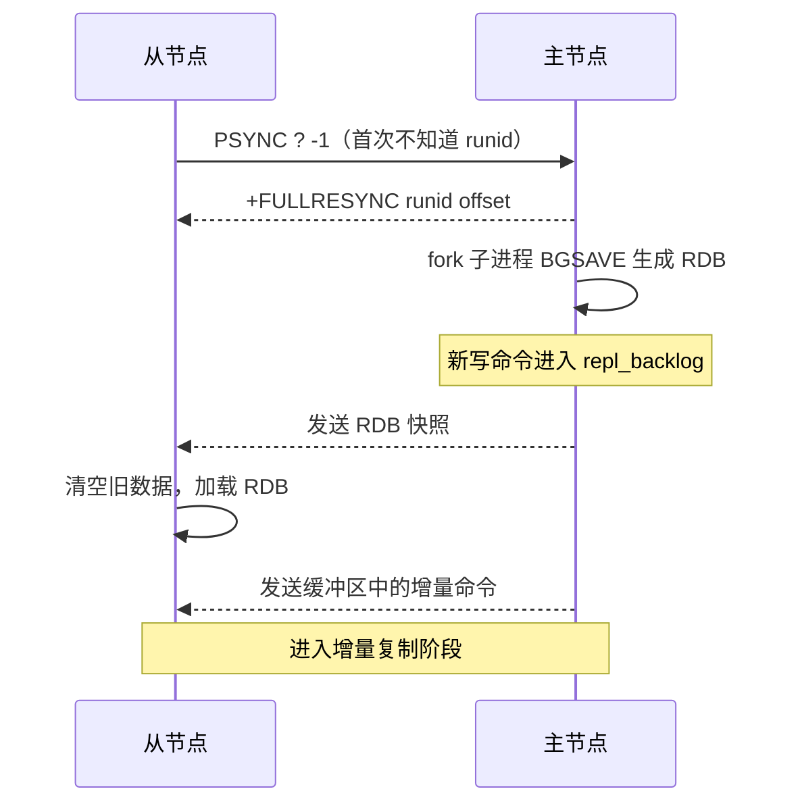
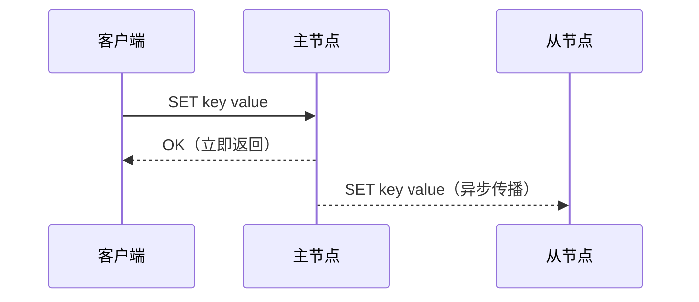

# 主从复制

> 单机 Redis 存在单点故障与读写瓶颈。主从复制让数据在多个节点间同步，是哨兵与集群的基石。本章从同步流程到源码级细节，讲清主从复制的全貌，以及生产环境中最常见的坑。

## 1. 为什么需要主从复制

单机 Redis 面临三个问题：

| 问题 | 说明 |
| :-- | :-- |
| 单点故障 | 主节点宕机，服务不可用 |
| 读瓶颈 | 所有请求都压在一个节点上 |
| 容量受限 | 单机内存有上限 |

主从复制引入「一主多从」结构：主节点负责写，从节点复制数据并分担读请求。


## 2. 全量同步 {#full-sync}

首次连接或增量同步失败时，从节点需要复制主节点的全部数据。

### 2.1 流程


全量同步的时序：



### 2.2 BGSAVE 的 fork 代价

`BGSAVE` 通过 `fork()` 创建子进程，利用操作系统的 **Copy-On-Write（COW）** 机制生成 RDB。fork 的代价：

| 项目 | 说明 |
| :-- | :-- |
| fork 耗时 | 取决于内存页表大小，具体值用 `latest_fork_usec` 实测（见 [RDB 持久化](../02-standalone-core/chapter-03-rdb.md)） |
| 内存开销 | fork 后父子进程共享内存页，写入时才复制，极端情况内存翻倍 |
| 主线程阻塞 | fork 期间主线程短暂阻塞（毫秒级） |

> 生产环境常见问题：数据量过大（>10GB）导致 fork 耗时长，fork 期间主线程阻塞导致请求超时。解决方案：控制单实例内存在 10GB 以内，并避免频繁 fork（如多个从节点同时全量同步）。

### 2.3 复制缓冲区大小 {#repl-buffer}

复制缓冲区（`repl_backlog`）是一个环形缓冲区，存放最近的写命令。如果全量同步期间写入量太大，缓冲区溢出，会导致全量同步失败、重新触发。

```bash
# 查看缓冲区大小
redis-cli INFO replication | grep repl_backlog_size

# 调整大小（默认 1MB，生产环境建议调大）
# redis.conf
repl-backlog-size 256mb
```

缓冲区大小的计算公式：

```text
repl-backlog-size ≥ 写入速率（MB/s）× 全量同步耗时（s）× 2（安全系数）
```

下表为代入公式的示例值（非实测基准），实际大小应代入自身写入速率与同步耗时计算：

| 场景 | 写入速率 | 全量同步耗时 | 建议大小 |
| :-- | :-- | :-- | :-- |
| 低写入 | 1 MB/s | 30s | 64 MB |
| 中等写入 | 10 MB/s | 60s | 1.2 GB |
| 高写入 | 50 MB/s | 120s | 12 GB |

## 3. 增量同步

断线重连后，如果从节点的偏移量还在主节点的复制缓冲区范围内，就只补发缺失部分。

### 3.1 PSYNC 机制

```text
从节点发送：PSYNC <runid> <offset>
主节点检查：
  - runid 匹配 && offset 在缓冲区内 → +CONTINUE <offset>，增量同步
  - runid 不匹配 || offset 不在缓冲区 → +FULLRESYNC，全量同步
```

### 3.2 偏移量与积压缓冲区

| 概念 | 说明 |
| :-- | :-- |
| 复制偏移量（replication offset） | 主从各自维护，记录已复制的字节数 |
| 积压缓冲区（repl_backlog） | 主节点的环形缓冲区，保存最近的写命令 |
| 命令传播 | 全量同步后，主节点持续把写命令传播给从节点 |

主节点每次写入时，同时写入积压缓冲区并推进偏移量。从节点每收到一批命令，也推进自己的偏移量。两者之差就是「复制延迟」。

```bash
# 查看主从偏移量差
redis-cli INFO replication
# master_repl_offset: 123456789
# slave_repl_offset:  123456000   # 差 789 字节
```

## 4. 异步复制

Redis 的复制是**异步**的：主节点写完就返回客户端成功，不等待从节点确认。



### 4.1 异步的代价

| 特性 | 说明 |
| :-- | :-- |
| 高性能 | 主节点不等待从节点，写入延迟低 |
| 可能丢数据 | 主节点宕机时，未同步到从节点的数据丢失 |
| 弱一致 | 读从节点可能读到旧数据 |

数据丢失窗口 = 主节点宕瞬间，已写入但未传播到从节点的数据量。窗口大小取决于网络延迟和写入频率。

### 4.2 WAIT 命令（半同步）

如果业务需要「至少 N 个从节点确认」才返回成功，可以用 `WAIT` 命令：

```bash
SET key value
WAIT 1 5000   # 等待至少 1 个从节点确认，超时 5 秒
```

`WAIT` 是 Redis 3.0+ 提供的半同步机制：

| 参数 | 含义 |
| :-- | :-- |
| `numreplicas` | 需要确认的从节点数 |
| `timeout` | 超时时间（毫秒） |

返回值 = 确认的从节点数。超时返回 0，表示没有从节点在指定时间内确认。

> `WAIT` 不能保证绝对不丢数据（从节点确认后、主节点返回前主节点宕机，数据仍可能丢），但把丢数据的概率大幅降低了。

## 5. 读写分离的问题

主写从读，看似完美，但生产中会遇到几个坑：

### 5.1 复制延迟

从节点收到写命令有延迟，读从节点可能读到旧数据。

```text
主节点写入 key=1 → 100ms 后从节点才收到 → 这 100ms 内读从节点读到旧值
```

解决方案：

| 方案 | 说明 |
| :-- | :-- |
| 关键读走主节点 | 写后立即读的请求，路由到主节点 |
| WAIT 半同步 | 写后 WAIT 确认从节点同步完成再读 |
| 接受最终一致 | 业务能容忍短暂不一致，直接读从节点 |

### 5.2 从节点全量同步风暴 {#full-sync-storm}

多个从节点同时全量同步，主节点 fork 多次，CPU 和内存压力飙升。

```text
主节点内存 10GB
3 个从节点同时全量同步 → 3 次 fork → 短暂阻塞 + 内存峰值 40GB
```

解决方案：

| 方案 | 说明 |
| :-- | :-- |
| 错开同步时间 | 不要同时启动多个从节点 |
| 级联复制 | 从节点 A 复制主节点，从节点 B 复制从节点 A |
| 控制实例大小 | 单实例 ≤ 10GB |

### 5.3 主节点宕机后的数据丢失

主节点宕机后，从节点提升为新主，但原主节点中「已写入但未同步」的数据丢失。

```text
原主节点：key1, key2, key3（key3 还未同步到从节点）
原主节点宕机 → 从节点提升为新主 → key3 丢失
原主节点恢复 → 变成从节点 → 被新主的数据覆盖 → key3 彻底丢失
```

这个问题由哨兵的故障转移机制处理（见第 2 章）。

## 6. 配置参考

```bash
# 从节点配置
replicaof <master-ip> <master-port>   # 指定主节点
replica-read-only yes                 # 从节点只读
replica-serve-stale-data yes          # 同步期间是否返回旧数据

# 主节点配置
repl-backlog-size 256mb               # 复制缓冲区大小
repl-backlog-ttl 3600                 # 无从节点后保留缓冲区的时间（秒）
min-replicas-to-write 1               # 至少 N 个从节点在线才允许写
min-replicas-max-lag 10               # 从节点最大延迟（秒）
```

| 配置 | 含义 |
| :-- | :-- |
| `replica-read-only` | 从节点只读，防止误写导致数据不一致 |
| `replica-serve-stale-data` | 同步期间是否返回旧数据（`yes` 保证可用性，`no` 保证一致性） |
| `min-replicas-to-write` | 保护机制，从节点不足时禁止写入 |

## 7. 小结

| 要点 | 说明 |
| :-- | :-- |
| 全量同步 | 首次连接或增量失败时触发，代价高（fork + RDB 传输） |
| 增量同步 | 断线重连后补发缺失数据，依赖复制缓冲区 |
| 异步复制 | 主节点不等从节点确认，高性能但可能丢数据 |
| WAIT 半同步 | 等待从节点确认，降低丢数据概率 |
| 读写分离坑 | 复制延迟、全量同步风暴、数据丢失 |
| 核心调优 | `repl-backlog-size` 要根据写入速率调整 |
