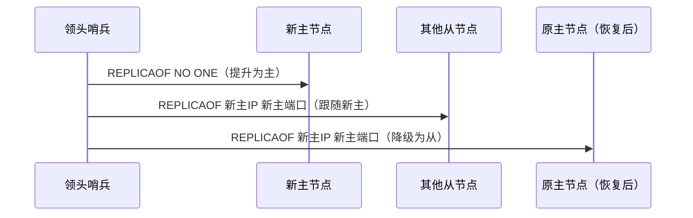

# 哨兵模式

> 主从复制需要手动切换主节点，哨兵（Sentinel）补上了「自动故障转移」这一环。本章讲清哨兵的故障检测机制、选举算法、故障转移全流程，以及生产环境的配置与踩坑。

## 1. 架构

哨兵是一个独立的进程（或一组进程），负责监控 Redis 主从节点，并在主节点故障时自动完成切换。


哨兵的三个核心职责：

| 职责 | 说明 |
| :-- | :-- |
| 监控 | 周期性检测主从节点是否存活 |
| 通知 | 节点故障时通知管理员或客户端 |
| 自动故障转移 | 主节点故障时，选举新主并让从节点跟随 |

> 哨兵本身也是一组进程，它们之间通过 Raft 类算法达成共识，避免单个哨兵误判。

## 2. 故障检测

### 2.1 心跳机制

哨兵每秒向主节点发送 `PING`，主节点返回 `PONG`。如果在 `down-after-milliseconds` 内没有收到 `PONG`，哨兵认为主节点下线。

```text
哨兵 → 主节点：PING
主节点 → 哨兵：PONG
（正常）

哨兵 → 主节点：PING
...（超时无响应）
哨兵标记：主观下线（SDOWN）
```

### 2.2 主观下线与客观下线

| 阶段 | 全称 | 说明 |
| :-- | :-- | :-- |
| 主观下线（SDOWN） | Subjectively Down | 单个哨兵认为某个节点（主/从/哨兵）下线 |
| 客观下线（ODOWN） | Objectively Down | 达到 quorum 个哨兵都认为下线 |

单个哨兵判断下线可能是网络抖动导致的误判，多个哨兵达成共识才可靠。

```text
哨兵A：SDOWN（主观下线）
哨兵B：SDOWN（主观下线）
哨兵C：SDOWN（主观下线）
quorum = 2 → 3 个哨兵中 2 个确认 → ODOWN（客观下线）
```

### 2.3 检测从节点

主节点客观下线后，哨兵还会检测从节点的状态：

```text
哨兵 → 从节点1：PING → PONG（存活）
哨兵 → 从节点2：PING → PONG（存活）
哨兵 → 从节点3：PING → ...（无响应，标记下线，不参与选举）
```

## 3. 领头选举

客观下线后，哨兵之间通过类 Raft 算法选举一个「领头哨兵（Leader）」来执行故障转移。

### 3.1 Raft 选举流程

```text
1. 每个哨兵发起投票，先到先得（每个哨兵在一个纪元内只能投一票）
2. 哨兵 A 发起投票，哨兵 B、C 投给 A → A 获得多数票，成为 Leader
3. 如果没有任何哨兵获得多数票，纪元递增，重新选举
```

| 概念 | 说明 |
| :-- | :-- |
| 纪元（epoch） | 递增的计数器，每次选举新纪元 |
| 投票规则 | 先到先得，每个纪元内每个哨兵只能投一票 |
| 多数票 | 需要超过半数的哨兵投票才能成为 Leader |

### 3.2 为什么需要 Leader

如果所有哨兵都同时执行故障转移，可能选出不同的新主，导致脑裂。Leader 机制保证只有一个哨兵执行转移。

## 4. 故障转移流程 {#failover}


### 4.1 选新主节点

领头哨兵按以下规则从从节点中选出新主：

```text
1. 过滤掉不健康的从节点（下线、断连、长时间无响应）
2. 按 slave-priority 选最高的（可手动配置优先级）
3. 优先级相同，选复制偏移量最大的（数据最新）
4. 都相同，选 runid 最小的（启动最早的）
```

### 4.2 执行切换



### 4.3 客户端通知

切换完成后，哨兵通过 Pub/Sub 通知客户端新主节点的地址：

```bash
# 客户端订阅哨兵频道
SENTINEL get-master-addr-by-name mymaster   # 获取当前主节点地址
# 哨兵切换后，自动推送新地址
```

## 5. 配置详解

```bash
# sentinel.conf

# 监控主节点：IP 端口 quorum
sentinel monitor mymaster 127.0.0.1 6379 2

# 主观下线阈值：30 秒无响应判定下线
sentinel down-after-milliseconds mymaster 30000

# 故障转移超时：180 秒内未完成转移则放弃
sentinel failover-timeout mymaster 180000

# 并行同步从节点数：切换后同时从新主同步的从节点数
sentinel parallel-syncs mymaster 1

# 连接密码
sentinel auth-pass mymaster your_password
```

| 配置 | 含义 | 建议值 |
| :-- | :-- | :-- |
| `quorum` | 判定客观下线所需的哨兵数 | 哨兵总数的多数（如 3 个哨兵取 2） |
| `down-after-milliseconds` | 主观下线阈值 | 30000（30 秒），过短易误判 |
| `failover-timeout` | 故障转移超时 | 180000（3 分钟） |
| `parallel-syncs` | 并行同步从节点数 | 1（避免同时全量同步） |

### 5.1 哨兵数量建议

| 哨兵数 | 说明 |
| :-- | :-- |
| 1 | 单点故障，不推荐 |
| 2 | 一个挂了无法达成多数，不推荐 |
| 3 | 最小推荐数量，可容忍 1 个故障 |
| 5 | 大规模部署，可容忍 2 个故障 |

> quorum 和「执行转移的哨兵数」是两个概念。quorum 用于判定客观下线，执行转移需要多数哨兵投票选出 Leader。

## 6. 客户端连接

### 6.1 Jedis 连接哨兵

```java
Set<String> sentinels = new HashSet<>();
sentinels.add("192.168.1.10:26379");
sentinels.add("192.168.1.11:26379");
sentinels.add("192.168.1.12:26379");

JedisSentinelPool pool = new JedisSentinelPool("mymaster", sentinels);

try (Jedis jedis = pool.getResource()) {
    jedis.set("key", "value");
}
```

### 6.2 Lettuce / Spring Boot 连接

```yaml
# application.yml
spring:
  redis:
    sentinel:
      master: mymaster
      nodes: 192.168.1.10:26379,192.168.1.11:26379,192.168.1.12:26379
```

客户端通过哨兵发现当前主节点地址，主节点切换后自动更新。不需要硬编码主节点 IP。

## 7. 生产踩坑

### 7.1 脑裂

网络分区时，旧主节点和新主节点同时存在，客户端可能写入旧主，导致数据丢失。

```text
网络分区：
  哨兵 + 从节点（选出新主）
  旧主节点（仍在接收写入）
  
网络恢复：
  旧主降级为从节点 → 旧主的数据被新主覆盖 → 数据丢失
```

缓解措施：

```bash
# 旧主检测到从节点不足时停止接受写入
min-replicas-to-write 1
min-replicas-max-lag 10
```

### 7.2 故障转移期间的不可用

切换期间（通常几秒到几十秒），集群短暂不可写。客户端需要做好重试和错误处理。

### 7.3 误判与抖动

`down-after-milliseconds` 过短会导致频繁误判，触发不必要的故障转移。建议 ≥ 30 秒。

### 7.4 多数据中心

哨兵应部署在多个机房/可用区，避免单机房故障导致所有哨兵不可用。

## 8. 小结

| 要点 | 说明 |
| :-- | :-- |
| SDOWN → ODOWN | 单个哨兵主观判断 → 多数哨兵客观确认 |
| Leader 选举 | Raft 类算法，保证只有一个哨兵执行转移 |
| 选新主规则 | 优先级 → 偏移量 → runid |
| 脑裂防护 | `min-replicas-to-write` 保护旧主不再写入 |
| 哨兵数量 | ≥ 3 且为奇数，部署在多个机房 |
