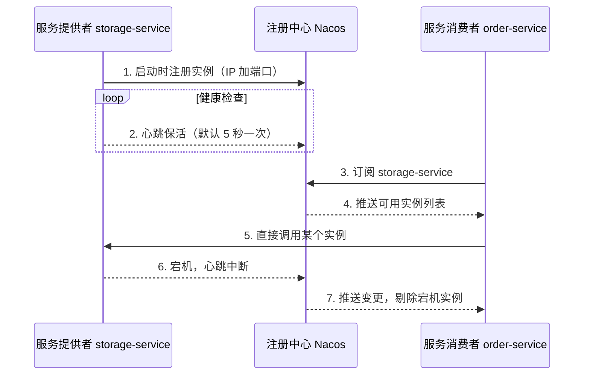

# 服务注册与发现

> 服务调用章节里的 `lb://order-service`、`@LoadBalanced`，全都依赖同一个前提，先要知道 `order-service` 现在有哪些存活实例。这个前提由注册中心提供。本章讲清楚注册中心解决什么问题、Nacos 怎么实现它，以及最容易踩的两个坑。

## 1. 为什么需要注册中心

假设 order-service 要调用 storage-service。没有注册中心时，只能把 storage-service 的地址写死在配置里：

```yaml
storage:
  url: http://192.168.1.10:8080
```

这个写法撑不过第一次扩容。storage-service 从 1 个实例加到 10 个，地址从一台变成十台；某个实例重启后换到了别的端口；容器化部署后每次发布的 IP 都不一样。地址一旦写死，任何一次实例变化都要改配置、重启 order-service。

注册中心把「服务现在在哪」从静态配置变成动态查询。它维护一张表，key 是服务名，value 是存活实例列表。服务启动时把自己登记进去，调用方按服务名查地址。



## 2. 注册中心承担的四件事

时序图里的七步可以归为四件事。

| 动作 | 谁发起 | 说明 |
| :-- | :-- | :-- |
| 服务注册 | 提供者 | 启动时把服务名、IP、端口、元数据登记到注册中心 |
| 健康检查 | 提供者或注册中心 | 判断实例是否还活着，决定它是否留在列表里 |
| 服务发现 | 消费者 | 按服务名拿到存活实例列表 |
| 服务注销 | 提供者或注册中心 | 正常下线时主动摘除，异常宕机时靠健康检查剔除 |

四件事里最关键的是健康检查。注册中心不能只听服务「说自己起来了」，它需要持续确认这个实例是否真的还能用。健康检查做不好，就会出现调用方拿到一堆死地址。

## 3. Nacos Discovery 集成

依赖和配置都很薄。

```xml
<dependency>
    <groupId>com.alibaba.cloud</groupId>
    <artifactId>spring-cloud-starter-alibaba-nacos-discovery</artifactId>
</dependency>
```

```yaml
spring:
  application:
    name: order-service
  cloud:
    nacos:
      discovery:
        server-addr: 127.0.0.1:8848
```

Spring Cloud Alibaba 2021.x 起，`@EnableDiscoveryClient` 不再是必须的，引入依赖后自动生效。`spring.application.name` 就是注册到注册中心的服务名，调用方用这个名字发起 `lb://order-service` 调用。

启动后可以在 Nacos 控制台的「服务列表」看到 order-service，以及它下面的实例。

## 4. 临时实例与持久实例

这是 Nacos 区别于 Eureka 的核心设计，也是出问题最多的地方。

Nacos 把实例分成两类，由 `ephemeral` 字段控制。默认是临时实例。

| 维度 | 临时实例（默认） | 持久实例 |
| :-- | :-- | :-- |
| 配置 | `ephemeral: true` | `ephemeral: false` |
| 健康检查 | 客户端心跳上报 | 服务端主动探测（TCP / HTTP / MySQL） |
| 判定节奏 | 心跳 5 秒一次，15 秒未收到标不健康，30 秒剔除 | 默认 20 秒探测一次 |
| 存储 | 只存内存，重启即失 | 持久化到磁盘 |
| 宕机处理 | 自动从列表剔除 | 只标不健康，不删除 |
| 一致性模型 | AP | CP |
| 适用场景 | 弹性伸缩的业务服务 | MySQL、Redis 等基础设施 |

两种实例的差别，本质是「宕机后谁负责把它踢出去」。

临时实例靠心跳保活。客户端每 5 秒向服务端报一次心跳，服务端 15 秒没收到就标记不健康，30 秒还没收到就从列表剔除。业务服务用临时实例，进程被杀、机器断电，心跳自然中断，最迟 30 秒后调用方就拿不到这个死实例了。

持久实例靠服务端反向探测。服务端主动去连实例的端口（TCP 探测）或请求健康接口（HTTP 探测），默认 20 秒一次。探测失败只把实例标记为不健康，不会删除，因为持久实例的信息落到了磁盘上，运维需要看到「这个节点出问题了」并手动处理。MySQL、Redis 这类基础设施适合持久实例，它们的地址不该因为一次探测失败就从注册表消失。

两种模式对应两种一致性取舍。临时实例走 AP，注册信息写入内存即成功，牺牲一致性换可用性，适合实例频繁变化的场景。持久实例走 CP，通过 Raft 保证集群内数据一致，适合需要强一致的基础设施注册。

> **踩坑提醒**：`ephemeral: false` 一旦误设，会带来一次典型的线上事故。一个节点因为 GC 停顿导致心跳中断超过 30 秒，正常流程下它会被剔除，调用方不再把流量打到它。但持久实例不会被剔除，调用方继续往这个已经卡死的节点发请求，最终拖垮整条链路。业务服务不要设为持久实例。

## 5. 心跳与 gRPC 长连接

Nacos 2.x 把 1.x 的 HTTP 心跳换成了 gRPC 长连接。长连接让心跳不再是一次次独立的 HTTP 请求，客户端与服务端维持一条连接，心跳是连接上的保活信号。

这个变化带出一个新的端口模型。2.x 在 8848 之外按固定偏移量派生出三个端口：

| 端口 | 偏移量 | 用途 |
| :-- | :-- | :-- |
| 8848 | 主端口 | HTTP，控制台、OpenAPI |
| 9848 | +1000 | 客户端 gRPC 请求服务端 |
| 9849 | +1001 | 服务端 gRPC 之间同步 |
| 7848 | -1000 | Raft 选举，集群节点间 |

> **踩坑提醒**：这是 2.x 升级最常见的故障源。很多环境的防火墙只放行了 8848，控制台能正常打开，但客户端注册服务时报 `Connection refused`，因为注册和心跳走的是 9848 这条 gRPC 连接。客户端与服务端之间至少放开 8848 和 9848。

## 6. 与负载均衡的衔接

注册中心解决「有哪些实例」，负载均衡解决「选哪一个」。服务调用章节里的 `ServiceInstanceListSupplier` 就是从这个衔接点取数的，它内部向注册中心订阅服务名，拿到实时实例列表，再交给 `ReactorLoadBalancer` 挑一个。注册中心的实例列表每次变化都会推给订阅方，负载均衡拿到的永远是当前存活的那批地址。

## 7. 注册中心选型

| 注册中心 | 一致性 | 健康检查 | 状态 |
| :-- | :-- | :-- | :-- |
| Nacos | AP（临时）/ CP（持久） | 心跳 + 服务端探测 | 活跃 |
| Eureka | AP | 心跳 | 已停止维护 |
| Consul | CP | 服务端探测 | 活跃 |
| Zookeeper | CP | 临时节点 + 心跳 | 活跃但偏重 |

Nacos 相对 Eureka 的额外价值在于一套组件同时覆盖服务发现和配置中心，且临时实例与持久实例的双模式能兼顾业务服务与基础设施两类场景。

## 8. 生产注意事项

1. **业务服务保持默认临时实例**，不要设 `ephemeral: false`。
2. **防火墙至少放开 8848 和 9848**，走 Nginx 或 SLB 时 9848 要配 TCP 转发，不能配 HTTP。
3. **保护阈值**。服务健康实例占比跌破阈值时，Nacos 会把不健康实例也返回给调用方，避免流量全压到少数健康实例上引发雪崩。这个机制牺牲少量请求换整体可用，不要当成故障去「修复」。
4. **命名空间隔离环境**。dev、test、prod 用不同 namespace，跨 namespace 的服务互相不可见，能挡住一次配置错误导致的跨环境调用。
